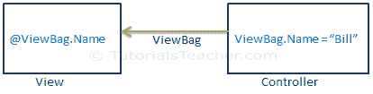

# ASP.NET MVC - ViewBag

> 原文:[https://www.tutorialsteacher.com/mvc/viewbag-in-asp.net-mvc](https://www.tutorialsteacher.com/mvc/viewbag-in-asp.net-mvc)

ASP.NET MVC 中的视图包用于将临时数据(不包括在模型中)从控制器传输到视图。

在内部，它是`ControllerBase`类的[动态](/csharp/csharp-dynamic-type)类型属性，是`Controller`类的基类。

下图说明了视图包。

<figure>[](../../Content/images/mvc/viewbag.png)

<figcaption>ViewBag Data Transfer</figcaption>

</figure>

在上图中，它用点符号将名称属性附加到视图包，并在控制器中为它分配一个字符串值“Bill”。这可以在像@ ViewBag.Name 这样的视图中访问

 You can assign a primitive or a complex type object as a value to ViewBag property.

您可以为视图包分配任意数量的属性和值。如果多次向视图包分配相同的属性名，那么它将只考虑分配给该属性的最后一个值。

*Note:**ViewBag only transfers data from controller to view, not visa-versa. ViewBag values will be null if redirection occurs.* *下面的示例演示了如何使用视图包将数据从控制器传输到视图。

Example: Set ViewBag in Action method<button class="copy-btn pull-right" title="Copy example code">*Copy*</button> *```
namespace MVC_BasicTutorials.Controllers
{
    public class StudentController : Controller
    {
        IList<Student> studentList = new List<Student>() { 
                    new Student(){ StudentID=1, StudentName="Steve", Age = 21 },
                    new Student(){ StudentID=2, StudentName="Bill", Age = 25 },
                    new Student(){ StudentID=3, StudentName="Ram", Age = 20 },
                    new Student(){ StudentID=4, StudentName="Ron", Age = 31 },
                    new Student(){ StudentID=5, StudentName="Rob", Age = 19 }
                };
        // GET: Student
        public ActionResult Index()
        {
            ViewBag.TotalStudents = studentList.Count();

            return View();
        }

    }
} 
```

在上面的例子中，我们想要在一个视图中显示学生的总数。因此，我们将`TotalStudents`属性附加到了`ViewBag`上，并赋予了`studentList.Count()`值。

现在，在`Index.cshtml`视图中，可以访问`ViewBag.TotalStudents`属性，如下图所示。

Index.cshtml<button class="copy-btn pull-right" title="Copy example code">*Copy*</button> *```
<label>Total Students:</label>  @ViewBag.TotalStudents
```

Output:

```
Total Students: 5
```

在内部，视图包是对视图数据的包装。如果视图包属性名与视图数据的键匹配，它将引发运行时异常。

## 视图包限制

*   从视图包中检索值时不需要类型转换。如果对该值使用了错误的方法，这可能会引发运行时异常。
*   ViewBag 是一种动态类型，跳过编译时检查。因此，手动编写视图包时，视图包属性名必须在控制器和视图中匹配。***