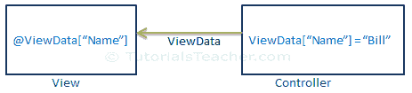

# ASP.NET MVC-视图数据

> 原文：<https://www.tutorialsteacher.com/mvc/viewdata-in-asp.net-mvc>

在 ASP.NET MVC 中，视图数据类似于视图包，它将数据从控制器传输到视图。视图数据属于[字典](/csharp/csharp-dictionary)类型，而视图包属于[动态类型](/csharp/csharp-dynamic-type)。但是，两者都在内部将数据存储在同一个字典中。

视图数据是一个字典，所以它包含键值对，其中每个键必须是一个字符串。

下图说明了视图数据。

[](../../Content/images/mvc/viewdata.png)

*Note:**ViewData only transfers data from controller to view, not vice-versa. It is valid only during the current request.* *以下示例演示如何使用视图数据将数据从控制器传输到视图。

Example: ViewData in Action method 

```
public ActionResult Index()
{
    IList<Student> studentList = new List<Student>();
    studentList.Add(new Student(){ StudentName = "Bill" });
    studentList.Add(new Student(){ StudentName = "Steve" });
    studentList.Add(new Student(){ StudentName = "Ram" });

    ViewData["students"] = studentList;

    return View();
} 
```

在上面的例子中，`ViewData["students"]`被分配给一个`studentList`，其中`"students"`是一个键，`studentList`是一个值。 现在可以在视图中访问`ViewData["students"]`，如下图所示。

Example: Access ViewData in a Razor View 

```
<ul>
@foreach (var std in ViewData["students"] as IList<Student>)
{
    <li>
        @std.StudentName
    </li>
}
</ul>
```

上面，我们使用`ViewData["students"]`检索值，并将其类型转换为适当的数据类型。 您也可以将`KeyValuePair`对象添加到视图数据中，如下所示。

Example: Add KeyValuePair in ViewData 

```
public ActionResult Index()
{
    ViewData.Add("Id", 1);
    ViewData.Add(new KeyValuePair<string, object>("Name", "Bill"));
    ViewData.Add(new KeyValuePair<string, object>("Age", 20));

    return View();
} 
```

视图数据和视图包都在内部使用相同的字典。因此，您不能让视图数据键与视图包的属性名匹配，否则它将引发运行时异常。

Example: ViewBag and ViewData 

```
public ActionResult Index()
{
    ViewBag.Id = 1;

    ViewData.Add("Id", 1); // throw runtime exception as it already has "Id" key
    ViewData.Add(new KeyValuePair<string, object>("Name", "Bill"));
    ViewData.Add(new KeyValuePair<string, object>("Age", 20));

    return View();
} 
```

  Points to Remember :

1.  视图数据将数据从控制器传输到视图，而不是相反。
2.  视图数据是一种字典类型。
3.  ViewData 的生命只持续在当前的 HTTP 请求期间。如果发生重定向，视图数据值将被清除。
4.  在使用视图数据值之前，必须将其类型转换为适当的类型。
5.  视图包在内部将数据插入视图数据字典。所以视图数据的关键字和视图包的属性必须**不**匹配。*****