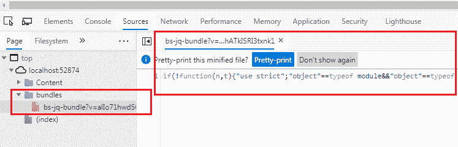

# 在 ASP.NET MVC 中使用脚本包组合脚本文件

> 哎哎哎:# t0]https://www . tutorial connector . com/MVC/script bundle-MVC

在这里，您将学习如何组合多个 JavaScript 文件，并在 ASP.NET MVC 中创建一个可以在单个 HTTP 请求中返回的脚本包。

[脚本捆绑包](https://docs.microsoft.com/en-us/previous-versions/aspnet/jj646584(v=vs.110))类代表了一个进行 JavaScript 缩小和捆绑的捆绑包。 您可以在 ASP.NET MVC 项目的`App_Start`文件夹下的`BundleConfig`类中创建样式或脚本包。(您可以创建自己的自定义类，而不是使用 BundleConfig 类，但建议遵循标准做法。)

下面的示例演示如何创建脚本包。

Example: Create Script Bundle<button class="copy-btn pull-right" title="Copy example code">*Copy*</button> *```
using System.Web;
using System.Web.Optimization;

public class BundleConfig
{
    public static void RegisterBundles(BundleCollection bundles)
    {   
        bundles.Add(new ScriptBundle("~/bundles/bs-jq-bundle").Include(
                      "~/Scripts/bootstrap.js",
                      "~/Scripts/jquery-3.3.1.js"));

        //the following creates bundles in debug mode;
        //BundleTable.EnableOptimizations = true;
    }
} 
```

在上面的例子中，我们通过创建`ScriptBundle`类的实例创建了一个新的包，并在构造函数中指定了虚拟路径和包名。`~/bundles/`是虚拟路径，`bs-jq-bundle`是捆绑名称。 然后，我们在这个包中添加了两个 js 文件，`bootstrap.js`和`jquery-3.3.1.js`。 使用`bundles.Add()`方法将新捆添加到`BundleCollection`中。 默认情况下，上述`bs-jq-bundle`捆绑包将在发布模式下创建。如果想在调试模式下看到包，请使用`BundleTable.EnableOptimizations = true`。

现在，要将上面的`bs-jq-bundle`包含在您的网页中，请在[布局视图](/mvc/layout-view-in-asp.net-mvc)中使用`Scripts.Render()`方法，如下所示。

Example: Use Script Bundle<button class="copy-btn pull-right" title="Copy example code">*Copy*</button> *```
<!DOCTYPE html>
<html>
<head>
    <meta charset="utf-8" />
    <meta name="viewport" content="width=device-width, initial-scale=1.0">
    <title>@ViewBag.Title</title>
    **@Scripts.Render("~/bundles/bootstrap")**
</head>
<body>
    @*html code removed for clarity *@
</body>
</html> 
```

现在，当您在发布模式下运行应用程序时，您将看到在一个请求中创建并加载了包。

<figure>[](../../Content/images/mvc/script-bundle.png)</figure>

## 在包中包含目录

使用`IncludeDirectory`方法将一个包中特定目录下的所有文件添加到一起，如下图所示。

ScriptBundle Example:<button class="copy-btn pull-right" title="Copy example code">*Copy*</button> *```
public static void RegisterBundles(BundleCollection bundles)
{            
    bundles.Add(new ScriptBundle("~/bundles/scripts")
                    .IncludeDirectory("~/Scripts/","*.js", true));
} 
```

## 使用通配符

大多数第三方 JavaScript 文件都在脚本文件的名称中包含一个版本。例如，jQuery 在文件名中包含版本。通配符`{version}`会自动拾取一个可用的版本文件。

Example: Wildcard with bundle<button class="copy-btn pull-right" title="Copy example code">*Copy*</button> *```
public class BundleConfig
{
    public static void RegisterBundles(BundleCollection bundles)
    {            
        bundles.Add(new ScriptBundle("~/bundles/jquery")
               .Include( "~/Scripts/jquery-{version}.js"));
    }
} 
```

## 使用 CDN

您也可以从内容交付网络(CDN)创建一个文件包，如下所示。

Example: Load files from CDN<button class="copy-btn pull-right" title="Copy example code">*Copy*</button> *```
public class BundleConfig
{
    public static void RegisterBundles(BundleCollection bundles)
    {            
        var cdnPath = "http://ajax.aspnetcdn.com/ajax/jQuery/jquery-1.7.1.min.js";

        bundles.Add(new ScriptBundle("~/bundles/jquery", cdnPath)
               .Include( "~/Scripts/jquery-{version}.js"));
    }
} 
```

*Note:**ASP.NET MVC framework calls the `BundleConfig.RegisterBundle()` from the `Application_Start` event in the `Global.asax.cs` file. So, all the bundles are added into the `BundleCollection` at the starting of an application.******