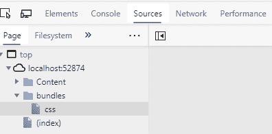

# 样式表-在 ASP.NET MVC 中组合 CSS 文件

> 原文：<https://www.tutorialsteacher.com/mvc/stylebundle-mvc>

在这里，您将学习如何组合多个 CSS(级联样式表)文件，以便在一个 HTTP 请求中返回它。

ASP.NET MVC API 包括 [StyleBundle](https://docs.microsoft.com/en-us/previous-versions/aspnet/jj646585(v=vs.110)) 类，做 CSS 缩小和捆绑。与[脚本包](/mvc/scriptbundle-mvc)相同，所有的样式包都应该在`BundleConfig`类中创建。 在`App_Start`文件夹下。

下面的例子展示了如何将多个 CSS 文件组合成一个包。

Example: Create Style Bundle 

```
public class BundleConfig
{
    public static void RegisterBundles(BundleCollection bundles)
    {            
        bundles.Add(new StyleBundle("~/bundles/css").Include(
                                                    "~/Content/bootstrap.css",
                                                    "~/Content/site.css"
                                                ));
        // add ScriptBundle here..  

    }
} 
```

在上面的例子中，我们通过创建`StyleBundle`类的实例创建了一个新的样式包，并在构造器中指定了虚拟路径和包名。 `~/bundles/`是虚拟路径，`css`是捆绑名称。 然后，我们在这个包中添加了两个`.css`文件，`bootstrap.css`和`site.css`。 使用`bundles.Add()`方法将新捆添加到`BundleCollection`中。 默认情况下，上述`css`捆绑包将在发布模式下创建。如果您想在调试模式下查看包，请使用`BundleTable.EnableOptimizations = true`。

现在，要将上述`css`捆绑包包含在您的网页中，请在[布局视图](/mvc/layout-view-in-asp.net-mvc)中使用`Styles.Render()`方法，如下所示。

Example: Include Style Bundle in View 

```
<!DOCTYPE html>
<html>
<head>
    <meta charset="utf-8" />
    <meta name="viewport" content="width=device-width, initial-scale=1.0">
    <title>@ViewBag.Title - My ASP.NET Application</title>
    **@Styles.Render("~/bundles/css")**
</head>
<body>
    @*html code removed for clarity *@
</body>
</html> 
```

现在，当您在发布模式下运行应用时，您将看到在一个请求中创建并加载了包。

[](../../Content/images/mvc/style-bundle.png) 

您可以使用`IncludeDirectory()`方法、版本通配符`{version}`，以及与[脚本包](/mvc/scriptbundle-mvc)相同的 CDN 路径。 学习[如何在 StyleBundle](/articles/how-to-set-image-path-in-style-bundle) 中设置图像路径。

*Note:**ASP.NET MVC framework calls the `BundleConfig.RegisterBundle()` from the `Application_Start` event in the `Global.asax.cs` file. So, all the bundles are added into the `BundleCollection` at the starting of an application.***