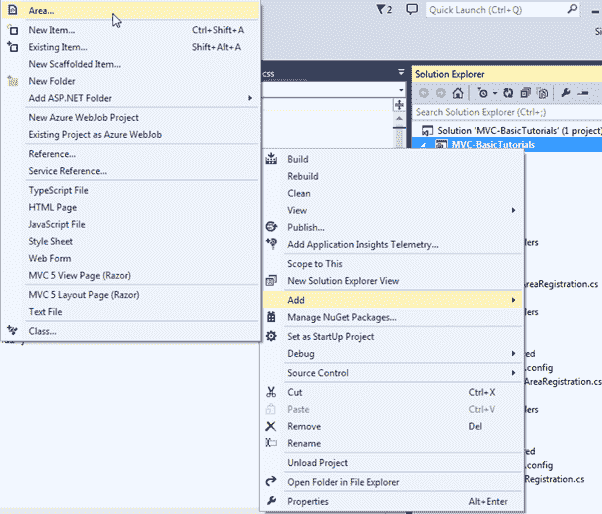
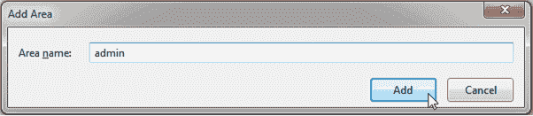
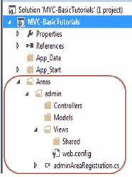

# ASP.NET MVC 中的区域

> 原文：<https://www.tutorialsteacher.com/mvc/area-in-asp.net-mvc>

在这里，您将了解 ASP.NET MVC 应用程序中的一个区域是什么，以及如何创建它。

大型 ASP.NET MVC 应用程序包括许多控制器、视图和模型类。所以用默认的 ASP.NET MVC 项目结构很难维护它。ASP.NET MVC 为此引入了一个名为 Area 的新特性。区域允许我们将大型应用程序划分成更小的单元，其中每个单元包含一个单独的 MVC 文件夹结构，与默认的 MVC 文件夹结构相同。例如，大型企业应用程序可能有不同的模块，如管理、财务、人力资源、营销等。因此一个区域可以包含所有这些模块的单独的 MVC 文件夹结构，如下所示。

[](../../Content/images/mvc/area-1.png)

Multiple Areas in ASP.NET MVC Application


## 创建区域

您可以通过在解决方案资源管理器中右键单击项目来创建区域-> `Add` - > `Area..`，如下所示。

[](../../Content/images/mvc/create-area.png)

在`Add Area`对话框中输入区域名称，点击添加按钮。

[](../../Content/images/mvc/area-2.png)

这将在`Area`文件夹下添加一个`admin`文件夹，如下图所示。

[](../../Content/images/mvc/area-3.png)

可以看到，每个区域都包含`AreaRegistration`类。 以下是用管理区创建的`adminAreaRegistration`类。

Example: Area Registration 

```
public class adminAreaRegistration : AreaRegistration 
{
    public override string AreaName 
    {
        get 
        {
            return "admin";
        }
    }

    public override void RegisterArea(AreaRegistrationContext context) 
    {
        context.MapRoute(
            "admin_default",
            "admin/{controller}/{action}/{id}",
            new { action = "Index", id = UrlParameter.Optional }
        );
    }
} 
```

`AreaRegistration`类覆盖`RegisterArea`方法来绘制该区域的路线。在上面的例子中，任何以 admin 开头的 URL 都将被包含在`Area`文件夹下的 admin 文件夹结构中的控制器处理。 例如，`http://localhost/admin/profile`将由包含在`Areas/admin/controller/ProfileController`文件夹中的配置文件控制器处理。

最后，所有区域必须在`Global.asax.cs`的`Application_Start`事件中注册为`AreaRegistration.RegisterAllAreas();`。

因此，通过这种方式，您可以为大型应用程序创建和维护多个区域。*