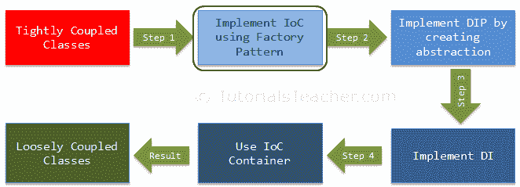
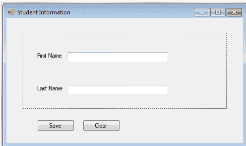
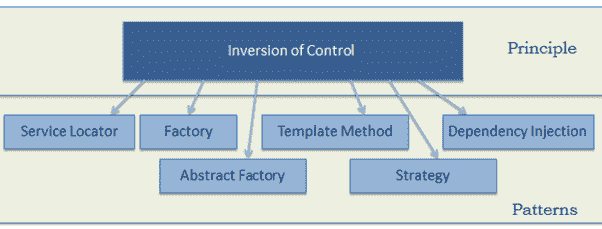

# 控制反转

> 原文：<https://www.tutorialsteacher.com/ioc/inversion-of-control>

在本章中，我们将了解 IoC 以及如何实现它。这是实现松耦合设计的第一步，如下图所示:

[](../../Content/images/ioc/ioc-step1.png)

控制反转(IoC)是一种设计原则(虽然，有人称之为模式)。顾名思义，它用于在面向对象设计中反转不同种类的控件，以实现松散耦合。这里，控制指的是一个类除了它的主要职责之外的任何额外职责。这包括对应用程序流程的控制，以及对对象创建或相关对象创建和绑定流程的控制。

IoC 就是反转控件。用外行人的话来解释，假设你开车去上班的地方。这意味着你控制了汽车。IoC 原则建议颠倒控制，意思是你不用自己开车，而是租一辆出租车，由另一个人来开。因此，这被称为控制反转——从你到司机。你不必自己开车，你可以让司机开车，这样你就可以专注于你的主要工作。

IoC 原则有助于设计松散耦合的类，使它们可测试、可维护和可扩展。

让我们理解 IoC 是如何反转不同种类的控件的。

### 对程序流程的控制

在典型的 C# 控制台应用程序中，执行从 Main()函数开始。Main()函数控制程序的流程，或者说，控制用户交互的顺序。考虑以下简单的控制台程序。

Example: Program Flow - C# 

```
namespace FlowControlDemo
{
    class Program
    {
        static void Main(string[] args)
        {
           bool continueExecution = true;
            do
            {
                Console.Write("Enter First Name:");
                var firstName = Console.ReadLine();

                Console.Write("Enter Last Name:");
                var lastName = Console.ReadLine();

                Console.Write("Do you want to save it? Y/N: ");

                var wantToSave = Console.ReadLine();

                if (wantToSave.ToUpper() == "Y")
                    SaveToDB(firstName, lastName);

                Console.Write("Do you want to exit? Y/N: ");

                var wantToExit = Console.ReadLine();

                if (wantToExit.ToUpper() == "Y")
                    continueExecution = false;

            }while (continueExecution);

        }

        private static void SaveToDB(string firstName, string lastName)
        {
            //save firstName and lastName to the database here..
        }
    }
} 
```

在上面的例子中，程序类的 Main()函数控制程序的流程。它接受用户对名字和姓氏的输入。它保存数据，并根据用户的输入继续或退出控制台。所以这里通过`Main()`功能控制流量。

IoC 可以通过创建一个基于 GUI 的应用程序应用于上述程序，例如下面的基于 windows 的应用程序，其中框架将通过使用事件来处理程序的流程。

[](../../Content/images/ioc/winform.png)

这是一个在程序流程中实现 IoC 的简单例子。

### 对从属对象创建的控制

当我们创建依赖类的对象时，也可以应用 IoC。首先，让我们理解这里的依赖是什么意思。

考虑下面的例子。

```
public class A
{
    B b;

    public A()
    {
        b = new B();
    }

    public void Task1() {
        // do something here..
        b.SomeMethod();
        // do something here..
    }

}

public class B {

    public void SomeMethod() { 
        //doing something..
    }
} 
```

在上例中，A 类调用 b.SomeMethod()来完成它的任务 1。A 类没有 B 类就无法完成任务，所以你可以说“A 类依赖 B 类”或者“B 类是 A 类的依赖”。

在面向对象的设计方法中，类需要相互交互才能完成应用程序的一个或多个功能，如上面的例子——类 A 和类 b。类 A 创建和管理类 b 的对象的生命周期。本质上，它控制依赖类的对象的创建和生命周期。

IoC 原则建议反转控件。这意味着将控件委托给另一个类。换句话说，将依赖项创建控件从类 A 反转到另一个类，如下所示。

```
public class A
{
    B b;

    public A()
    {
        b = Factory.GetObjectOfB ();
    }

    public void Task1() {
        // do something here..
        b.SomeMethod();
        // do something here..
    }
}

public class Factory
{
    public static B GetObjectOfB() 
    {
        return new B();
    }
} 
```

如上所述，类 A 使用工厂类来获取类 b 的对象。因此，我们将依赖对象的创建从类 A 反转到了工厂。A 类不再创建 B 类的对象，而是使用工厂类来获取 B 类的对象。

让我们用一个更实际的例子来理解这一点。

在面向对象的设计中，类应该以松散耦合的方式设计。松散耦合意味着一个类中的变化不应该迫使其他类发生变化，因此整个应用程序可以变得可维护和可扩展。让我们通过使用典型的 n 层体系结构来理解这一点，如下图所示:

[](../../Content/images/ioc/demo-architecture.png)

在典型的 n 层架构中，用户界面使用服务层来检索或保存数据。服务层使用`BusinessLogic`类对数据应用业务规则。`BusinessLogic`类依赖于`DataAccess`类，该类检索数据或将数据保存到底层数据库。这是简单的 n 层架构设计。 我们来关注一下`BusinessLogic`和`DataAccess`两个班，了解一下 IoC。

以下是客户的`BusinessLogic`和`DataAccess`课程示例。

```
public class CustomerBusinessLogic
{
    DataAccess _dataAccess;

    public CustomerBusinessLogic()
    {
        _dataAccess = new DataAccess();
    }

    public string GetCustomerName(int id)
    {
        return _dataAccess.GetCustomerName(id);
    }
}

public class DataAccess
{
    public DataAccess()
    {
    }

    public string GetCustomerName(int id) {
        return "Dummy Customer Name"; // get it from DB in real app
    }
} 
```

上例可以看到，`CustomerBusinessLogic`类依赖于`DataAccess`类。它创建了一个`DataAccess`类的对象来获取客户数据。

现在，让我们了解一下上面的课有什么问题。

在上例中，`CustomerBusinessLogic`和`DataAccess`是紧密耦合的类，因为`CustomerBusinessLogic`类包含了具体`DataAccess`类的引用。它还创建了一个`DataAccess`类的对象，并管理该对象的生存期。

上述示例类中的问题:

1.  `CustomerBusinessLogic`和`DataAccess`类是紧密耦合的类。所以，`DataAccess`班的变化会导致`CustomerBusinessLogic`班的变化。例如，如果我们在`DataAccess`类中添加、移除或重命名任何方法，那么我们需要相应地改变`CustomerBusinessLogic`类。
2.  假设客户数据来自不同的数据库或 web 服务，未来我们可能需要创建不同的类，因此这将导致`CustomerBusinessLogic`类的变化。
3.  `CustomerBusinessLogic`类使用**新的**关键字创建`DataAccess`类的对象。可能有多个类使用`DataAccess`类并创建其对象。 所以，如果你改变类名，那么你需要在你的源代码中找到你创建`DataAccess`对象的所有地方，并在整个代码中进行改变。 这是用于创建相同类的对象并维护它们的依赖关系的重复代码。
4.  因为`CustomerBusinessLogic`类创建了具体`DataAccess`类的一个对象，所以不能独立测试(TDD)。`DataAccess`课不能用模拟课代替。

为了解决上述所有问题并获得松散耦合的设计，我们可以一起使用 IoC 和 DIP 原理。请记住，IoC 是一种原则，而不是一种模式。它只是给出了高级设计准则，但没有给出实现细节。你可以随心所欲地实施 IoC 原则。

以下模式(但不限于)实施 IoC 原则。

[](../../Content/images/ioc/ioc-patterns.png)

让我们在上面的例子中使用*工厂*模式来实现 IoC，作为实现松散耦合类的第一步。

首先，创建一个简单的工厂类，它返回一个如下所示的`DataAccess`类的对象。

Example: DataAccess Factory - C# 

```
public class DataAccessFactory
{
    public static DataAccess GetDataAccessObj() 
    {
        return new DataAccess();
    }
} 
```

现在，使用`CustomerBusinessLogic`类中的这个`DataAccessFactory`类来获取`DataAccess`类的一个对象。

Example: Use Factory Class to Retrieve Object - C# 

```
public class CustomerBusinessLogic
{

    public CustomerBusinessLogic()
    {
    }

    public string GetCustomerName(int id)
    {
        DataAccess _dataAccess =  DataAccessFactory.GetDataAccessObj();

        return _dataAccess.GetCustomerName(id);
    }
} 
```

如您所见，`CustomerBusinessLogic`类使用`DataAccessFactory.GetCustomerDataAccessObj()`方法来获取`DataAccess`类的对象，而不是使用*新的*关键字来创建它。 因此，我们已经将创建依赖类的对象的控制从`CustomerBusinessLogic`类反转为`DataAccessFactory`类。

这是 IoC 的简单实现，也是实现完全松耦合设计的第一步。如前一章所述，我们不会仅仅通过使用 IoC 来实现完整的松散耦合类。除了 IoC，我们还需要使用 DIP、策略模式和依赖注入。

让我们进入第二步，在下一章中了解 DIP 以及它如何帮助实现松耦合设计。***