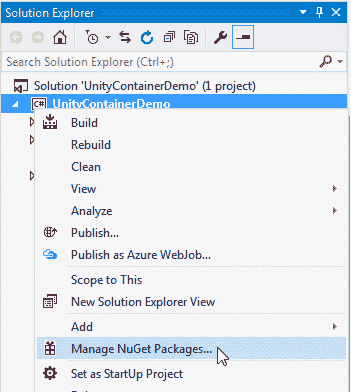
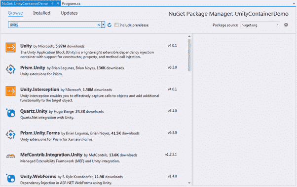
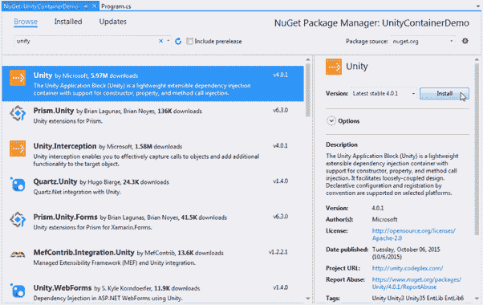
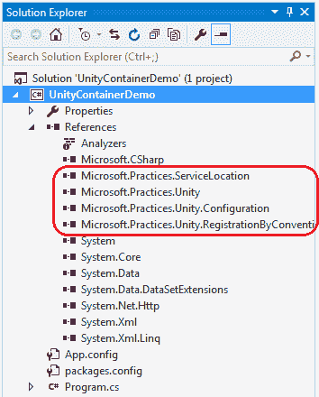

# 在 Visual Studio 中安装统一容器

> 原文：<https://www.tutorialsteacher.com/ioc/install-unity-container>

在这里，我们将使用 NuGet 在 Visual Studio 中安装 Unity 容器。

首先，我们需要创建一个项目来使用 Unity。它可以是任何类型的项目，如类库、控制台、网站、窗口或任何其他 C# 或 VB.NET 项目。我们将创建一个控制台应用程序来演示统一容器。因此，从 Visual Studio 的“开始”页面中单击“新建项目”。它将打开如下所示的*新项目*弹出窗口。

输入项目名称和位置，然后单击“确定”。这将创建一个新的控制台应用程序项目。

现在，我们需要在这个项目中安装 Unity，以便能够在项目中使用依赖注入。因此，右键单击解决方案资源管理器中的项目节点，并选择“管理 NuGet 包”，如下所示。

现在，我们可以从 NuGet 的浏览选项卡中搜索 Unity。在搜索框中输入“unity”，它会列出所有包含“unity”这个词的库或插件，如下所示。

现在，点击右窗格中的**安装**按钮，如下图所示。

这将把 Unity 的所有引用添加到您的项目中，如下所示。

现在，我们准备使用 Unity 在我们的项目中实现自动依赖注入。