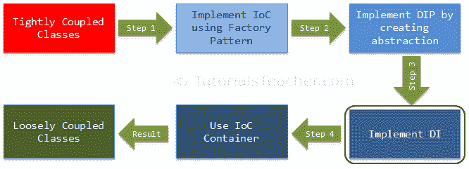
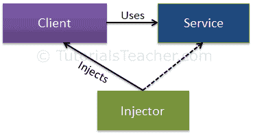
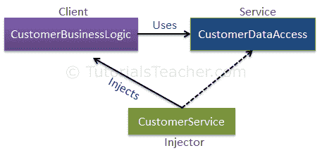

# 依赖注入

> 原文:[https://www.tutorialsteacher.com/ioc/dependency-injection](https://www.tutorialsteacher.com/ioc/dependency-injection)

在与 DIP 相关的前一章中，我们创建并使用抽象来使类松散耦合。在这里，我们将一起实现依赖注入和策略模式，以将依赖对象的创建完全移出类。这是我们使类完全松散耦合的第三步。

<figure>[](../../Content/images/ioc/ioc-step3.png)</figure>

依赖注入(DI)是一种用于实现 IoC 的设计模式。它允许在类外创建依赖对象，并通过不同的方式将这些对象提供给类。使用 DI，我们将依赖对象的创建和绑定移到依赖它们的类之外。

依赖注入模式涉及 3 种类型的类。

1.  **客户端类:**客户端类(依赖类)是依赖于服务类的类
2.  **服务类:**服务类(依赖)是为客户端类提供服务的类。
3.  **注入器类:**注入器类将服务类对象注入客户端类。

下图说明了这些类之间的关系:

<figure>[](../../Content/images/ioc/DI.png)

<figcaption>Dependency Injection</figcaption>

</figure>

如您所见，注入器类创建服务类的一个对象，并将该对象注入客户端对象。这样，DI 模式将创建服务类对象的责任从客户机类中分离出来。

## 依赖注入的类型

正如您在上面看到的，注入器类将服务(依赖)注入到客户端(依赖)。注入器类主要通过三种方式注入依赖关系:通过构造函数、通过属性或通过方法。

**构造函数注入:**在构造函数注入中，注入器通过客户端类构造函数提供服务(依赖)。

**属性注入:**在属性注入(又称 Setter 注入)中，注入器通过客户端类的公共属性提供依赖关系。

**方法注入:**在这种类型的注入中，客户端类实现一个接口，该接口声明提供依赖关系的方法，注入器使用该接口向客户端类提供依赖关系。

让我们举一个上一章的例子来保持连续性。在 DIP 的前一部分中，我们使用`CustomerBusinessLogic`类内部的 Factory 类来获取`CustomerDataAccess`对象的一个对象，如下所示。

```
public interface ICustomerDataAccess
{
    string GetCustomerName(int id);
}

public class CustomerDataAccess: ICustomerDataAccess
{
    public CustomerDataAccess() {
    }

    public string GetCustomerName(int id) {
        return "Dummy Customer Name";        
    }
}

public class DataAccessFactory
{
    public static ICustomerDataAccess GetCustomerDataAccessObj() 
    {
        return new CustomerDataAccess();
    }
}

public class CustomerBusinessLogic
{
    ICustomerDataAccess _custDataAccess;

    public CustomerBusinessLogic()
    {
        _custDataAccess = DataAccessFactory.GetCustomerDataAccessObj();
    }

    public string GetCustomerName(int id)
    {
        return _custDataAccess.GetCustomerName(id);
    }
} 
```

上面例子的问题是我们在`CustomerBusinessLogic`类里面使用了`DataAccessFactory`。 那么，假设有另一个`ICustomerDataAccess`的实现，我们想在`CustomerBusinessLogic`中使用这个新类。然后，我们还需要修改`CustomerBusinessLogic`类的源代码。 依赖注入模式通过构造函数、属性或接口注入依赖对象来解决这个问题。

下图说明了上述示例的 DI 模式实现。

<figure>[](../../Content/images/ioc/DI-example.png)

<figcaption>Dependency Injection</figcaption>

</figure>

如您所见，`CustomerService`类成为注入器类，它通过构造函数、属性或方法将服务类(CustomerDataAccess)的对象设置为客户端类(CustomerBusinessLogic)，以实现松散耦合。让我们来探索这些选项中的每一个。

## 构造函数注入

如前所述，当我们通过构造函数提供依赖关系时，这被称为构造函数注入。

考虑下面的例子，我们已经使用构造函数实现了 DI。

Example: Constructor Injection - C# 

```
public class CustomerBusinessLogic
{
    ICustomerDataAccess _dataAccess;

    public CustomerBusinessLogic(ICustomerDataAccess custDataAccess)
    {
        _dataAccess = custDataAccess;
    }

    public CustomerBusinessLogic()
    {
        _dataAccess = new CustomerDataAccess();
    }

    public string ProcessCustomerData(int id)
    {
        return _dataAccess.GetCustomerName(id);
    }
}

public interface ICustomerDataAccess
{
    string GetCustomerName(int id);
}

public class CustomerDataAccess: ICustomerDataAccess
{
    public CustomerDataAccess()
    {
    }

    public string GetCustomerName(int id) 
    {
        //get the customer name from the db in real application 
        return "Dummy Customer Name"; 
    }
} 
```

在上例中，`CustomerBusinessLogic`包含了一个参数类型为`ICustomerDataAccess`的构造函数。现在，调用类必须注入一个 ICustomerDataAccess 的对象。

Example: Inject Dependency - C# 

```
public class CustomerService
{
    CustomerBusinessLogic _customerBL;

    public CustomerService()
    {
        _customerBL = new CustomerBusinessLogic(new CustomerDataAccess());
    }

    public string GetCustomerName(int id) {
        return _customerBL.ProcessCustomerData(id);
    }
} 
```

如上例所示，`CustomerService`类创建了`CustomerDataAccess`对象并将其注入到`CustomerBusinessLogic`类中。 因此，`CustomerBusinessLogic`类不需要使用`new`关键字或使用工厂类来创建`CustomerDataAccess`的对象。 调用类(CustomerService)创建适当的数据访问类并将其设置为`CustomerBusinessLogic`类。这样，`CustomerBusinessLogic`和`CustomerDataAccess`类就变成了“更”松散耦合的类。

## 属性注入

在属性注入中，依赖项是通过公共属性提供的。考虑下面的例子。

Example: Property Injection - C# 

```
public class CustomerBusinessLogic
{
    public CustomerBusinessLogic()
    {
    }

    public string GetCustomerName(int id)
    {
        return DataAccess.GetCustomerName(id);
    }

    public ICustomerDataAccess DataAccess { get; set; }
}

public class CustomerService
{
    CustomerBusinessLogic _customerBL;

    public CustomerService()
    {
        _customerBL = new CustomerBusinessLogic();
        _customerBL.DataAccess = new CustomerDataAccess();
    }

    public string GetCustomerName(int id) {
        return _customerBL.GetCustomerName(id);
    }
} 
```

如上图所示，`CustomerBusinessLogic`类包含名为`DataAccess`的公共属性，在这里可以设置一个实现`ICustomerDataAccess`的类的实例。 所以，`CustomerService`类使用这个公共属性创建并设置`CustomerDataAccess`类。

## 方法注入

在方法注入中，依赖是通过方法提供的。此方法可以是类方法或接口方法。

下面的示例演示了使用基于接口的方法的方法注入。

Example: Interface Injection - C# 

```
interface IDataAccessDependency
{
    void SetDependency(ICustomerDataAccess customerDataAccess);
}

public class CustomerBusinessLogic : IDataAccessDependency
{
    ICustomerDataAccess _dataAccess;

    public CustomerBusinessLogic()
    {
    }

    public string GetCustomerName(int id)
    {
        return _dataAccess.GetCustomerName(id);
    }

    public void SetDependency(ICustomerDataAccess customerDataAccess)
    {
        _dataAccess = customerDataAccess;
    }
}

public class CustomerService
{
    CustomerBusinessLogic _customerBL;

    public CustomerService()
    {
        _customerBL = new CustomerBusinessLogic();
        ((IDataAccessDependency)_customerBL).SetDependency(new CustomerDataAccess());
    }

    public string GetCustomerName(int id) {
        return _customerBL.GetCustomerName(id);
    }
} 
```

在上例中，`CustomerBusinessLogic`类实现了`IDataAccessDependency`接口，其中包含了`SetDependency()`方法。 因此，注入器类`CustomerService`现在将使用这个方法向客户端类注入依赖类(CustomerDataAccess)。

因此，您可以使用 DI 和策略模式来创建松散耦合的类。

到目前为止，我们已经使用了几种原则和模式来实现松散耦合的类。在专业项目中，有许多依赖类，实现这些模式很耗时。这里，IoC 容器(又名 DI 容器)帮助我们。在下一章中了解 IoC 容器。

在这里了解更多关于 IoC 和依赖注入[的信息。](https://martinfowler.com/articles/injection.html "IoC & Dependency Injection")****