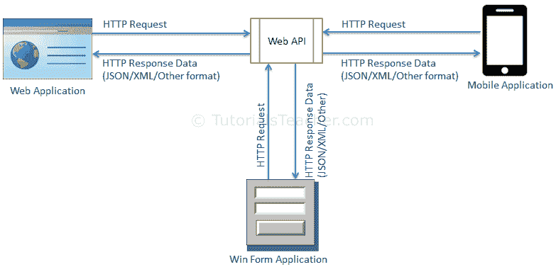

# 什么是 Web API？

> 原文:[https://www.tutorialsteacher.com/webapi/what-is-web-api](https://www.tutorialsteacher.com/webapi/what-is-web-api)

在了解什么是网络应用编程接口之前，我们先来看看什么是应用编程接口。

根据[维基百科对 API 的定义](https://en.wikipedia.org/wiki/Application_programming_interface):在计算机编程中，应用程序编程接口(API)是一组用于构建软件和应用程序的子程序定义、协议和工具。

简单地说，应用编程接口是一种接口，它有一组功能，允许程序员访问应用程序、操作系统或其他服务的特定功能或数据。

网络应用编程接口，顾名思义，是一个可以通过超文本传输协议访问的网络应用编程接口。这是一个概念，而不是技术。我们可以使用不同的技术来构建网络应用编程接口，例如 Java。NET 等。例如，twitter 的[REST API](https://dev.twitter.com/rest/public)提供了读写数据的编程访问，使用它我们可以将 Twitter 的功能集成到我们自己的应用程序中。

## ASP.NET 网页应用编程接口

ASP.NET 网络应用编程接口是一个可扩展的框架，用于构建基于超文本传输协议的服务，这些服务可以在网络、窗口、移动等不同平台上的不同应用程序中访问。它的工作方式与 ASP.NET MVC web 应用程序大致相同，只是它发送数据作为响应，而不是 html 视图。它像一个网络服务或 WCF 服务，但例外的是，它只支持 HTTP 协议。

Web API

## ASP.NET 网络应用编程接口的特点

1.  ASP.NET 网络应用编程接口是构建 RESTful 服务的理想平台。
2.  ASP.NET 网络应用编程接口建立在 ASP.NET 之上，支持 ASP.NET 请求/响应管道
3.  ASP.NET 网络应用编程接口将 HTTP 动词映射到方法名。
4.  ASP.NET 网络应用编程接口支持不同格式的响应数据。内置对 JSON、XML、BSON 格式的支持。
5.  ASP.NET 网络应用编程接口可以托管在 IIS，自托管或其他网络服务器支持。NET 4.0+。
6.  ASP.NET 网络应用编程接口框架包括新的 HttpClient 来与网络应用编程接口服务器通信。HttpClient 可以在 ASP 中使用。MVC 服务器端、Windows 窗体应用、控制台应用或其他应用。

### ASP.NET 网络应用编程接口版本

| 网络应用编程接口版本 | 支持。NET 框架 | 符合 | 支持于 |
| --- | --- | --- | --- |
| Web API 1.0 | 。NET 框架 4.0 | ASP.NET MVC 4 | VS 2010 |
| 网络应用编程接口 2 -当前 | 。NET 框架 4.5 | ASP.NET MVC 5 | VS 2012，2013 |

## ASP.NET 网络广告对 WCF

| Web API | 世界商会联合会 |
| --- | --- |
| 开源并附带。NET 框架。 | 船上有。NET 框架 |
| 仅支持 HTTP 协议。 | 支持 HTTP、TCP、UDP 和自定义传输协议。 |
| 将 http 谓词映射到方法 | 使用基于属性的编程模型。 |
| 使用类似于 ASP.NET MVC 的路由和控制器概念。 | 使用服务、运营和数据合同。 |
| 不支持可靠的消息传递和事务。 | 支持可靠的消息传递和事务。 |
| Web API 可以使用 HttpConfiguration 类配置，但不能在 web.config 中配置。 | 使用 web.config 和属性来配置服务。 |
| 非常适合构建 RESTful 服务。 | 支持 RESTful 服务，但有限制。 |

### 什么时候选择 WCF？

*   如果你使用，选择 WCF。NET 框架 3.5。Web API 不支持。NET 3.5 或更低版本。
*   如果您的服务需要支持多种协议，如 HTTP、TCP、命名管道，请选择 WCF。
*   如果您想使用 WS-*标准(如可靠消息传递、事务、消息安全)构建服务，请选择 WCF。
*   如果要使用请求-回复、单向和双工消息交换模式，请选择 WCF。

### 什么时候选择 ASP.NET Web API？

*   如果您正在使用，请选择网络应用编程接口。. NET framework 4.0 或以上版本。
*   如果您想构建一个只支持 HTTP 协议的服务，请选择网络应用编程接口。
*   选择网络应用编程接口来构建基于 RESTful HTTP 的服务。
*   如果你熟悉 ASP.NET MVC，选择 Web API。

在下一节中，让我们从使用 Visual Studio 创建一个简单的 ASP.NET 网络应用编程接口项目开始。