# 创建 Web API 项目

> 原文：<https://www.tutorialsteacher.com/webapi/create-web-api-project>

在这里，您将学习如何使用 Visual Studio 创建一个新的 ASP.NET Web API 项目。

您可以通过两种方式创建 Web API 项目。

1.  基于 MVC 项目的 Web API
2.  独立 Web API 项目

## 基于 MVC 项目的 Web API

Visual Studio (2013/2015/2017)包含 Web API 模板，该模板使用 ASP.NET MVC 应用创建了一个新的 Web API 项目，并包含了开始使用所需的所有参考。

为此，打开 Visual Studio，点击**文件**菜单，点击**新建项目。**这将打开如下所示的新项目弹出窗口。

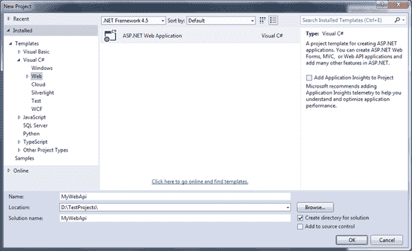

Create Web API project


在新建项目弹出窗口中，展开 **Visual C#** 并在左窗格中选择**网站**节点。在中间窗格选择**ASP.NET Web 应用**模板，输入项目名称，点击**确定**。 (ASP.NET Web 应用( .NET 框架)模板。)

这将打开新 ASP.NET 项目弹出窗口，如下所示。

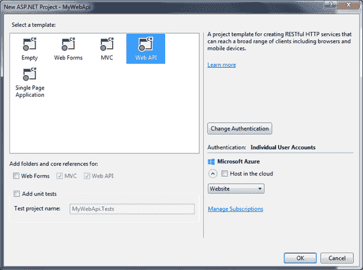

Select Web API Template


在上面的弹出窗口中选择 Web API。请注意，这已经选中并禁用了 MVC 和 Web API 复选框。这意味着它将为 MVC 和 Web API 添加必要的文件夹和引用。

单击“确定”创建一个新的 Web API+ MVC 项目，如下所示。

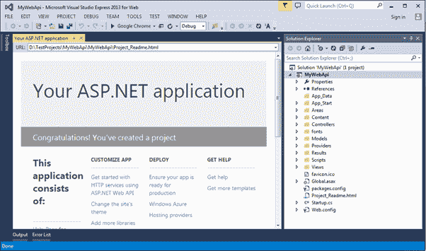

Web API project


该项目与默认 MVC 项目相同，有两个特定的 Web API 文件， **App_Start** 文件夹中的 WebApiConfig.cs 和**控制器**文件夹中的 ValuesController.cs，如下图所示。

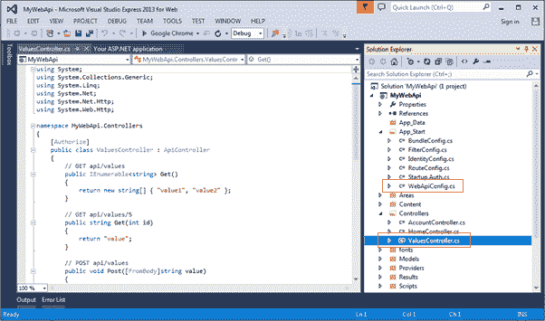

Web API project


WebApiConfig.cs 是 Web API 的配置文件。你可以为 Web API 配置路由和其他东西，就像 RouteConfig.cs 被用来配置 MVC 路由一样。默认情况下，它还创建 Web API 控制器值。在下一节中，您将了解网络配置和控制器。

因此，您可以用 MVC 创建 Web API 项目来开始您的应用。

## 独立 Web API 项目

在这里，我们将创建一个没有 MVC 项目的新的独立的 Web API 项目。

为此，打开 Visual Studio 2013 进行网页->转到**文件**菜单，选择**新项目..**这将打开如下所示的**新项目**弹出窗口。

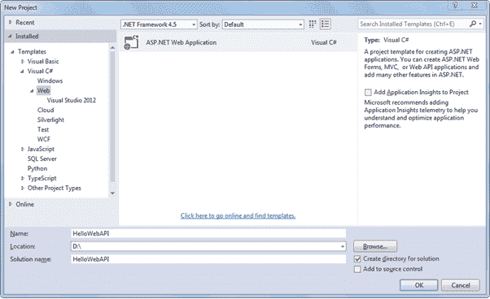

Create Web API Project


在左窗格中选择**网页**模板，在中间窗格中选择**ASP.NET 网页应用**。如上所示，输入项目名称、位置和解决方案名称。点击**确定**会弹出如下图。

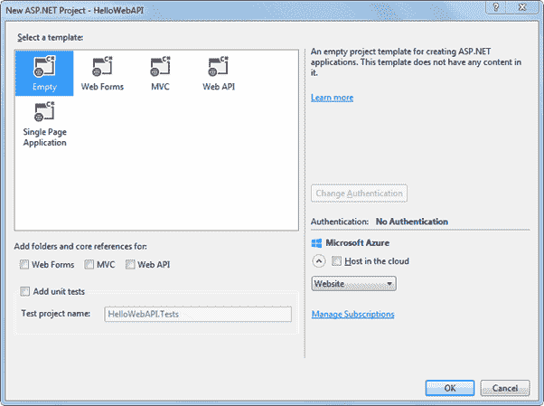

Select Project Template


在上面的弹出窗口中，选择**清空**作为模板，点击确定。这将创建一个空的“HelloWebAPI”项目。

现在，我们需要使用 **NuGet 包管理器**添加最新的 Web API 引用。右键单击项目，然后单击**管理新包..**如下图。

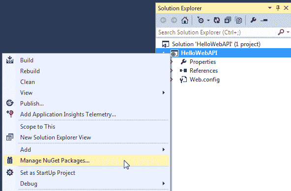

Open NuGet


这将打开管理新包弹出窗口。在左窗格中选择**在线**并搜索 webapi(确保互联网连接打开)。这将显示所有与 Web API 相关的包。选择**微软 ASP.NET 网 API2.2** 包，点击**安装**，如下图。

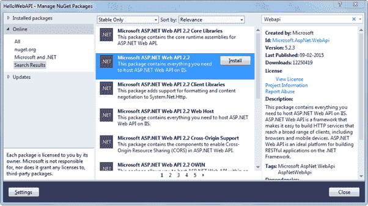

Install Web API Package


接受许可协议并继续。

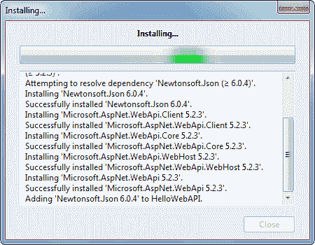

Install Web API Package


成功安装后，将显示以下 Web API 包。

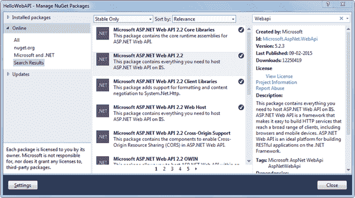

Web API Packages


现在，在 HelloWebAPI 项目中创建控制器和配置文件夹，如下所示。我们将在控制器文件夹中添加 Web API 控制器，并在配置文件夹中添加配置类。

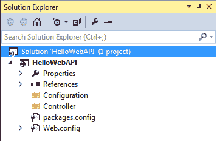

Web API Project


现在，在配置文件夹中添加一个新类，并用以下内容将其命名为“HelloWebAPIConfig”。(您可以给出任何合适的名称)

Example: Web API Configuration 

```cs
using System;
using System.Collections.Generic;
using System.Linq;
using System.Web;
using System.Web.Http;

namespace HelloWebAPI.Configuration
{
    public static class HelloWebAPIConfig
    {
        public static void Register(HttpConfiguration config)
        {
            // Web API routes
            config.MapHttpAttributeRoutes();

            config.Routes.MapHttpRoute(
                name: "DefaultApi",
                routeTemplate: "api/{controller}/{id}",
                defaults: new { id = RouteParameter.Optional }
            );
        }
    }
} 
```

现在，通过右键单击项目->选择添加->单击新建项目来添加 Global.asax..打开如下所示的添加新项目弹出窗口。选择全局应用类，然后单击确定。

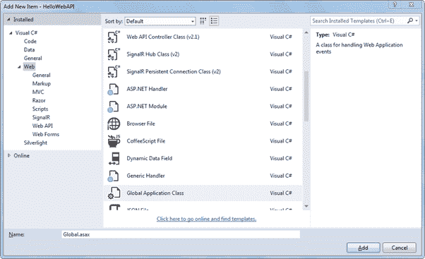

Add Global.asax


这将把 Global.asax 文件添加到项目中。当应用启动时，我们需要配置我们的 Web API 路由。所以叫 HelloWebAPIConfig。在全局变量中的 Application_Start 事件中注册()方法，如下所示。

Global.asax 

```cs
public class Global : System.Web.HttpApplication
{
    protected void Application_Start(object sender, EventArgs e)
    {
        GlobalConfiguration.Configure(HelloWebAPIConfig.Register);
    }
} 
```

Web API 仅使用基于代码的配置进行配置，该配置使用全局配置类。Configure()方法需要一个回调方法，您已经在该方法中配置了您的 Web API。

因此，当应用启动时，它将调用 Application_Start 事件，该事件又调用 HelloWebAPIConfig。注册()方法来配置您的 Web API。

现在，让我们通过右键单击控制器文件夹->选择控制器来添加 Web API 控制器..这将打开如下弹出窗口。

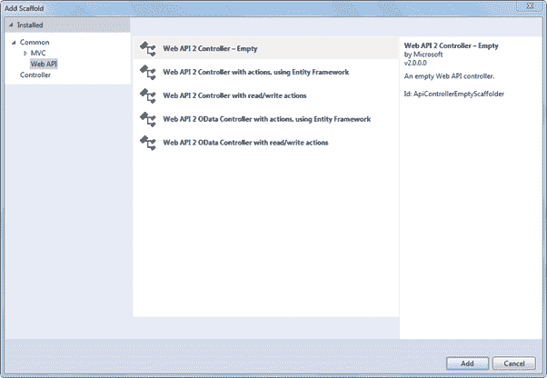

Add Web API Controller


在左窗格选择 Web API，在中间窗格选择 Web API 2 控制器-空，点击**添加**。这将打开另一个弹出窗口，输入控制器的名称，如下所示。输入控制器名称，点击**添加**。

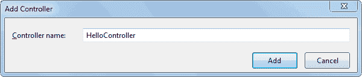

Enter Controller Name


这将在控制器文件夹中创建以下空的 HelloController 类。

Example: Web API Controller 

```cs
using System;
using System.Collections.Generic;
using System.Linq;
using System.Net;
using System.Net.Http;
using System.Web.Http;

namespace HelloWebAPI.Controller
{
    public class HelloController : ApiController
    {

    }
} 
```

现在，我们需要添加动作方法。在这里，我们将添加简单的 Get 动作方法，如下所示。

Example: Web API Controller 

```cs
using System;
using System.Collections.Generic;
using System.Linq;
using System.Net;
using System.Net.Http;
using System.Web.Http;

namespace HelloWebAPI.Controller
{
    public class HelloController : ApiController
    {
        public string Get()
        {
            return "Hello World";
        }
    }
} 
```

现在，编译并运行项目，在浏览器中导航至`http://localhost:xxxx/api/hello`。它将显示以下结果。(用本地端口号替换 xxxx)

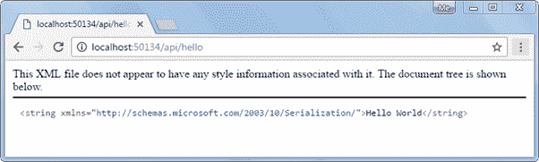

Access Web API in the Browser


因此，通过这种方式，您可以用配置和控制器类从头开始创建一个简单的 Web API。

在开发过程中，程序员经常需要对 Web API 的结果进行测试和检查。在下一节中学习如何测试 Web API 进行开发。****