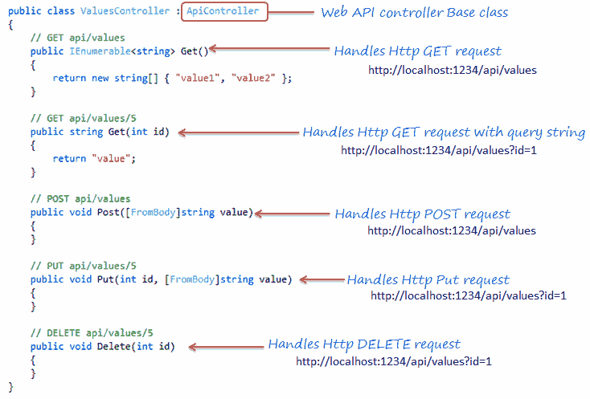

# Web API 控制器

> 原文：<https://www.tutorialsteacher.com/webapi/web-api-controller>

在前一节中，我们用 MVC 项目创建了 Web API，它生成了一个简单的控制器。在这里，您将详细了解 Web API 控制器。

Web API 控制器类似于 ASP.NET 的 MVC 控制器。它处理传入的 HTTP 请求，并将响应发送回调用者。

Web API 控制器是一个类，可以在**控制器**文件夹或项目根文件夹下的任何其他文件夹下创建。 控制器类的名称必须以“controller”结尾，并且必须源自 system . web . http .**API Controller**类。控制器的所有公共方法都称为动作方法。

下面是我们在[创建 Web API 项目](/webapi/create-web-api-project)部分新建 Web API 项目时，visual studio 默认添加的一个简单的控制器类。

Example: Simple Web API Controller 

```cs
using System;
using System.Collections.Generic;
using System.Linq;
using System.Net;
using System.Net.Http;
using System.Web.Http;

namespace MyWebAPI.Controllers
{
    public class ValuesController : ApiController
    {
        // GET: api/values
        public IEnumerable<string> Get()
        {
            return new string[] { "value1", "value2" };
        }

        // GET: api/values/5
        public string Get(int id)
        {
            return "value";
        }

        // POST: api/values
        public void Post([FromBody]string value)
        {
        }

        // PUT: api/values/5
        public void Put(int id, [FromBody]string value)
        {
        }

        // DELETE: api/values/5
        public void Delete(int id)
        {
        }
    }
} 
```

正如您在上面的例子中看到的，ValuesController 类是从 ApiController 派生的，并且包括多个动作方法，这些动作方法的名称与像 Get、Post、Put 和 Delete 这样的 HTTP 动词相匹配。

基于传入的请求 URL 和 HTTP 动词(GET/POST/PUT/PATCH/DELETE)，Web API 决定执行哪个 Web API 控制器和动作方法，例如 GET()方法将处理 HTTP GET 请求，POST()方法将处理 HTTP POST 请求，PUT()方法将处理 HTTP PUT 请求，DELETE()方法将处理上述 Web API 的 HTTP DELETE 请求。

下图说明了 Web API 控制器和动作方法的意义。

[](../../Content/images/webapi/webapi-controller.png)

Web API Controller Overview


如果您想编写不以 http 动词开头的方法，那么您可以在方法上应用适当的 HTTP 动词属性，例如 HttpGet、HttpGet、HttpPut 等。与 MVC 控制器相同。

Example: Simple Web API Controller 

```cs
using System;
using System.Collections.Generic;
using System.Linq;
using System.Net;
using System.Net.Http;
using System.Web.Http;

namespace MyWebAPI.Controllers
{
    public class ValuesController : ApiController
    {
        [HttpGet]
        public IEnumerable<string> Values()
        {
            return new string[] { "value1", "value2" };
        }

        [HttpGet]
        public string Value(int id)
        {
            return "value";
        }

        [HttpPost]
        public void SaveNewValue([FromBody]string value)
        {
        }

        [HttpPut]
        public void UpdateValue(int id, [FromBody]string value)
        {
        }

        [HttpDelete]
        public void RemoveValue(int id)
        {
        }
    }
} 
```

## Web API 控制器特性

1.  一定是从`System.Web.Http.ApiController`类派生出来的。
2.  它可以在项目根文件夹的任何文件夹下创建。但是，建议按照惯例在**控制器**文件夹中创建控制器类。
3.  动作方法名称可以与 HTTP 动词名称相同，也可以以任何后缀(区分大小写)的 HTTP 动词开头，或者您可以将 Http 动词属性应用于方法。
4.  动作方法的返回类型可以是任何基本类型或复杂类型。在这里了解更多。

## 动作方法命名约定

如上所述，动作方法的名称在 Web API 控制器中起着重要的作用。动作方法名称可以与 HTTP 动词相同，如 Get、Post、Put、Patch 或 Delete，如上面的 Web API Controller 示例所示。但是，为了更好的可读性，您可以用 HTTP 动词附加任何后缀。例如，Get 方法可以是 GetAllNames()，GetStudents()或任何其他以 Get 开头的名称。

下表列出了每个 HTTP 方法可能的动作方法名称:

| HTTP 方法 | 可能的 Web API 动作方法名称 | 使用 |
| --- | --- | --- |
| 得到 | GET()
GET()
GET()
T6【GetAllStudent()
*任何以 Get * 开头的名称 | retrieveddata。 |
| 邮政 | POST()
【POST()
【POST()
POST newstudent()
*任何以 Post* 开头的名称】 | 插入新记录。 |
| 放 | Put()
PUT()
PUT()
T6【PUT student()
*任何以 PUT 开头的名称* | 更新现有记录。 |
| 修补 | PATCH()
PATCH()
PATCH()
T6【PATCH student()
*任何以 Patch* 开头的名称】 | 部分更新记录。 |
| 删除 | Delete()
DELETE()
DELETE()
T6】DELETE student()
*任何以 DELETE 开头的名字* | 删除记录。 |

下图说明了整个请求/响应管道。

[](../../Content/images/webapi/webapi-request-pipeline.png)

Web API Request Pipeline


更多详情请访问 [Web API HTTP 消息生命周期海报](https://www.asp.net/media/4071077/aspnet-web-api-poster.pdf)。

## Web API 和 MVC 控制器的区别

| Web API 控制器 | MVC 控制器 |
| --- | --- |
| 源自系统。Web.Http.ApiController 类 | 源自系统。Web.Mvc.Controller 类。 |
| 方法名必须以 http 动词开头，否则应用 Http 动词属性。 | 必须应用适当的 Http 动词属性。 |
| 专门返回数据。 | 擅长渲染视图。 |
| 返回根据接受类型标题属性自动格式化的数据。默认为 json 或 xml。 | 返回操作结果或任何派生类型。 |
| 需要。. NET 4.0 或更高版本 | 需要 .NET 3.5 或更高版本 |**