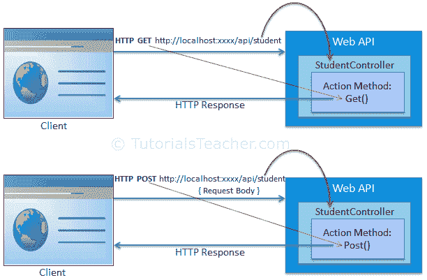

# Web API 路由

> 原文：<https://www.tutorialsteacher.com/webapi/web-api-routing>

在上一节中，我们了解到可以在 WebApiConfig 类中配置 Web API。在这里，我们将学习如何配置 Web API 路由。

Web API 路由类似于[ASP.NET MVC 路由](/mvc/routing-in-mvc)。它将传入的 HTTP 请求路由到 Web API 控制器上的特定动作方法。 T3】

Web API 支持两种类型的路由:

1.  基于约定的路由
2.  属性路由

## 基于约定的路由

在基于约定的路由中，Web API 使用路由模板来确定执行哪个控制器和动作方法。为了处理各种 HTTP 请求，路由表中必须至少添加一个路由模板。

当我们在[创建 WebAPI 项目](/webapi/create-web-api-project)部分使用 Web API 模板创建 Web API 项目时，它还在 App_Start 文件夹中添加了 WebApiConfig 类，默认路由如下所示。

Example: WebApiConfig with Default Route 

```cs
public static class WebApiConfig
{
    public static void Register(HttpConfiguration config)
    {
        // Enable attribute routing
        config.MapHttpAttributeRoutes();

        // Add default route using convention-based routing
        config.Routes.MapHttpRoute(
            name: "DefaultApi",
            routeTemplate: "api/{controller}/{id}",
            defaults: new { id = RouteParameter.Optional }
        );
    }
} 
```

在上面的网络配置中。Register()方法，`config.MapHttpAttributeRoutes()`启用属性路由，我们将在本节后面学习。`config.Routes`是[类型的路由表或路由集合](https://msdn.microsoft.com/en-us/library/system.web.http.httproutecollection(v=vs.118).aspx)。“DefaultApi”路由是使用 [MapHttpRoute()](https://msdn.microsoft.com/en-us/library/hh835153(v=vs.118).aspx) 扩展方法在路由表中添加的。 `MapHttpRoute()`扩展方法在内部创建一个新的[ihttprout](https://msdn.microsoft.com/en-us/library/system.web.http.routing.ihttproute(v=vs.118).aspx)实例，并将其添加到一个 HttpRouteCollection 中。 但是，您可以创建一条新路由，并将其手动添加到集合中，如下所示。

Example: Add Default Route 

```cs
public static class WebApiConfig
{
    public static void Register(HttpConfiguration config)
    {
        config.MapHttpAttributeRoutes();

        // define route
        IHttpRoute defaultRoute = config.Routes.CreateRoute("api/{controller}/{id}", 
                                            new { id = RouteParameter.Optional }, null);

        // Add route
        config.Routes.Add("DefaultApi", defaultRoute);

    }
} 
```

下表列出了 MapHttpRoute()方法的参数。

| 参数 | 描述 |
| --- | --- |
| 名字 | 路由名称 |
| routeTemplate | 路由的网址模式 |
| 默认 | 包含默认路径值的对象参数 |
| 限制 | 用于指定路由值特征的正则表达式 |
| 处理者 | 请求将被分派到的处理程序。 |

现在，让我们看看 Web API 如何处理传入的 http 请求并发送响应。

下面是一个示例 HTTP GET 请求。

Sample HTTP GET Request

```cs
GET http://localhost:1234/api/values/ HTTP/1.1
User-Agent: Fiddler
Host: localhost: 60464
Content-Type: application/json

```

考虑到在上面的 WebApiConfig 类中配置的 DefaultApi 路由，上面的请求将执行 ValuesController 的 GET()动作方法，因为 HTTP 方法是 Get，URL 是`http://localhost:1234/api/values`，它与 DefaultApi 的路由模板`/api/{controller}/{id}`相匹配，其中{controller}的值将是 ValuesController。 默认路由将 id 指定为可选参数，因此如果 url 中没有 id，则{id}将被忽略。请求的 HTTP 方法是 Get，因此它将执行 ValueController 的 GET()动作方法。

如果 Web API 框架没有为传入的请求找到匹配的路由，那么它将发送 404 错误响应。

下图说明了 Web API 路由。



Web API Routing


下表显示了将对不同的传入请求执行的动作方法和控制器。

| 请求网址 | 请求 HTTP 方法 | 动作方法 | 控制器 |
| --- | --- | --- | --- |
| `http://localhost:1234/api/course` | 得到 | Get() | 课程控制器 |
| `http://localhost:1234/api/product` | 邮政 | 帖子() | 产品控制器 |
| `http://localhost:1234/api/teacher` | 放 | 放() | 教师控制器 |

*Note:**Web API also supports routing same as ASP.NET MVC by including action method name in the URL.* *### 配置多条路由

我们在上面配置了一条路由。但是，您可以使用 HttpConfiguration 对象在 Web API 中配置多条路由。以下示例演示了如何配置多条路由。

Example: Multiple Routes 

```cs
public static class WebApiConfig
{
                public static void Register(HttpConfiguration config)
    {
        config.MapHttpAttributeRoutes();

                // school route
        config.Routes.MapHttpRoute(
            name: "School",
            routeTemplate: "api/myschool/{id}",
            defaults: new { controller="school", id = RouteParameter.Optional }
            constraints: new { id ="/d+" }
        );

                // default route
        config.Routes.MapHttpRoute(
            name: "DefaultApi",
            routeTemplate: "api/{controller}/{id}",
            defaults: new { id = RouteParameter.Optional }
        );
    }
} 
```

在上面的示例中，学校路由配置在默认 API 路由之前。因此，任何传入请求都将首先与 School 路由匹配，如果传入请求 url 与它不匹配，那么只有它将与 DefaultApi 路由匹配。例如请求 url 为`http://localhost:1234/api/myschool`与学校路由模板匹配，则由 SchoolController 处理。

Note: The reason to use api in the route template is just to avoid confusion between MVC controller and Web API controller. You can use any pattern based on your app architecture.

访问 ASP.NET，详细了解[路由](https://www.asp.net/web-api/overview/web-api-routing-and-actions/routing-in-aspnet-web-api)。

## 属性路由

Web API 2 支持属性路由。顾名思义，属性路由使用[Route()]属性来定义路由。`Route`属性可以应用于任何控制器或动作方法。

为了与 Web API 一起使用属性路由，必须通过调用`config.MapHttpAttributeRoutes()`方法在 WebApiConfig 中启用。

考虑以下属性路由的示例。

Example: Attribute Routing 

```cs
public class StudentController : ApiController
{
    [Route("api/student/names")]
                public IEnumerable<string> Get()
    {
                return new string[] { "student1", "student2" };
    }
} 
```

在上例中，`Route`属性定义了新的路由“API/student/name”，将由 StudentController 的 Get()动作方法处理。因此，一个 HTTP GET 请求`http://localhost:1234/api/student/names`将返回学生姓名列表。

访问 ASP.NET，详细了解[属性路由](https://www.asp.net/web-api/overview/web-api-routing-and-actions/attribute-routing-in-web-api-2)。*****