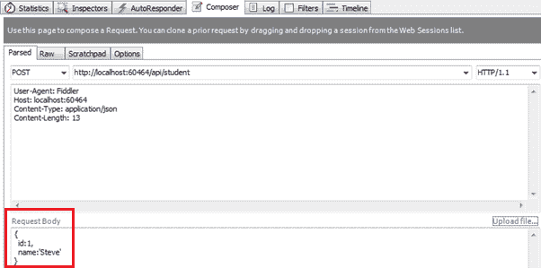
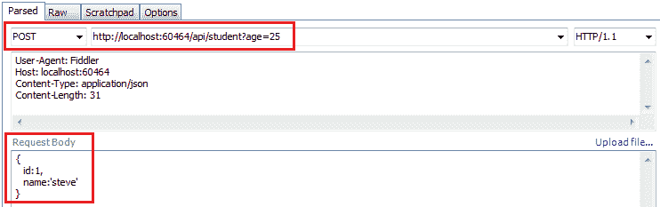
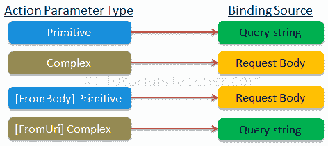

# ASP.NET 网络应用编程接口中的参数绑定

> 原文：<https://www.tutorialsteacher.com/webapi/parameter-binding-in-web-api>

在前一节中，我们学习了网络应用编程接口如何将 HTTP 请求路由到控制器和操作方法。在这里，我们将学习网络应用编程接口如何将 HTTP 请求数据绑定到操作方法的参数。

网络应用编程接口控制器中的动作方法可以有一个或多个不同类型的参数。它可以是基本类型，也可以是复杂类型。根据参数类型，Web API 将操作方法参数与 URL 的查询字符串或请求正文绑定在一起。

默认情况下，如果参数类型为。NET 基本类型，如 int、bool、double、string、GUID、DateTime、decimal 或任何其他可以从字符串类型转换的类型，然后它从查询字符串中设置参数的值。如果参数类型是复杂类型，那么默认情况下，网络应用编程接口会尝试从请求体中获取值。

下表列出了参数绑定的默认规则。

| HTTP 方法 | 查询字符串 | 请求正文 |
| --- | --- | --- |
| 得到 | 原始类型，
复杂类型 | 钠 |
| 邮政 | 原语类型 | 复数型 |
| 放 | 原语类型 | 复数型 |
| 修补 | 原语类型 | 复数型 |
| 删除 | 原始类型，
复杂类型 | 钠 |

让我们看看网络应用编程接口如何从 HTTP 请求中获取动作方法参数的值。

## 获取带有原始参数的操作方法

考虑以下包含单个图元类型参数的`GET`动作方法的示例。

Example: Primitive Parameter Binding 

```
public class StudentController : ApiController
{
    public Student Get(int id) 
    {

    }
} 
```

可以看到，上面的 HTTP `GET`动作方法包含了`int`类型的`id`参数。因此，网络应用编程接口将尝试从请求的网址的查询字符串中提取 id 的值，将其转换为 int，并将其分配给`GET`动作方法的`id`参数。 例如，如果一个 HTTP 请求是`http://localhost/api/student?id=1`，那么`id`参数的值将是 1。

以下是上述动作方法的有效 HTTP `GET`请求。

`http://localhost/api/student?id=1`

`http://localhost/api/student?ID=1`

*Note:**Query string parameter name and action method parameter name must be the same (case-insensitive). If names do not match, then the values of the parameters will not be set. The order of the parameters can be different.* *## 多个基本参数

考虑以下具有多个图元参数的`GET`动作方法的示例。

Example: Multiple Parameters Binding 

```
public class StudentController : ApiController
{
    public Student Get(int id, string name) 
    {

    }
} 
```

如上图所示，一个 HTTP `GET`方法包含多个原语类型参数。因此，网络应用编程接口将尝试从请求的网址的查询字符串中提取值。 例如，如果一个 HTTP 请求是`http://localhost/api/student?id=1&name=steve`，那么`id`参数的值将是 1，`name`参数将是`"steve"`。

以下是上述操作方法的有效 HTTP GET 请求。

`http://localhost/api/student?id=1&name=steve`

`http://localhost/api/student?ID=1&NAME=steve`

`http://localhost/api/student?name=steve&id=1`

*Note:**Query string parameter names must match with the name of an action method parameter. However, they can be in a different order.* *## 具有原始参数的后动作方法

一个 HTTP `POST`请求被用来创建一个新的资源。它可以将请求数据包含在 HTTP 请求正文和查询字符串中。

考虑下面的后动作方法。

Example: Post Method with Primitive Parameter 

```
public class StudentController : ApiController
{
    public Student Post(id id, string name)
    {

    }
} 
```

如上图所示，`Post()`动作方法包括图元类型参数 id 和名称。因此，默认情况下，网络应用编程接口将从查询字符串中获取值。 例如，如果一个 HTTP POST 请求是`http://localhost/api/student?id=1&name=steve`，那么在上面的`Post()`方法中，`id`参数的值将是 1，`name`参数将是`"steve"`。

现在，考虑以下带有复杂类型参数的`Post()`方法。

Example: Post Method with Complex Type Parameter 

```
public class Student
{
    public int Id { get; set; }
    public string Name { get; set; }
}

public class StudentController : ApiController
{
    public Student Post(Student stud)
    {

    }
} 
```

上述`Post()`方法包括`Student`类型参数。因此，作为默认规则，网络应用编程接口将尝试从 HTTP 请求正文中获取`stud`参数的值。

以下是提琴手中针对上述操作方法的有效 HTTP POST 请求。

[](../../Content/images/webapi/fiddler-example1.png) 

Parameter Binding


Web API 将从上面的 HTTP 请求体中提取 JSON 对象，并自动将其转换为`Student`对象，因为 JSON 对象的属性名称与`Student`类属性的名称匹配(不区分大小写)。

## 混合参数的开机自检方法

HTTP `Post`动作方法可以包括原语和复杂类型参数。考虑下面的例子。

Example: Post Method with Primitive and Complex Type Parameters 

```
public class Student
{
    public int Id { get; set; }
    public string Name { get; set; }
}

public class StudentController : ApiController
{
    public Student Post(int age, Student student)
    {

    }
} 
```

上面的 Post 方法包括基元和复杂类型参数。所以，默认情况下，Web API 会从查询字符串中获取`age`参数，从请求体中获取`student`参数。

以下是提琴手中针对上述操作方法的有效 HTTP POST 请求。

[](../../Content/images/webapi/post-request-fiddler.png) 

Parameter Binding


*Note:**Post action method cannot include multiple complex type parameters because, at most, one parameter is allowed to be read from the request body.* *Put 和 Patch 方法的参数绑定将与 Web API 中的`POST`方法相同。

## [FromUri]和[FromBody]

您已经看到，默认情况下，ASP.NET 网络应用编程接口从查询字符串中获取基本参数的值，从请求体中获取复杂类型参数的值。但是，如果我们想改变这种默认行为呢？

使用`[FromUri]`属性强制 Web API 从查询字符串中获取复杂类型的值，`[FromBody]`属性从请求体中获取原语类型的值，与默认规则相反。

比如考虑以下`GET`方法。

Example: FormUri 

```
public class StudentController : ApiController
{
    public Student Get([FromUri] Student stud)
    {

    }
} 
```

在上例中，`Get()`方法包含一个带有`[FromUri]`属性的复杂类型参数。因此，网络应用编程接口将尝试从查询字符串中获取`Student`类型参数的值。 例如，如果一个 HTTP GET 请求`http://localhost:xxxx/api/student?id=1&name=steve`那么网络应用编程接口将创建一个`Student`类型的对象，并将其`id`和`name`属性值设置为`id`和`name`查询字符串参数的值。

*Note:**The name of the complex type's properties and the query string parameters must match.* *同样，考虑以下`Post()`方法的例子。

Example: FromUri 

```
public class StudentController : ApiController
{
    public Student Post([FromUri]Student stud)
    {

    }
} 
```

如上图所示，我们已经应用了带有`Student`参数的`[FromUri]`属性。默认情况下，网络应用编程接口从请求体中提取复杂类型的值，但是在这里，我们应用了`[FromUri]`属性。 所以现在，网络应用编程接口将从查询字符串而不是请求正文中提取`Student`属性的值。

同样，应用`[FromBody]`属性从请求体而不是查询字符串中获取原语数据类型的值，如下所示。

Example: FromBody 

```
public class StudentController : ApiController
{
    public Student Post([FromBody]string name)
    {

    }
} 
```

以下是提琴手中针对上述操作方法的有效 HTTP POST 请求。

[](../../Content/images/webapi/post-request-fiddler2.png) 

Parameter Binding


*Note:**The `[FromBody]` attribute can be applied on only one primitive parameter of an action method. It cannot be applied to multiple primitive parameters of the same action method.* *下图总结了参数绑定规则。

[](../../Content/images/webapi/parameter-binding.png) 

Web API Parameter Bindings

*************