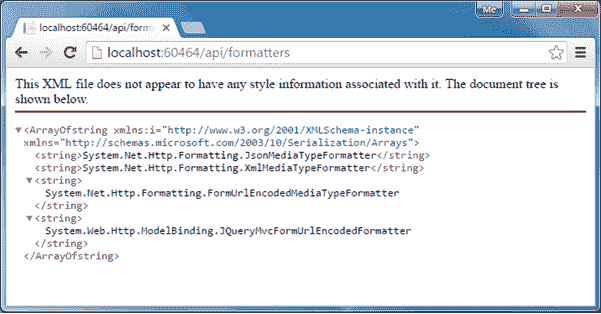

# ASP.NET 网络应用编程接口:媒体类型格式化程序

> 原文:[https://www.tutorialsteacher.com/webapi/web-api-formatters](https://www.tutorialsteacher.com/webapi/web-api-formatters)

正如您在上一节中看到的，网络应用编程接口基于接受和内容类型头来处理 JSON 和 XML 格式。但是，它如何处理这些不同的格式呢？答案是:通过使用媒体类型格式化程序。

媒体类型格式化程序是负责序列化请求/响应数据的类，以便网络应用编程接口能够理解请求数据格式，并以客户端期望的格式发送数据。

网络应用编程接口包括以下内置媒体类型格式化程序。

| 媒体类型格式化程序类 | MIME 类型 | 描述 |
| --- | --- | --- |
| JsonMediaTypeFormatter | 应用程序/json，文本/json | 处理 JSON 格式 |
| XmlMediaTypeFormatter | 应用程序/xml、文本/json | 处理 XML 格式 |
| FormUrlEncodedMediaTypeFormatter | 应用程序/x-www-form-urlencoded | 处理 HTML 表单的网址编码数据 |
| jquery ymvcformurlencodeformatter | 应用程序/x-www-form-urlencoded | 处理模型绑定的 HTML 表单 URL 编码数据 |

## 检索内置媒体类型格式化程序

如上所述，默认情况下，网络应用编程接口包括上面列出的媒体类型格式化程序类。但是，您也可以添加、删除或更改格式化程序的顺序。

下面的示例演示返回所有内置格式化程序类的 HTTP Get 方法。

Example: Retrieve Built-in Formatters in C#<button class="copy-btn pull-right" title="Copy example code">*Copy*</button> 

```
public class FormattersController : ApiController
{
    public IEnumerable<string> Get()
    {
        IList<string> formatters = new List<string>();

        foreach (var item in GlobalConfiguration.Configuration.Formatters)
        {
            formatters.Add(item.ToString());
        }

        return formatters.AsEnumerable<string>();
    }
} 
```

在上面的示例中，`GlobalConfiguration.Configuration.Formatters`返回包含所有格式化程序类的 MediaTypeFormatterCollection。上面的示例返回所有格式化程序类的名称，如下所示。

<figure>[](../../Content/images/webapi/formatters1.png)

<figcaption>Built-in Media-Type Formatters</figcaption>

</figure>

或者，MediaTypeFormatterCollection 类定义了便利属性，提供对四个内置媒体类型格式化程序中的三个的直接访问。下面的示例演示如何使用 MediaTypeFormatterCollection 的属性检索媒体类型格式化程序。

Example: Retrieve Built-in Formatters in C#<button class="copy-btn pull-right" title="Copy example code">*Copy*</button> 

```
public class FormattersController : ApiController
{
    public IEnumerable<string> Get()
    {
        IList<string> formatters = new List<string>();

        formatters.Add(GlobalConfiguration.Configuration.Formatters.JsonFormatter.GetType().FullName);
        formatters.Add(GlobalConfiguration.Configuration.Formatters.XmlFormatter.GetType().FullName);
        formatters.Add(GlobalConfiguration.Configuration.Formatters.FormUrlEncodedFormatter.GetType().FullName);

        return formatters.AsEnumerable<string>();
    }
} 
```

以上示例向浏览器返回以下响应。

<figure>[](../../Content/images/webapi/formatters2.png)

<figcaption>Media-Type Formatters</figcaption>

</figure>

### BSON 格式器

网络应用编程接口也支持 BSON 格式。顾名思义，BSON 是二进制 JSON，它是类似 JSON 文档的二进制编码序列化。目前对 BSON 的支持很少，在浏览器中运行的客户端也没有 JavaScript 实现。这意味着不可能检索 BSON 数据并自动将其解析为 JavaScript 对象。

网络应用编程接口包括内置的格式化程序类 BsonMediaTypeFormatter，适用于 BSON，但默认情况下被**禁用**。在网络应用编程接口[中了解更多关于 BSON 支持的信息。](https://www.asp.net/web-api/overview/formats-and-model-binding/bson-support-in-web-api-21)

### JSON 格式化程序

如上所述，Web API 包括处理 JSON 格式的 JsonMediaTypeFormatter 类。JsonMediaTypeFormatter 将 HTTP 请求中的 JSON 数据转换为 CLR 对象(C# 或 VB.NET 中的对象)，还将 CLR 对象转换为嵌入 HTTP 响应中的 JSON 格式。

在内部，JsonMediaTypeFormatter 使用名为[Json.NET](https://json.codeplex.com)的第三方开源库来执行序列化。

### 配置 JSON 序列化

JSON 格式化程序可以在 WebApiConfig 类中配置。JsonMediaTypeFormatter 类包括各种属性和方法，使用这些属性和方法可以自定义 JSON 序列化。例如，默认情况下，Web API 用 PascalCase 编写 JSON 属性名。要用 camelCase 编写 JSON 属性名，请在序列化程序设置上设置 camel casepropertynamescontresolver，如下所示。

Example: Customize JSON Serialization in C#<button class="copy-btn pull-right" title="Copy example code">*Copy*</button> 

```
public static class WebApiConfig
{
    public static void Register(HttpConfiguration config)
    {
        config.MapHttpAttributeRoutes();

        config.Routes.MapHttpRoute(
            name: "DefaultApi",
            routeTemplate: "api/{controller}/{id}",
            defaults: new { id = RouteParameter.Optional }
        );

        // configure json formatter
        JsonMediaTypeFormatter jsonFormatter = config.Formatters.JsonFormatter;

        jsonFormatter.SerializerSettings.ContractResolver = new CamelCasePropertyNamesContractResolver();
    }
} 
```

### XML 格式化程序

XmlMediaTypeFormatter 类负责将模型对象序列化为 XML 数据。它使用系统。生成 XML 数据的类。

在这里了解更多配置 JSON 和 XML 序列化[的信息。](https://www.asp.net/web-api/overview/formats-and-model-binding/json-and-xml-serialization)***