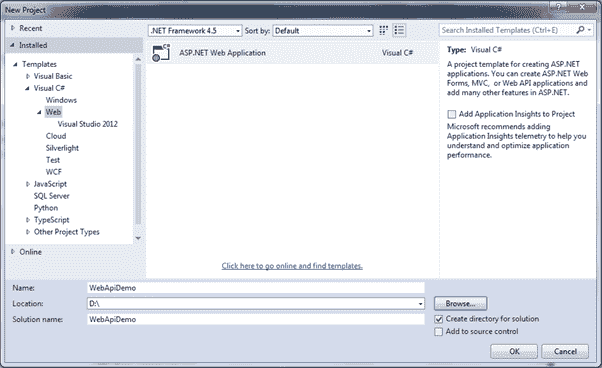
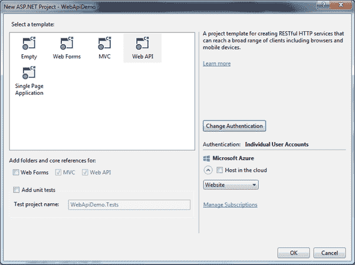
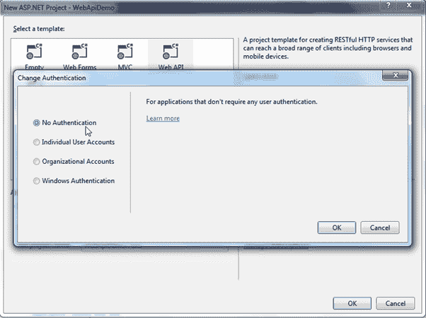
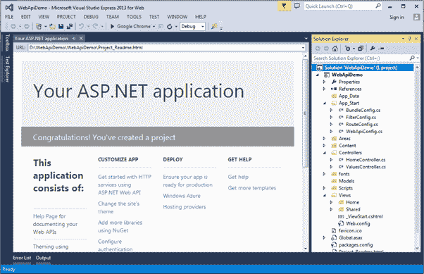
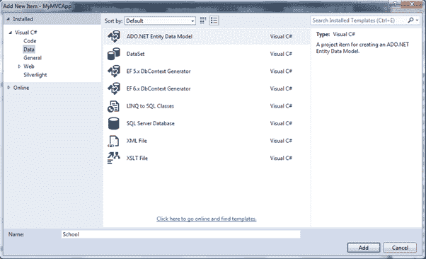
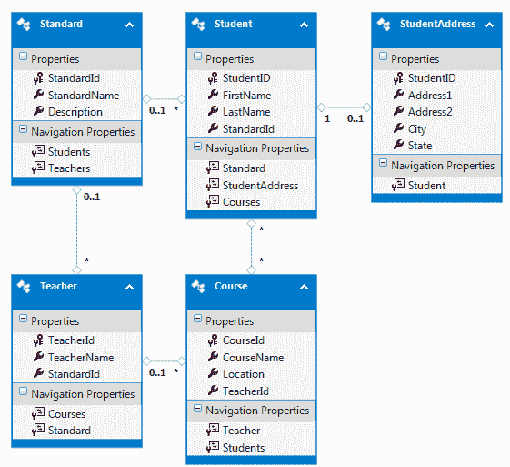
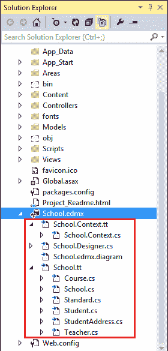
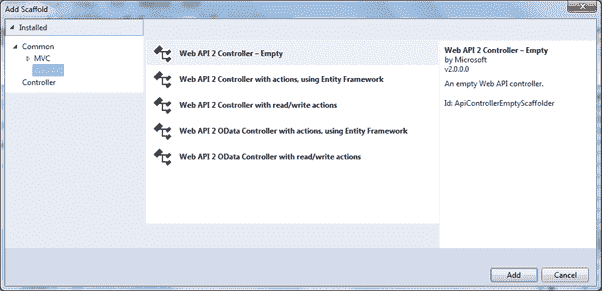
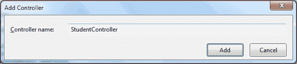
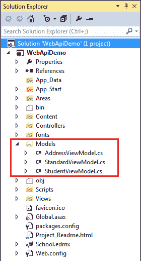

# 为 CRUD 操作创建 Web API——第 1 部分

> 原文：<https://www.tutorialsteacher.com/webapi/create-web-api-for-crud-operation>

在这里，我们将创建一个新的 Web API 项目，并使用实体框架为 CRUD 操作实现 GET、POST、PUT 和 DELETE 方法。

首先，在 Visual Studio 2013 中为 Web express 版创建一个新的 Web API 项目。

打开 Visual Studio 2013 进行 Web，点击**文件**菜单- > **新建项目..**这将打开新项目弹出窗口，如下所示。

[](../../Content/images/webapi/create-webapi-crud1.png)

Create Web API Project


在新建项目弹出窗口中，选择**下的**网页**模板。输入项目名称 WebApiDemo 和您想要创建项目的位置。点击**确定**继续。这将打开另一个弹出窗口来选择项目模板。选择如下所示的 Web API 项目。**

[](../../Content/images/webapi/create-webapi-crud2.png)

Select Web API Project Template


在这里，我们不打算在演示项目中使用任何身份验证。因此，点击**更改认证**按钮打开认证弹出窗口，选择**无认证**单选按钮，然后点击**确定**，如下图。

[](../../Content/images/webapi/create-webapi-crud3.png)

Change Authentication


现在，在新 ASP.NET 项目弹出窗口中点击**确定**，创建如下图所示的项目。

[](../../Content/images/webapi/create-webapi-crud4.png)

Web API Project


正如您所看到的，一个新的 WebApiDemo 项目创建时包含了所有必要的文件。它还添加了默认值控制器。因为，我们将添加新的 Web API 控制器，我们可以删除默认值控制器。

在这里，我们将使用实体框架数据库优先方法来访问现有的学校数据库。因此，让我们使用数据库优先方法为学校数据库添加 EF 数据模型。

### 添加实体框架数据模型

要使用数据库优先方法添加 EF 数据模型，右键单击您的项目->单击**新建项目..**这将打开如下所示的添加新项目弹出窗口。

[](../../Content/images/webapi/create-webapi-crud5.png)

Create Entity Data Model


在左窗格中选择**数据**，在中间窗格中选择**ADO.NET 实体数据模型**，输入数据模型名称，点击**添加**。 这将打开实体数据模型向导，您可以使用该向导为现有的学校数据库生成实体数据模型。[从 Github](https://github.com/entityframeworktutorial/EF6-DBFirst-Demo) 下载带有 Schoold 数据库的 EF 6 演示项目。本主题的范围仅限于 Web API，因此我们还没有讨论如何生成电火花加工。学习[如何在 EF 6](https://www.entityframeworktutorial.net/entityframework6/create-entity-data-model.aspx "Learn to create EDM in EF 6") 中创建实体数据模型。

完成实体数据模型向导的所有步骤后，实体框架将生成以下数据模型。

[](../../Content/images/webapi/ef-data-model.png)

Generated Entities in the EDM Designer


实体框架还生成实体和上下文类，如下所示。

[](../../Content/images/webapi/webapi-project.png)

.edmx in the Project


现在，我们准备在我们的 Web API 项目中使用实体框架实现 CRUD 操作。现在，让我们在项目中添加一个 Web API 控制器。

## 添加 Web API 控制器

要在 MVC 项目中添加 Web API 控制器，右键单击**控制器**文件夹或要添加 Web API 控制器的其他文件夹- >选择**添加** - >选择**控制器**。这将打开如下所示的**添加脚手架**弹出窗口。

[](../../Content/images/webapi/create-webapi-controller.png)

Create Web API Controller


在添加支架弹出窗口中，选择左窗格中的**Web API**，并选择中间窗格中的**Web API 2 控制器-清空**，然后单击**添加**。(我们选择空模板，因为我们计划自己添加动作方法和实体框架。)

这将打开**添加控制器**弹出窗口，您需要在其中输入控制器的名称。输入“学生控制器”作为控制器名称，点击**添加**，如下图。

[](../../Content/images/webapi/webapi-controller-name.png)

Create Web API Controller


这将添加一个空的 StudentController 类，如下所示。

Web API Controller 

```
using System;
using System.Collections.Generic;
using System.Linq;
using System.Net;
using System.Net.Http;
using System.Web.Http;

namespace MyMVCApp.Controllers
{
    public class StudentController : ApiController
    {

    }
} 
```

我们将在后面的章节中在这个控制器中实现 GET、POST、PUT 和 DELETE 动作方法。

### 添加模型

我们将使用实体框架访问底层数据库。正如您在上面看到的，EF 创建了自己的实体类。理想情况下，我们不应该从 Web API 返回 EF 实体对象。建议从 Web API 返回 d to(数据传输对象)。由于我们已经用 MVC 创建了 Web API 项目，我们也可以使用 MVC 模型类，它们将在 MVC 和 Web API 中使用。

在这里，我们将从我们的 Web API 返回学生、地址和标准。因此，在模型文件夹中创建 StudentViewModel、AddressViewModel 和 StandardViewModel，如下所示。

[](../../Content/images/webapi/create-webapi-crud6.png)

Models


以下是模型类。

Model Classes 

```
public class StudentViewModel
{
    public int Id { get; set; }
    public string FirstName { get; set; }
    public string LastName { get; set; }

    public AddressViewModel Address { get; set; }
    public StandardViewModel Standard { get; set; }
}

public class StandardViewModel
{
    public int StandardId { get; set; }
    public string Name { get; set; }

    public ICollection<StudentViewModel> Students { get; set; }
} 

public class AddressViewModel
{
    public int StudentId { get; set; }
    public string Address1 { get; set; }
    public string Address2 { get; set; }
    public string City { get; set; }
    public string State { get; set; }
} 
```

*Note:**ViewModel classes or DTO classes are just for data transfer from Web API controller to clients. You may name it as per your choice.* *现在，让我们在下一节中实现 Get 方法来处理各种 HTTP GET 请求。***