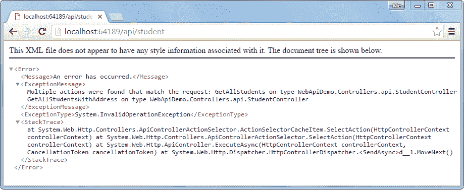
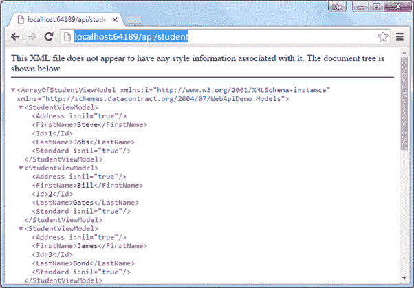
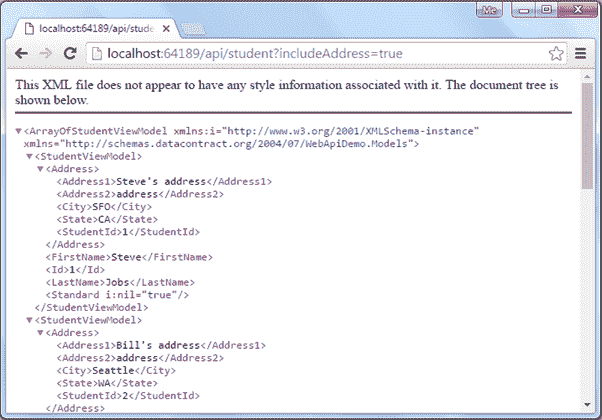
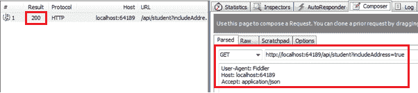
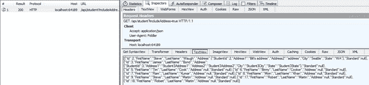

# 为 CRUD 操作创建网络应用编程接口-第 2 部分:实现获取方法

> 原文:[https://www . tutorial stearn . com/web API/implement-get-method-in-web-API](https://www.tutorialsteacher.com/webapi/implement-get-method-in-web-api)

本节是上一节的延续，我们在这一节中为我们的网络应用编程接口创建了必要的基础设施。

在本节中，我们将在处理 HTTP GET 请求的 Web API 控制器类中实现 Get 操作方法。

根据网络应用编程接口命名约定，以“获取”开头的动作方法将处理 HTTP 获取请求。我们可以只给它命名为 Get，也可以用任何后缀。让我们添加我们的第一个 Get 操作方法，并将其命名为 GetAllStudents，因为它将返回数据库中的所有学生。遵循适当的命名方法增加了可读性，任何人都可以容易地理解方法的目的。

`StudentController`类中的以下 GetAllStudents()操作方法(我们在上一节中创建的)使用 Entity Framework 从数据库中返回所有学生。

Example: Get Method in Web API Controller 

```
public class StudentController : ApiController
{
    public IHttpActionResult GetAllStudents ()
    {
        IList<StudentViewModel> students = null;

        using (var ctx = new SchoolDBEntities())
        {
            students = ctx.Students.Include("StudentAddress")
                        .Select(s => new StudentViewModel()
                        {
                            Id = s.StudentID,
                            FirstName = s.FirstName,
                            LastName = s.LastName
                        }).ToList<StudentViewModel>();
        }

        if (students.Count == 0)
        {
            return NotFound();
        }

        return Ok(students);
    }
} 
```

从上面的例子中可以看到，GetAllStudents()方法使用 EF 返回所有的学生。如果数据库中没有学生，那么它将返回 404 个未找到响应，否则它将返回 200 个包含学生数据的正常响应。ApiController 中定义的`NotFound()`和`Ok()`方法分别返回 404 和 200 响应。

在数据库中，每个学生都有零个或一个地址。假设，您想要实现另一个 get 方法来获取所有学生及其地址，那么您可以创建另一个 GET 方法，如下所示。

Example: Get Methods in Web API Controller 

```
public class StudentController : ApiController
{

    public IHttpActionResult GetAllStudents ()
    {
        IList<StudentViewModel> students = null;

        using (var ctx = new SchoolDBEntities())
        {
            students = ctx.Students.Include("StudentAddress")
                        .Select(s => new StudentViewModel()
                        {
                            Id = s.StudentID,
                            FirstName = s.FirstName,
                            LastName = s.LastName
                        }).ToList<StudentViewModel>();
        }

        if (students.Count == 0)
        {
            return NotFound();
        }

        return Ok(students);
    }

    public IHttpActionResult GetAllStudentsWithAddress()
    {
        IList<StudentViewModel> students = null;

        using (var ctx = new SchoolDBEntities())
        {
            students = ctx.Students.Include("StudentAddress").Select(s => new StudentViewModel()
            {
                Id = s.StudentID,
                FirstName = s.FirstName,
                LastName = s.LastName,
                Address = s.StudentAddress == null ? null : new AddressViewModel()
                {
                    StudentId = s.StudentAddress.StudentID,
                    Address1 = s.StudentAddress.Address1,
                    Address2 = s.StudentAddress.Address2,
                    City = s.StudentAddress.City,
                    State = s.StudentAddress.State
                }
            }).ToList<StudentViewModel>();
        }

        if (students.Count == 0)
        {
            return NotFound();
        }

        return Ok(students);
    }
} 
```

上面的网络应用编程接口例子将编译没有错误，但是当您执行 HTTP GET 请求时，它将响应以下发现错误的多个操作。

<figure>[](../../Content/images/webapi/multiple-action-error.png)

<figcaption>Web API Error</figcaption>

</figure>

这是因为不能有多个具有相同类型的相同数量参数的操作方法。以上两种动作方法都不包含任何参数。所以网络应用编程接口不知道对 HTTP GET 请求`http://localhost:64189/api/student`执行哪种方法。

下面的示例说明了如何处理这种情况。

Example: Get Method in Web API Controller 

```
public class StudentController : ApiController
{

    public StudentController()
    {
    }

    public IHttpActionResult GetAllStudents(bool includeAddress = false)
    {
        IList<StudentViewModel> students = null;

        using (var ctx = new SchoolDBEntities())
        {
            students = ctx.Students.Include("StudentAddress")
                       .Select(s => new StudentViewModel()
                        {
                            Id = s.StudentID,
                            FirstName = s.FirstName,
                            LastName = s.LastName,
                            Address = s.StudentAddress == null || includeAddress == false ? null : new AddressViewModel()
                            {
                                StudentId = s.StudentAddress.StudentID,
                                Address1 = s.StudentAddress.Address1,
                                Address2 = s.StudentAddress.Address2,
                                City = s.StudentAddress.City,
                                State = s.StudentAddress.State
                            }
                        }).ToList<StudentViewModel>();
        }

        if (students.Count == 0)
        {
            return NotFound();
        }

        return Ok(students);
    }
} 
```

如您所见，GetAllStudents 操作方法包含默认值为 false 的参数 includeAddress。如果一个 HTTP 请求在查询字符串中包含一个 includeAddress 参数，该参数的值为 true，那么它将返回所有学生及其地址，否则它将返回没有地址的学生。

例如`http://localhost:64189/api/student` (64189 是一个端口号，在你的本地可以不同)会返回所有没有地址的学生，如下图所示。

<figure>[](../../Content/images/webapi/implement-get1.png)

<figcaption>Access Web API GET Method in the Browser</figcaption>

</figure>

一个 HTTP 请求`http://localhost:64189/api/student?includeAddress=true`将返回所有学生，地址如下所示。

<figure>[](../../Content/images/webapi/implement-get2.png)

<figcaption>Access Web API GET Method in the Browser</figcaption>

</figure>

## 实现多种获取方法

如上所述，网络应用编程接口控制器可以包括多个具有不同参数和类型的获取方法。

让我们在 StudentController 中添加以下动作方法，演示 Web API 如何处理多个 HTTP GET 请求。

| 行动方法 | 目的 |
| --- | --- |
| getsstudent tbyid(int id) | 返回 id 与指定 id 匹配的学生。 |
| GetAllStudents（字符串名称） | 返回姓名与指定姓名匹配的学生列表。 |
| 最严格的测量标准(int standardid) | 返回符合指定标准的学生列表。 |

下面的示例实现了上述操作方法。

Example: Multiple Get Methods in Web API Controller 

```
public class StudentController : ApiController
{
    public StudentController()
    {
    }

    public IHttpActionResult GetAllStudents(bool includeAddress = false)
    {
        IList<StudentViewModel> students = null;

        using (var ctx = new SchoolDBEntities())
        {
            students = ctx.Students.Include("StudentAddress").Select(s => new StudentViewModel()
            {
                Id = s.StudentID,
                FirstName = s.FirstName,
                LastName = s.LastName,
                Address = s.StudentAddress == null || includeAddress == false ? null : new AddressViewModel()
                {
                    StudentId = s.StudentAddress.StudentID,
                    Address1 = s.StudentAddress.Address1,
                    Address2 = s.StudentAddress.Address2,
                    City = s.StudentAddress.City,
                    State = s.StudentAddress.State
                }
            }).ToList<StudentViewModel>();
        }

        if (students == null)
        {
            return NotFound();
        }

        return Ok(students);
    }

    public IHttpActionResult GetStudentById(int id)
    {
        StudentViewModel student = null;

        using (var ctx = new SchoolDBEntities())
        {
            student = ctx.Students.Include("StudentAddress")
                .Where(s => s.StudentID == id)
                .Select(s => new StudentViewModel()
                {
                    Id = s.StudentID,
                    FirstName = s.FirstName,
                    LastName = s.LastName
                }).FirstOrDefault<StudentViewModel>();
        }

        if (student == null)
        {
            return NotFound();
        }

        return Ok(student);
    }

    public IHttpActionResult GetAllStudents(string name)
    {
        IList<StudentViewModel> students = null;

        using (var ctx = new SchoolDBEntities())
        {
            students = ctx.Students.Include("StudentAddress")
                .Where(s => s.FirstName.ToLower() == name.ToLower())
                .Select(s => new StudentViewModel()
                {
                    Id = s.StudentID,
                    FirstName = s.FirstName,
                    LastName = s.LastName,
                    Address = s.StudentAddress == null ? null : new AddressViewModel()
                    {
                        StudentId = s.StudentAddress.StudentID,
                        Address1 = s.StudentAddress.Address1,
                        Address2 = s.StudentAddress.Address2,
                        City = s.StudentAddress.City,
                        State = s.StudentAddress.State
                    }
                }).ToList<StudentViewModel>();
        }

        if (students.Count == 0)
        {
            return NotFound();
        }

        return Ok(students);
    }

    public IHttpActionResult GetAllStudentsInSameStandard(int standardId)
    {
        IList<StudentViewModel> students = null;

        using (var ctx = new SchoolDBEntities())
        {
            students = ctx.Students.Include("StudentAddress").Include("Standard").Where(s => s.StandardId == standardId)
                        .Select(s => new StudentViewModel()
                        {
                            Id = s.StudentID,
                            FirstName = s.FirstName,
                            LastName = s.LastName,
                            Address = s.StudentAddress == null ? null : new AddressViewModel()
                            {
                                StudentId = s.StudentAddress.StudentID,
                                Address1 = s.StudentAddress.Address1,
                                Address2 = s.StudentAddress.Address2,
                                City = s.StudentAddress.City,
                                State = s.StudentAddress.State
                            },
                            Standard = new StandardViewModel()
                            {
                                StandardId = s.Standard.StandardId,
                                Name = s.Standard.StandardName
                            }
                        }).ToList<StudentViewModel>();
        }

        if (students.Count == 0)
        {
            return NotFound();
        }

        return Ok(students);
    }
} 
```

现在，上面的网络应用编程接口将处理以下 HTTP GET 请求。

| 获取请求网址 | 描述 |
| --- | --- |
| http://localhost:64189/API/student | 返回所有没有关联地址的学生。 |
| http://localhost:64189/API/student？includeAddress=false | 返回所有没有关联地址的学生。 |
| http://localhost:64189/API/student？includeAddress=true | 返回所有有地址的学生。 |
| http://localhost:64189/API/student？id=123 | 返回具有指定 id 的学生。 |
| http://localhost:64189/API/student？名字=史蒂夫 | 返回所有姓名为史蒂夫的学生。 |
| http://localhost:64189/API/student？standardId=5 | 返回所有第五标准的学生。 |

同样，您可以在网络应用编程接口中实现获取方法来处理不同的 HTTP 获取请求。

下图显示了 Fiddler 中的 HTTP GET 请求。

<figure>[](../../Content/images/webapi/implement-get3.png)

<figcaption>Http GET request in Fiddler</figcaption>

</figure>

下图显示了 Fiddler 中上述请求的 HTTP GET 响应。

<figure>[](../../Content/images/webapi/fiddler-response.png)

<figcaption>Http GET response in Fiddler</figcaption>

</figure>

接下来，在 Web API 中实现 Post 动作方法来处理 HTTP POST 请求。****