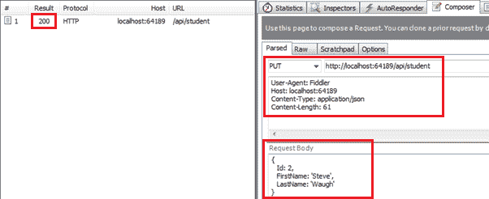

# 为 CRUD 操作创建 Web API——第 4 部分：实现`PUT`方法

> 原文：<https://www.tutorialsteacher.com/webapi/implement-put-method-in-web-api>

本节是前面三节的延续，我们在这三节中为 Web API 创建了必要的基础设施，并实现了 GET & POST 方法。这里，我们将在 Web API 中实现 PUT 方法。

HTTP PUT 方法用于在 RESTful 架构中更新数据源中的现有记录。

因此，让我们在学生控制器中创建一个动作方法，使用实体框架更新数据库中现有的学生记录。处理 HTTP PUT 请求的动作方法必须以单词 PUT 开头。它可以被命名为 PUT 或带有任何后缀，例如 Put()，Put()，PutStudent()，PutStudents()是处理 HTTP PUT 请求的动作方法的有效名称。

以下示例演示了处理 HTTP PUT 请求的 Put 动作方法。

Example: Put Method in Web API Controller 

```cs
public class StudentController : ApiController
{
    public StudentController()
    {
    }

    public IHttpActionResult Put(StudentViewModel student)
    {
        if (!ModelState.IsValid)
            return BadRequest("Not a valid model");

        using (var ctx = new SchoolDBEntities())
        {
            var existingStudent = ctx.Students.Where(s => s.StudentID == student.Id)
                                                    .FirstOrDefault<Student>();

            if (existingStudent != null)
            {
                existingStudent.FirstName = student.FirstName;
                existingStudent.LastName = student.LastName;

                ctx.SaveChanges();
            }
            else
            {
                return NotFound();
            }
        }

        return Ok();
    }
} 
```

如上图所示，Put 动作方法包含 StudentViewModel 的参数。然后，它使用传递的学生视图模型对象创建新的学生实体，然后更改要修改的状态。

现在，您可以使用 Fiddler 发送 HTTP PUT 请求，如下所示，并查看响应。

[](../../Content/images/webapi/fiddler-put-request.png)

Execute PUT request in Fiddler


从上图可以看到，HTTP PUT 请求在请求体中将 *StudentViewModel* 对象包含成 JSON 格式。成功执行后，响应状态为 200 正常。

接下来，在 Web API 中实现 Delete 动作方法来处理 HTTP DELETE 请求。*