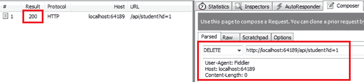

# 为 CRUD 操作创建网络应用编程接口-第 5 部分:实现删除方法

> 原文:[https://www . tutorial stearn . com/web API/implement-delete-method-in-web-API](https://www.tutorialsteacher.com/webapi/implement-delete-method-in-web-api)

本节是前面四节的延续，在这四节中，我们为网络应用编程接口创建了必要的基础设施，并实现了 GET、POST 和 PUT 方法。这里，我们将在网络应用编程接口中实现删除操作方法。

HTTP DELETE 请求用于在 RESTful 架构中删除数据源中的现有记录。

因此，让我们在学生控制器中创建一个操作方法，使用实体框架删除数据库中现有的学生记录。处理 HTTP DELETE 请求的操作方法必须以单词“DELETE”开始。它可以被命名为 DELETE 或带有任何后缀，例如 Delete()、DeleteStudent()、DeleteAllStudents()是处理 HTTP DELETE 请求的操作方法的有效名称。

下面的示例演示了处理 HTTP DELETE 请求的 Delete 操作方法。

Example: Delete Method in Web API Controller 

```
public class StudentController : ApiController
{

    public StudentController()
    {
    }

    public IHttpActionResult Delete(int id)
    {
        if (id <= 0)
            return BadRequest("Not a valid student id");

        using (var ctx = new SchoolDBEntities())
        {
            var student = ctx.Students
                .Where(s => s.StudentID == id)
                .FirstOrDefault();

            ctx.Entry(student).State = System.Data.Entity.EntityState.Deleted;
            ctx.SaveChanges();
        }

        return Ok();
    }
} 
```

如上所述，Delete action 方法包含一个 int 类型的 id 参数，因为它只需要一个 id 来删除一条记录。它从数据库中提取与指定 id 匹配的现有学生，然后将其状态标记为已删除。这将从数据库中删除一名学生。

现在，您可以使用 Fiddler 发送 HTTP DELETE 请求，如下所示，并查看响应。

[](../../Content/images/webapi/fiddler-delete-request.png)

Execute HTTP DELETE request in Fiddler


如上图所示，HTTP DELETE 请求 url `http://localhost:64189/api/student?id=1`包含查询字符串 id。此 id 查询字符串将作为 Delete()方法中的 id 参数传递。 成功执行后，响应状态为 200 正常。

因此，您可以创建 Get、POST、PUT 和 DELETE 方法来分别实现 HTTP GET、Post、Put 和 Delete 请求。

现在，在接下来的部分中，让我们将这个网络应用编程接口使用到 ASP.NET MVC 和 AngularJS 应用程序中。*