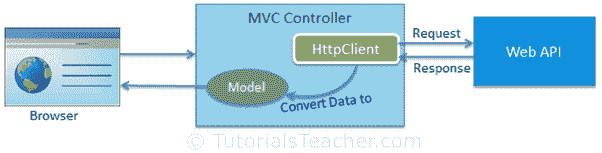
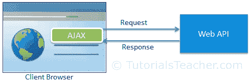

# 为 CRUD 操作使用网络应用编程接口

> 原文:[https://www . tutorial stearn . com/web API/consume-web-API-for-crud-operation](https://www.tutorialsteacher.com/webapi/consume-web-api-for-crud-operation)

在上一节中，我们用获取、发布、放置和删除方法创建了网络应用编程接口，分别处理 HTTP 获取、发布、放置和删除请求。在这里，我们将看到如何消费(访问)用于 CRUD 操作的 Web API。

Web API 可以在中的服务器端代码中访问。NET，也可以在客户端使用 JavaScript 框架，如 jQuery、AnguarJS、KnockoutJS 等。

在这里，我们将在以下环境中使用我们的网络应用编程接口(在前一节中创建):

1.  ASP.NET MVC 中的消费类网络应用编程接口
2.  在 AngularJS 中使用网络应用编程接口

## ASP.NET MVC 中的消费类网络应用编程接口

要在 ASP.NET MVC 服务器端使用 Web API，我们可以在 MVC 控制器中使用 [HttpClient](/webapi/consuming-web-api-in-dotnet-using-httpclient) 。HttpClient 向 Web API 发送请求并接收响应。然后，我们需要将来自网络应用编程接口的响应数据转换为模型，然后将其呈现为视图。

下图说明了在 ASP.NET MVC 中使用网络应用编程接口。

<figure>

<figcaption>Consume Web API at Server side ASP.NET MVC</figcaption>

</figure>

Note: AngularJS or any other JavaScript framework can be used in MVC view and can access Web API directly from the view using AJAX. We have taken ASP.NET MVC just to demonstrate how to access Web API from server side code in case you do not use any JavaScript framework.

## 在 AngularJS 中使用网络应用编程接口

网络应用编程接口可以直接从客户端的用户界面访问，使用任何 JavaScript 框架的 AJAX 功能，如 AngularJS、KnockoutJS、Ext JS 等。

下图说明了使用 AJAX 在客户端框架中使用网络应用编程接口。

<figure>

<figcaption>Consume Web API at Client Side</figcaption>

</figure>

在接下来的部分中，学习如何在 ASP.NET MVC 和 Angular 中使用网络应用编程接口的获取、发布、放置和删除方法。