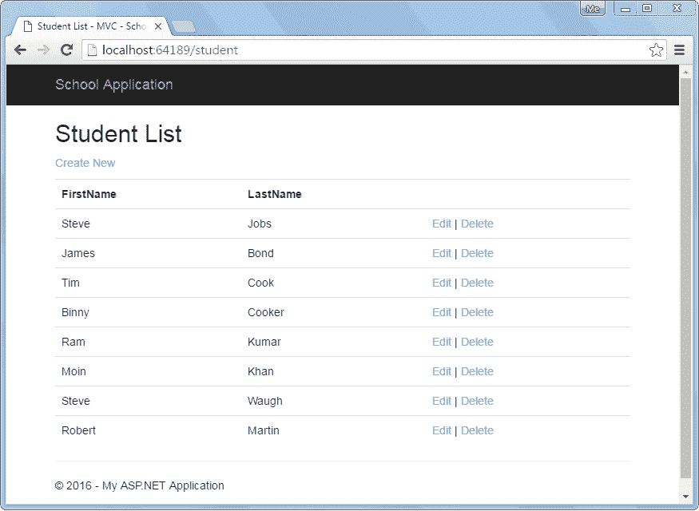
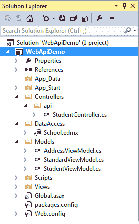
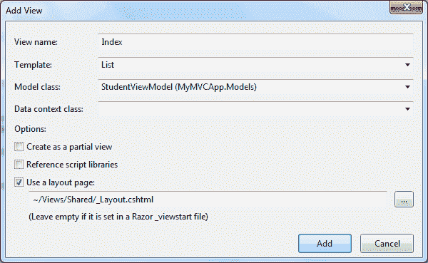
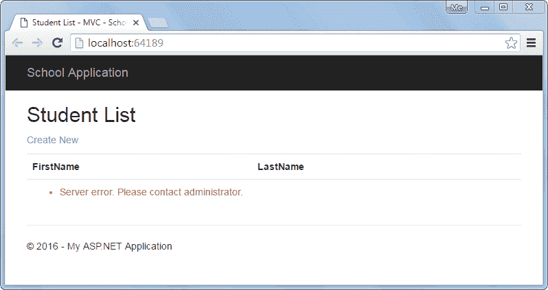

# ASP.NET MVC 中的消费类Web API获取方法

> 原文：<https://www.tutorialsteacher.com/webapi/consume-web-api-get-method-in-aspnet-mvc>

我们在[实现获取方法](/webapi/implement-get-method-in-web-api)部分创建了Web API并实现了各种获取方法来处理不同的 HTTP 获取请求。这里我们将使用下面显示的名为`GetAllStudents()`的 Get 方法之一。

Example: Sample Web API 

```
public class StudentController : ApiController
{
    public StudentController()
    {
    }

    public IHttpActionResult GetAllStudents(bool includeAddress = false)
    {
        IList<StudentViewModel> students = null;

        using (var ctx = new SchoolDBEntities())
        {
            students = ctx.Students.Include("StudentAddress").Select(s => new StudentViewModel()
            {
                Id = s.StudentID,
                FirstName = s.FirstName,
                LastName = s.LastName,
                Address = s.StudentAddress == null || includeAddress == false ? null : new AddressViewModel()
                {
                    StudentId = s.StudentAddress.StudentID,
                    Address1 = s.StudentAddress.Address1,
                    Address2 = s.StudentAddress.Address2,
                    City = s.StudentAddress.City,
                    State = s.StudentAddress.State
                }
            }).ToList<StudentViewModel>();
        }

        if (students.Count == 0)
        {
            return NotFound();
        }

        return Ok(students);
    }
} 
```

以上`GetAllStudents()`动作方法将处理 HTTP GET 请求`http://localhost:64189/api/student`并返回学生列表。我们将在 ASP.NET MVC 控制器中发送这个 HTTP 请求，以获取所有的学生记录，并在 MVC 视图中显示它们。视图如下所示。

[](../../Content/images/webapi/sample-ui.png)

Student List View


下面是在前几节中创建的 Web API + MVC 项目结构。我们将在这个项目中添加必要的类。

[](../../Content/images/webapi/webapi-project-structure.png)

Web API Project


我们已经在“模型”文件夹下创建了以下 StudentViewModel 类。

Example: Model Class 

```
public class StudentViewModel
{
    public int Id { get; set; }
    public string FirstName { get; set; }
    public string LastName { get; set; }

    public AddressViewModel Address { get; set; }

    public StandardViewModel Standard { get; set; }
} 
```

让我们一步一步地将上面的 Web API 消费到 ASP.NET MVC 应用中。

**第一步:**

首先，在 Controllers 文件夹中创建名为`StudentController`的 MVC 控制器类，如下图所示。右键单击控制器文件夹> **添加..** >选择**控制器..**T7】

Example: MVC Controller 

```
public class StudentController : Controller
{
    // GET: Student
    public ActionResult Index()
    {            
        return View();
    }
} 
```

**第二步:**

我们需要使用如下所示的 HttpClient 在 Index()动作方法中访问 Web API。详细了解 HttpClient[这里](/webapi/consuming-web-api-in-dotnet-using-httpclient)。

Example: MVC Controller 

```
public class StudentController : Controller
{
    // GET: Student
    public ActionResult Index()
    {
        IEnumerable<StudentViewModel> students = null;

        using (var client = new HttpClient())
        {
            client.BaseAddress = new Uri("http://localhost:64189/api/");
            //HTTP GET
            var responseTask = client.GetAsync("student");
            responseTask.Wait();

            var result = responseTask.Result;
            if (result.IsSuccessStatusCode)
            {
                var readTask = result.Content.ReadAsAsync<IList<StudentViewModel>>();
                readTask.Wait();

                students = readTask.Result;
            }
            else //web api sent error response 
            {
                //log response status here..

                students = Enumerable.Empty<StudentViewModel>();

                ModelState.AddModelError(string.Empty, "Server error. Please contact administrator.");
            }
        }
        return View(students);
    }
} 
```

**第三步:**

现在，我们需要添加索引视图。右键单击索引动作方法，选择**添加视图..**选项。这将打开如下所示的添加视图弹出窗口。现在，选择列表作为模板，学生视图模型作为模型类，如下所示(我们已经在前一节中创建了学生视图模型)。

[](../../Content/images/webapi/add-view-mvc.png)

Add View in ASP.NET MVC


单击**添加**在**视图**文件夹中添加索引视图。这将生成以下索引. cshtml.

Index.cshtml 

```
@model IEnumerable<WebAPIDemo.Models.StudentViewModel>

@{
    ViewBag.Title = "Index";
    Layout = "~/Views/Shared/_Layout.cshtml";
}

<h2>Index</h2>

<p>
    @Html.ActionLink("Create New", "Create")
</p>
<table class="table">
    <tr>
        <th>
            @Html.DisplayNameFor(model => model.FirstName)
        </th>
        <th>
            @Html.DisplayNameFor(model => model.LastName)
        </th>
    <th></th>
    </tr>

    @foreach (var item in Model) {
        <tr>
            <td>
                @Html.DisplayFor(modelItem => item.FirstName)
            </td>
        <td>
            @Html.DisplayFor(modelItem => item.LastName)
        </td>
        <td>
            @Html.ActionLink("Edit", "Edit", new { id=item.Id }) |
            @Html.ActionLink("Details", "Details", new { id=item.Id }) |
            @Html.ActionLink("Delete", "Delete", new { id=item.Id })
        </td>
        </tr>
    }

</table>
```

从视图中删除详细信息链接，因为我们不会在此创建详细信息页面。

现在，运行该应用，您将在浏览器中看到学生列表，如下所示。

[](../../Content/images/webapi/sample-ui.png)

Student List View


### 显示误差

我们已经成功地在上面的视图中显示了记录，但是如果Web API返回错误响应呢？

要在 MVC 视图中显示适当的错误消息，请添加 ValidationSummary()，如下所示。

Index.cshtml 

```
@model IEnumerable<WebAPIDemo.Models.StudentViewModel>

@{
    ViewBag.Title = "Index";
    Layout = "~/Views/Shared/_Layout.cshtml";
}

<h2>Index</h2>

<p>
    @Html.ActionLink("Create New", "Create")
</p>
<table class="table">
    <tr>
        <th>
            @Html.DisplayNameFor(model => model.FirstName)
        </th>
        <th>
            @Html.DisplayNameFor(model => model.LastName)
        </th>
    <th></th>
    </tr>

    @foreach (var item in Model) {
        <tr>
            <td>
                @Html.DisplayFor(modelItem => item.FirstName)
            </td>
            <td>
                @Html.DisplayFor(modelItem => item.LastName)
            </td>
            <td>
                @Html.ActionLink("Edit", "Edit", new { id=item.Id }) |
                @Html.ActionLink("Delete", "Delete", new { id=item.Id })
            </td>
        </tr>
    }
    <tr>
        <td>
            @Html.ValidationSummary(true, "", new { @class = "text-danger" })
        </td>
    </tr>

</table>
```

在上面的视图中，我们已经在表格的最后一行添加了`@Html.ValidationSummary(true, "", new { @class = "text-danger" })`。这是为了在Web API返回状态不是 200 正常的错误响应时显示错误消息。

请注意，如果Web API响应的状态代码不是 200 OK，我们已经在步骤 2 中创建的 StudentController 类的 Index()动作方法中添加了模型错误。

所以现在，如果 Web API 返回任何类型的错误，那么学生列表视图将显示下面的消息。

[](../../Content/images/webapi/display-error.png)

Display Error Message


在下一节中，我们将使用 Post 方法，通过单击上面视图中的“新建”链接，在基础数据源中创建新记录。******