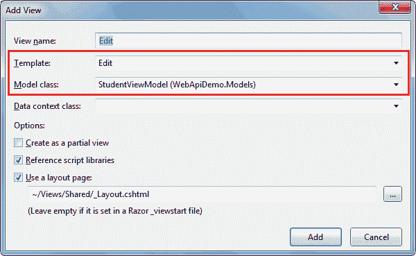
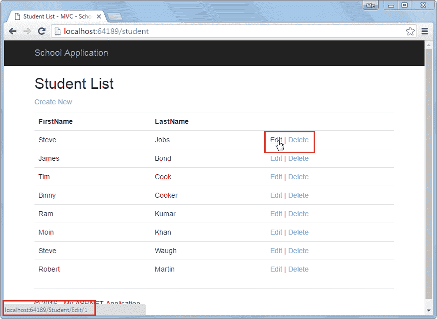
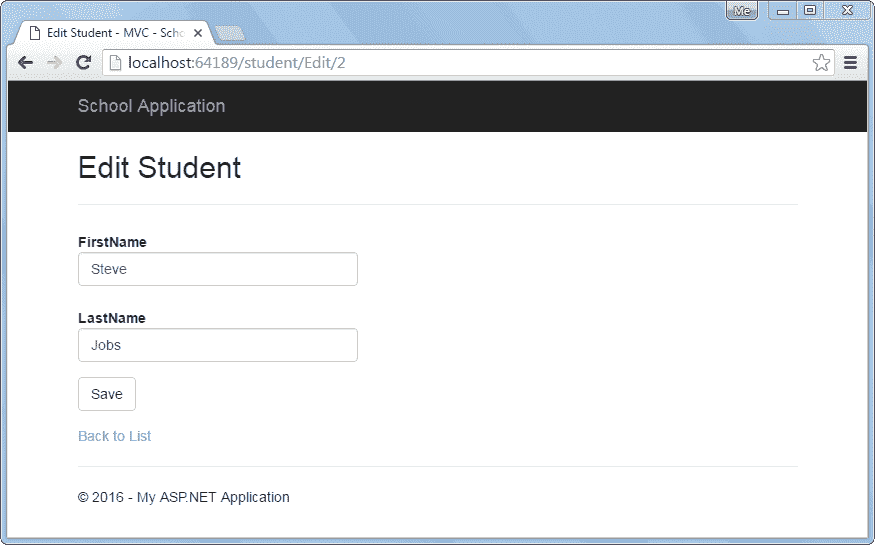

# 在 ASP.NET MVC 中消费 Web API `PUT`方法

> 原文：<https://www.tutorialsteacher.com/webapi/consume-web-api-put-method-in-aspnet-mvc>

在前两节中，我们学习了如何在 ASP.NET 视图中使用Web API获取和`POST`方法。在这里，我们将看到如何使用Web API的 Put 方法来更新现有的记录。

我们已经在[实现 PUT 方法](/webapi/implement-put-method-in-web-api)部分用 Put 方法创建了处理 HTTP PUT 请求的 Web API，如下所示。

Example: Sample Web API with Put method 

```
public class StudentController : ApiController
{
    public StudentController()
    {
    }

    public IHttpActionResult Put(StudentViewModel student)
    {
        if (!ModelState.IsValid)
            return BadRequest("Not a valid data");

        using (var ctx = new SchoolDBEntities())
        {
            var existingStudent = ctx.Students.Where(s => s.StudentID == student.Id).FirstOrDefault<Student>();

            if (existingStudent != null)
            {
                existingStudent.FirstName = student.FirstName;
                existingStudent.LastName = student.LastName;

                ctx.SaveChanges();
            }
            else
            {
                return NotFound();
            }
        }
        return Ok();
    }
} 
```

我们在上一节中创建了学生列表视图，如下所示。在下面的视图中，每个记录都有一个编辑链接来编辑该特定记录。我们将在这一部分处理编辑功能。

[](../../Content/images/webapi/sample-ui.png)

Student List View


下面是在前几节中创建的 Web API + MVC 项目结构。我们将在这个项目中添加必要的类。

[](../../Content/images/webapi/project-structure.png)

Web API Project


我们已经在“模型”文件夹下创建了以下 StudentViewModel 类。

Example: Model Class 

```
public class StudentViewModel
{
    public int Id { get; set; }
    public string FirstName { get; set; }
    public string LastName { get; set; }

    public AddressViewModel Address { get; set; }

    public StandardViewModel Standard { get; set; }
} 
```

因此，让我们通过实现编辑功能来使用Web API Put 方法。

**第一步:**

在上面的学生列表视图中，当用户点击编辑链接时，它会向 MVC 控制器发送 HTTP GET 请求`http://localhost:64189/student/edit/{id}`。因此，我们需要在 StudentController 中添加 HttpGet action 方法“Edit”，以呈现如下所示的编辑视图。

Example: Implement Edit Action Method 

```
public class StudentController : Controller
{
    public ActionResult Index()
    {
        //consume Web API Get method here.. 

        return View();
    }

    public ActionResult Edit(int id)
    {
        StudentViewModel student = null;

        using (var client = new HttpClient())
        {
            client.BaseAddress = new Uri("http://localhost:64189/api/");
            //HTTP GET
            var responseTask = client.GetAsync("student?id=" + id.ToString());
            responseTask.Wait();

            var result = responseTask.Result;
            if (result.IsSuccessStatusCode)
            {
                var readTask = result.Content.ReadAsAsync<StudentViewModel>();
                readTask.Wait();

                student = readTask.Result;
            }
        }

        return View(student);
    }
} 
```

如上所述，Edit()动作方法包含 id 参数。此 id 参数将绑定到查询字符串 id 参数。我们使用这个 id 通过 HttpClient 从数据库中获取学生记录，并在编辑视图中传递学生记录。访问 [HttpClient](/webapi/consuming-web-api-in-dotnet-using-httpclient) 部分了解更多信息。

**第二步:**

在上述编辑动作方法中右键单击创建编辑视图，并选择**添加视图..**这将打开如下所示的添加视图弹出窗口。

[](../../Content/images/webapi/edit-view-mvc.png)

Add View in ASP.NET MVC


在添加视图弹出窗口中，选择编辑模板和 StudentViewModel 作为模型类，如上图所示。点击【添加】按钮，在> 学生文件夹中生成如下图所示的 Edit.cshtml 视图。

Edit.cshtml 

```
@model WebApiDemo.Models.StudentViewModel

@{
    ViewBag.Title = "Edit Student - MVC";
    Layout = "~/Views/Shared/_Layout.cshtml";
}

<h2>Edit Student</h2>

@using (Html.BeginForm())
{
    @Html.AntiForgeryToken()

    <div class="form-horizontal">
        <hr />
            @Html.ValidationSummary(true, "", new { @class = "text-danger" })
            @Html.HiddenFor(model => model.Id)

        <div class="form-group">
            @Html.LabelFor(model => model.FirstName, htmlAttributes: new { @class = "control-label col-md-2" })
            <div class="col-md-10">
                @Html.EditorFor(model => model.FirstName, new { htmlAttributes = new { @class = "form-control" } })
                @Html.ValidationMessageFor(model => model.FirstName, "", new { @class = "text-danger" })
            </div>
        </div>

        <div class="form-group">
            @Html.LabelFor(model => model.LastName, htmlAttributes: new { @class = "control-label col-md-2" })
            <div class="col-md-10">
                @Html.EditorFor(model => model.LastName, new { htmlAttributes = new { @class = "form-control" } })
                @Html.ValidationMessageFor(model => model.LastName, "", new { @class = "text-danger" })
            </div>
        </div>

        <div class="form-group">
            <div class="col-md-offset-2 col-md-10">
                <input type="submit" value="Save" class="btn btn-default" />
            </div>
        </div>
    </div>
}

<div>
    @Html.ActionLink("Back to List", "Index")
</div>
```

在上图中，`Html.BeginForm()`生成 HTML 表单标签`<form> action="/Student/edit" method="post" </form>`，当用户点击保存按钮时，该标签将发送 post 请求。

现在，当您按 Ctrl + F5 运行项目时，它将显示以下学生列表视图。

[](../../Content/images/webapi/edit-click.png)

Student List View


当您单击上面视图中的编辑链接时，它将显示以下编辑视图。

[](../../Content/images/webapi/edit-view-mvc2.png)

Edit View


现在，执行 httpset 编辑动作方法，当用户点击上面的**保存**按钮时将执行该方法。

**第三步:**

在 MVC 的 StudentController 中添加 HTTP set 动作方法，它会向 Web API 发送 HTTP PUT 请求，更新当前记录。

Example: Implement HttpPost Action Method 

```
public class StudentController : Controller
{
    public ActionResult Edit(int id)
    {
        StudentViewModel student = null;

        using (var client = new HttpClient())
        {
            client.BaseAddress = new Uri("http://localhost:64189/api/");
            //HTTP GET
            var responseTask = client.GetAsync("student?id=" + id.ToString());
            responseTask.Wait();

            var result = responseTask.Result;
            if (result.IsSuccessStatusCode)
            {
                var readTask = result.Content.ReadAsAsync<StudentViewModel>();
                readTask.Wait();

                student = readTask.Result;
            }
        }
        return View(student);
    }

    [HttpPost]
    public ActionResult Edit(StudentViewModel student)
    {
        using (var client = new HttpClient())
        {
            client.BaseAddress = new Uri("http://localhost:64189/api/student");

            //HTTP POST
            var putTask = client.PutAsJsonAsync<StudentViewModel>("student", student);
            putTask.Wait();

            var result = putTask.Result;
            if (result.IsSuccessStatusCode)
            {

                return RedirectToAction("Index");
            }
        }
        return View(student);
    }
} 
```

如上图所示，`HttpPost`编辑动作方法使用`HttpClient`向更新了学生记录的 Web API 发送 HTTP PUT 请求。访问[网站](/webapi/consuming-web-api-in-dotnet-using-httpclient)部分了解更多信息。

这样我们就可以使用Web API的 Put 方法来执行 HTTP PUT 请求来编辑现有的记录。

接下来，使用 Web API 的 Delete 方法删除数据源中的一条记录。*****