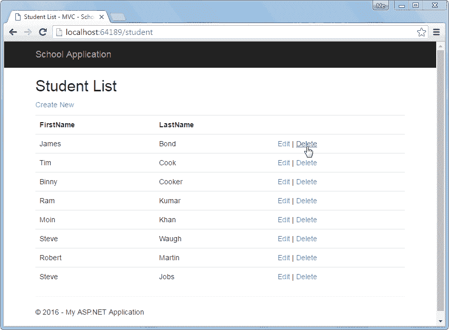

# 在 ASP.NET MVC 中消费 Web API `DELETE`方法

> 原文：<https://www.tutorialsteacher.com/webapi/consume-web-api-delete-method-in-aspnet-mvc>

在前几节中，我们使用了 Web API 的获取、发布和放置方法。在这里，我们将使用 ASP.NET MVC 中的 Web API 的 Delete 方法来删除一条记录。

我们已经在[实现`DELETE`方法](/webapi/implement-delete-method-in-web-api)部分用`DELETE`方法创建了处理 HTTP 删除请求的 Web API，如下所示。

Sample Web API with Delete Method 

```
public class StudentController : ApiController
{
    public StudentController()
    {
    }

    public IHttpActionResult Delete(int id)
    {
        if (id <= 0)
            return BadRequest("Not a valid student id");

        using (var ctx = new SchoolDBEntities())
        {
            var student = ctx.Students
                .Where(s => s.StudentID == id)
                .FirstOrDefault();

            ctx.Entry(student).State = System.Data.Entity.EntityState.Deleted;
            ctx.SaveChanges();
        }

        return Ok();
    }
} 
```

以下是在 MVC 部分的[消费`GET`方法中创建的学生列表视图。这里，我们将在用户点击以下用户界面中的删除链接时实现删除功能。](/webapi/consume-web-api-get-method-in-aspnet-mvc)

[](../../Content/images/webapi/delete-view-mvc.png)

Student List View


当用户点击上述 UI 中的删除链接时，它会向当前 id 参数的学生控制器发送 HTTP Get 请求`http://localhost:64189/student/delete/{id}`。因此，让我们通过使用 Web API `DELETE`方法来实现删除功能。

**第一步:**

在 MVC `StudentController`中用 id 参数创建 HttpGet 动作方法 Delete，如下图所示。

Example: Implement HttpGet Delete method 

```
public class StudentController : Controller
{
    // GET: Student
    public ActionResult Index()
    {
        IList<StudentViewModel> students = null;

        using (var client = new HttpClient())
        {
            client.BaseAddress = new Uri("http://localhost:64189/api/student");
            //HTTP GET
            var responseTask = client.GetAsync("student");
            responseTask.Wait();

            var result = responseTask.Result;
            if (result.IsSuccessStatusCode)
            {
                var readTask = result.Content.ReadAsAsync<IList<StudentViewModel>>();
                readTask.Wait();

                students = readTask.Result;
            }
        }

        return View(students);
    }

    public ActionResult Delete(int id)
    {
        using (var client = new HttpClient())
        {
            client.BaseAddress = new Uri("http://localhost:64189/api/");

            //HTTP DELETE
            var deleteTask = client.DeleteAsync("student/" + id.ToString());
            deleteTask.Wait();

            var result = deleteTask.Result;
            if (result.IsSuccessStatusCode)
            {

                return RedirectToAction("Index");
            }
        }

        return RedirectToAction("Index");
    }

} 
```

可以看到，上面的 Delete()动作方法使用`HttpClient`发送当前 id 参数的 HTTP DELETE 请求。第一个代码示例中显示的 Web API 控制器将处理这个删除请求，并从数据源中删除记录。请访问 [HttpClient](http://localhost:56670/webapi/consuming-web-api-in-dotnet-using-httpclient) 部分了解更多信息。

这样你就可以在 ASP.NET MVC 中使用 Web API 的`DELETE`方法。**