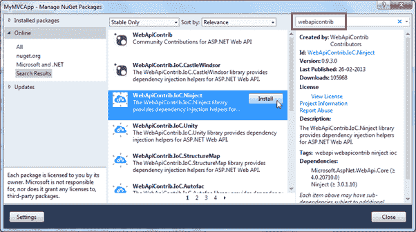
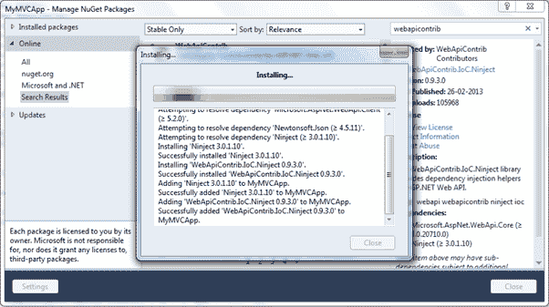
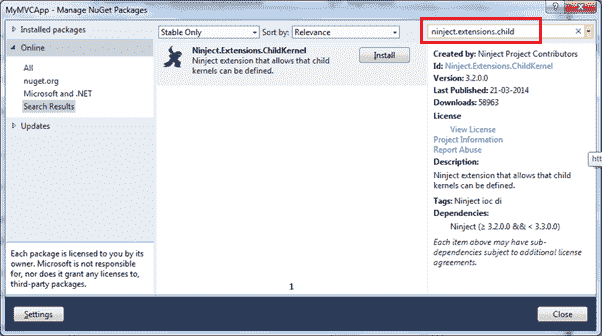

# 使用网络应用编程接口配置依赖注入

> 原文:[https://www . tutorial stearn . com/web API/configure-dependency-injection-with-web-API](https://www.tutorialsteacher.com/webapi/configure-dependency-injection-with-web-api)

在这里，您将学习如何使用网络应用编程接口配置和使用 IoC 容器进行依赖注入。

有许多 IoC 容器可用于依赖注入，如 Ninject、Unity、castleWidsor、structuremap 等。这里我们将使用 Ninject 进行依赖注入。

下面是我们的示例网络应用编程接口，它使用一个实现艾瑞定位的类的实例。

Example: Simple Web API Controller 

```
public class StudentController : ApiController
{
    private IRepository _repo = null;

    public StudentController(IRepository repo)
    {
        _repo = repo;
    }

    public IList<Student> Get()
    {
        return  _repo.GetAll();
    }
} 
```

以下是就业和学生就业类。

Example: Repository 

```
public interface IRepository
{
    IList<Student> GetAll();
}

public class StudentRepository : IRepository
{
    public IList<Student> GetAll()
    {
        //return students from db here
    }
} 
```

现在，让我们使用将在 StudentController 中注入 StudentRepository 类的 Ninject。

首先，您需要使用 NuGet 为网络应用编程接口安装 Ninject 库。为此，在解决方案资源管理器中右键单击您的项目->单击**管理 NuGet 包..**。这将打开 NuGet 弹出窗口。现在在搜索框中搜索 webapicontrib，如下所示。

[](../../Content/images/webapi/configure-DI-1.png)

Web API Configuration


如您所见，这将列出网络应用编程接口的所有 IoC 容器。选择 WebApiContrib。输入并点击**安装**。

[](../../Content/images/webapi/configure-DI-2.png)

Web API Configuration


现在，您需要安装它。搜索并安装它。

[](../../Content/images/webapi/configure-DI-3.png)

Web API Configuration


所以现在在为 Ninject 安装了必要的包之后，我们需要对它进行配置。

为了在 Web API 中使用依赖注入，我们需要创建一个实现 IDependencyResolver 接口的解析器类。在这里，我们已经在我们的网络应用编程接口项目的基础设施文件夹中创建了一个项目解析器类，如下所示。

Example: DI Resolver 

```
public class NinjectResolver : IDependencyResolver
{
    private IKernel kernel;

    public NinjectResolver() : this(new StandardKernel()) 
    { 
    }

    public NinjectResolver(IKernel ninjectKernel, bool scope = false)
    {
        kernel = ninjectKernel;
        if (!scope)
        {
            AddBindings(kernel);
        }
    }

    public IDependencyScope BeginScope()
    {
        return new NinjectResolver(AddRequestBindings(new ChildKernel(kernel)), true);
    }

    public object GetService(Type serviceType)
    {
        return kernel.TryGet(serviceType);
    }

    public IEnumerable<object> GetServices(Type serviceType)
    {
        return kernel.GetAll(serviceType);
    }

    public void Dispose()
    {

    }

    private void AddBindings(IKernel kernel)
    {
        // singleton and transient bindings go here
    }

    private IKernel AddRequestBindings(IKernel kernel)
    {
        kernel.Bind<IRepository>().To<StudentRepository>().InSingletonScope();
        return kernel;
    }
} 
```

现在，我们需要在 WebApiConfig 类中用 Web API 配置 NijectResolver，如下所示。

Example: Set DI Resolver 

```
public static class WebApiConfig
{
    public static void Register(HttpConfiguration config)
    {
        config.DependencyResolver = new NinjectResolver();

        config.MapHttpAttributeRoutes();

        config.Routes.MapHttpRoute(
            name: "DefaultApi",
            routeTemplate: "api/{controller}/{id}",
            defaults: new { id = RouteParameter.Optional }
        );

    }
} 
```

如上所述，HttpConfiguration。DependencyResolver 设置为 NinjectResolver。所以现在，网络应用编程接口将使用 NinjectResolver 类来创建它需要的对象。

因此，您可以使用网络应用编程接口配置 IoC 容器。****