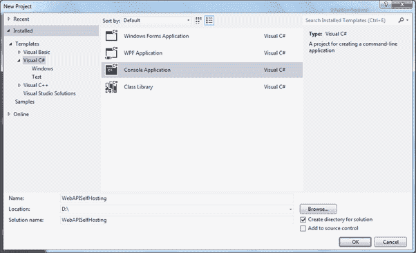
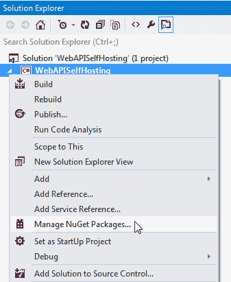
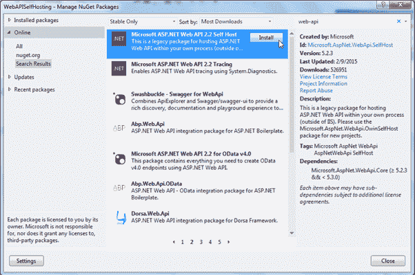
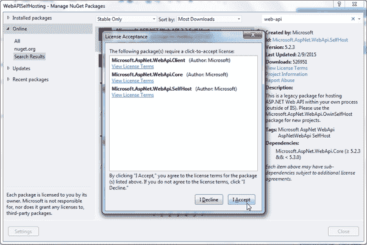
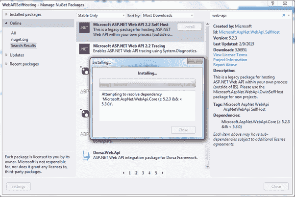
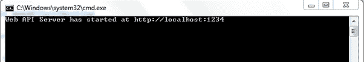
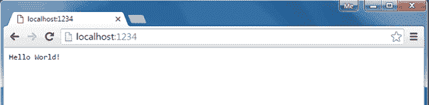
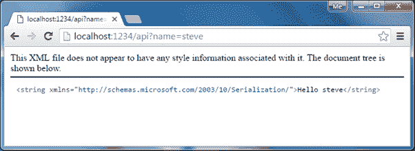

# 网络应用编程接口托管

> 原文：<https://www.tutorialsteacher.com/webapi/web-api-hosting>

在本节中，您将学习如何托管网络应用编程接口。

网络应用编程接口应用可以通过两种方式托管。

*   IIS 托管
*   自我托管

## IIS 托管

Web API 可以在 IIS 下托管，就像 Web 应用一样。在上一节中，您已经学习了创建网络应用编程接口。正如您在那里看到的，默认情况下，使用 ASP.NET MVC 项目创建了一个网络应用编程接口。因此，当您在 IIS 下托管您的 MVC web 应用时，它也将托管使用相同基地址的 Web API。

## 自我托管

您可以将网络应用编程接口作为一个独立的进程托管，而不是 ASP.NET。这意味着您可以在控制台应用或窗口服务或 OWIN 或任何其他由管理的进程中托管一个网络应用编程接口 .NET 框架。

您需要执行以下步骤来自行托管网络应用编程接口。

1.  使用 HttpConfiguration 配置网络应用编程接口
2.  创建 httpServer 并开始侦听传入的 Http 请求

让我们看看如何在控制台应用中托管一个简单的网络应用编程接口。

首先，在 Visual Studio 2012 中为 Desktop(或后者版本)创建一个控制台项目。

注意:您必须在管理模式下打开 Visual Studio。

[](../../Content/images/webapi/create-console-app.png)

Create Console Application


现在，您需要使用 NuGet 添加微软 ASP.NET 网络应用编程接口 2.x 自助主机包。在解决方案资源管理器窗口中右键单击项目，然后选择**管理项目包..**

[](../../Content/images/webapi/manage-nuget.png)

Open NuGet Manager


在“管理新包”窗口中，选择左平移中的“在线”选项，并搜索网络应用编程接口。这将列出网络应用编程接口的所有包。现在，寻找**微软 ASP.NET Web API 2.2 自主机**包，点击**安装**。

[](../../Content/images/webapi/install-selfhost.png)

Install Web API Self Host Package


点击许可接受窗口中的**接受**按钮。

[](../../Content/images/webapi/accept-selfhost.png)

Accept License Agreement


这将把包安装到您的项目中。

[](../../Content/images/webapi/installing-selfhost.png)

Install Web API self Hosting Package


现在在 Program 类的 Main()方法中编写以下代码。

Example: Self-Hosting Web API 

```
class Program
{
    static void Main(string[] args)
    {
        var config = new HttpSelfHostConfiguration("http://localhost:1234");

        var server = new HttpSelfHostServer(config, new MyWebAPIMessageHandler());
        var task = server.OpenAsync();
        task.Wait();

        Console.WriteLine("Web API Server has started at http://localhost:1234");
        Console.ReadLine();
    }
} 
```

在上面的代码中，我们首先通过传递 uri 位置创建了一个 HttpSelfHostConfiguration 类的对象。然后，我们通过传递 config 和 HttpMessageHandler 对象创建了一个 HttpSelfHostServer 的对象。然后我们开始监听呼叫服务器传入的请求。OpenAsync()方法。这将异步侦听请求，因此它将返回 Task 对象。

创建`MyWebAPIMessageHandler`类并编写以下代码。

Example: MessageHandler 

```
class MyWebAPIMessageHandler : HttpMessageHandler
{
    protected override Task<HttpResponseMessage> SendAsync(HttpRequestMessage request, System.Threading.CancellationToken cancellationToken)
    {
        var task = new Task<HttpResponseMessage>(() => {
            var resMsg = new HttpResponseMessage();
            resMsg.Content = new StringContent("Hello World!");
            return resMsg;
        });

        task.Start();
        return task;
    }
} 
```

因此，您可以创建简单的控制台应用和主机简单的网络应用编程接口，返回“你好世界！”每一个请求。

使用 Ctrl + F5 运行控制台应用。

[](../../Content/images/webapi/run-console-app.png)

Run Console Application


打开网页浏览器，进入`http://localhost:1234/`查看结果。

[](../../Content/images/webapi/response-in-browser.png)

Response in Browser


## 托管控制器基础架构

您可以在自我托管中使用与 ASP.NET 托管相同的 ASP.NET 路由和 ApiController 功能。

在同一个自托管控制台应用中，创建如下所示的简单 HomeController 类。

Example: Web API Controller 

```
public class HomeController : ApiController
{
    public string Get() {
        return "Hello World!";
    }

    public string Get(string name) {
        return "Hello " + name;
    }
} 
```

现在，在 Main()方法中，使用配置对象配置默认路由，如下所示。

Example: Self Hosting Web API 

```
static void Main(string[] args)
{
    var config = new HttpSelfHostConfiguration("http://localhost:1234");
    config.Routes.MapHttpRoute("default",
                                "api/{controller}/{id}",
                                new { controller = "Home", id = RouteParameter.Optional });

    var server = new HttpSelfHostServer(config);            
    var task = server.OpenAsync();
    task.Wait();

    Console.WriteLine("Web API Server has started at http://localhost:1234");
    Console.ReadLine();
} 
```

请注意，我们在创建 HttpSelfHostServer 对象时删除了 MessageHandler 的一个对象。

现在，按下 *Ctrl + F5* 运行控制台应用。打开浏览器，输入`http://localhost:1234/api`或`http://localhost:1234/api?name=steve`，看到如下图的结果。

[](../../Content/images/webapi/self-hosting.png)

Web API Response

****