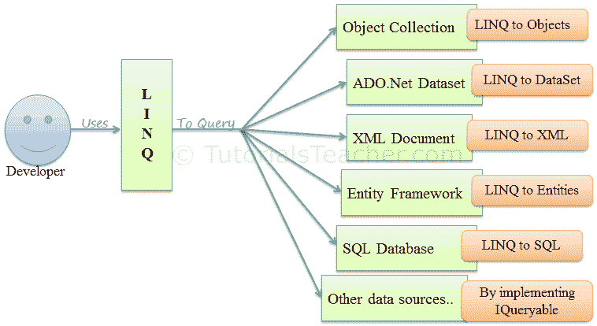

# 什么是 LINQ？

> 原文：<https://www.tutorialsteacher.com/linq/what-is-linq>

LINQ(语言集成查询)是 C# 和 VB.NET 的统一查询语法，用于从不同的来源和格式检索数据。它集成在 C# 或 VB 中，从而消除了编程语言和数据库之间的不匹配，并为不同类型的数据源提供了单一的查询接口。

例如，SQL 是一种结构化查询语言，用于保存和检索数据库中的数据。同样，LINQ 是一个用 C# 和 built 构建的结构化查询语法，用于从不同类型的数据源中检索数据，如集合、ADO.Net 数据集、XML 文档、web 服务和 MS SQL Server 等数据库。

[](../../Content/images/linq/linq-usage.PNG) 

LINQ Usage


LINQ 查询将结果作为对象返回。它使您能够在结果集上使用面向对象的方法，而不用担心将不同格式的结果转换成对象。

[](../../Content/images/linq/linq-execution.PNG) 

下面的示例演示了一个简单的 LINQ 查询，该查询从包含“a”的数组中获取所有字符串。

Example: LINQ Query to Array

```cs
// Data source
string[] names = {"Bill", "Steve", "James", "Mohan" };

// LINQ Query 
var myLinqQuery = from name in names
                where name.Contains('a')
                select name;

// Query execution
foreach(var name in myLinqQuery)
    Console.Write(name + " "); 
```

在上面的例子中，字符串数组名是一个数据源。以下是分配给变量`myLinqQuery`的 LINQ 查询。

```cs
from name in names
where name.Contains('a')
select name; 
```

上面的查询使用了 LINQ 的查询语法。您将在[查询语法](/linq/linq-query-syntax)一章中了解更多信息。

在执行 LINQ 查询之前，您不会得到它的结果。LINQ 查询可以通过多种方式执行，这里我们使用`foreach`循环来执行存储在`myLinqQuery`中查询。 `foreach`循环在数据源上执行查询并获得结果，然后迭代结果集。

因此，每个 LINQ 查询都必须查询某种数据源，无论它是数组、集合、XML 还是其他数据库。写完 LINQ 查询后，必须执行它才能得到结果。

了解为什么我们应该在下一章使用 LINQ。