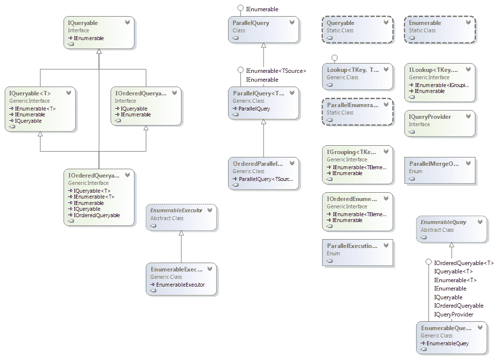
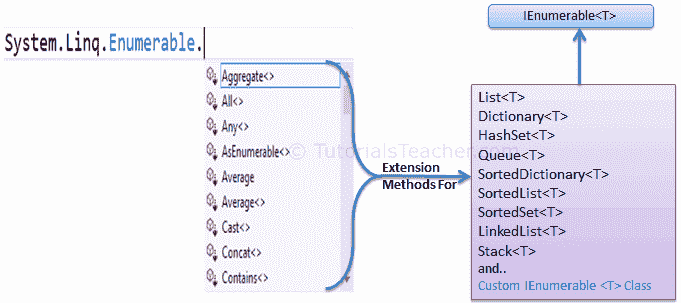
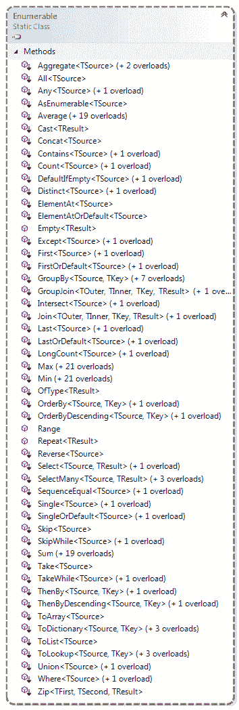
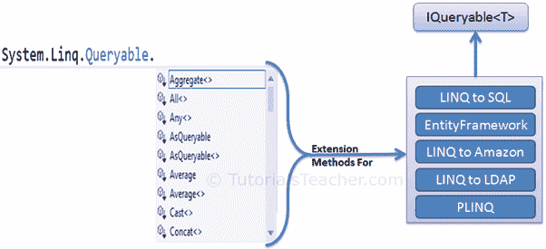
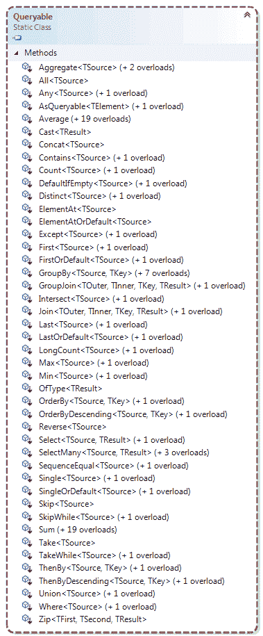

# LINQ API

> 原文：<https://www.tutorialsteacher.com/linq/linq-api>

我们可以为实现[IEnumerable<T>T1】或](https://docs.microsoft.com/en-us/dotnet/api/system.collections.generic.ienumerable-1?view=netframework-4.8 "IEnumerable Members")[IQueryable<T>T3】接口的类编写 LINQ 查询。](https://docs.microsoft.com/en-us/dotnet/api/system.linq.iqueryable-1?view=netframework-4.8 "IQueryable Members")[T5 系统。Linq](https://docs.microsoft.com/en-us/dotnet/api/system.linq?view=netframework-4.8 "system.linq") 命名空间包括 Linq 查询所需的下列类和接口。

 

LINQ API

  *System.Linq* namespace is included by default when you add a new class in Visual Studio.

LINQ 查询对实现`IEnumerable`或`IQueryable`接口的类使用扩展方法。 `Enumerable`和`Queryable`是两个静态类，包含编写 LINQ 查询的扩展方法。

## 可列举的

[可枚举](https://msdn.microsoft.com/en-us/library/system.linq.enumerable(v=vs.110).aspx) "Enumerable class members")类包括实现`IEnumerable<T>`接口的类的扩展方法，例如所有内置集合类都实现`IEnumerable<T>`接口，因此我们可以编写 LINQ 查询来从内置集合中检索数据。

下图显示了`Enumerable`类中包含的扩展方法，这些方法可以与 C# 或 VB.Net 中的泛型集合一起使用。

 

下图显示了`Enumerable`类中所有可用的扩展方法。

 

Enumerable Class

## 类型

[可查询](https://msdn.microsoft.com/en-us/library/system.linq.queryable(v=vs.110).aspx "Queryable class members")类包括实现[可查询<t>T5】接口的类的扩展方法。 `IQueryable<T>`接口用于针对已知数据类型的特定数据源提供查询功能。例如，实体框架 api 实现了`IQueryable<T>`接口来支持带有底层数据库的 LINQ 查询，比如微软的 SQL Server。](https://msdn.microsoft.com/en-us/library/vstudio/bb351562(v=vs.100).aspx "IQueryable<T> members")

此外，还有访问第三方数据的 APIs 例如，LINQ 到亚马逊提供了使用 LINQ 与亚马逊网络服务搜索书籍和其他项目的能力。这可以通过为亚马逊实现`IQueryable`界面来实现。

下图显示了`Queryable`类中可用的扩展方法，这些方法可用于各种本机或第三方数据提供程序。

 

下图显示了`Queryable`类中可用的扩展方法。

 

Queryable class

  Points to Remember:

1.  使用**系统。Linq** 命名空间使用 Linq。
2.  LINQ api 包括两个主要的静态类 Enumerable 和 Queryable。
3.  静态可枚举类包括实现 IEnumerable <t>接口的类的扩展方法。</t>
4.  IEnumerable <t>类型的集合是内存中的集合，如列表、字典、排序列表、队列、哈希集、链接列表。</t>
5.  静态可查询类包括实现 IQueryable <t>接口的类的扩展方法。</t>
6.  远程查询提供程序实现了，例如，从 Linq 到 SQL，从 LINQ 到亚马逊等。