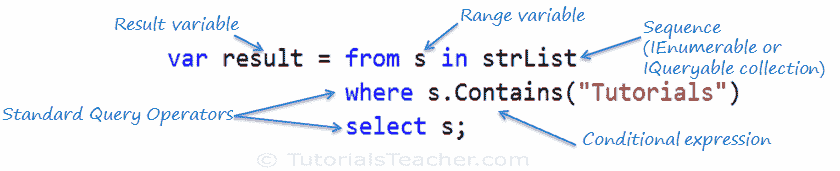

# LINQ 查询语法

> 原文：<https://www.tutorialsteacher.com/linq/linq-query-syntax>

有两种基本方法可以编写对 IEnumerable 集合或 IQueryable 数据源的 LINQ 查询。

1.  查询语法或查询表达式语法
2.  方法语法或方法扩展语法或流畅

## 查询语法

查询语法类似于数据库的 SQL(结构化查询语言)。它是在 C# 或 VB 代码中定义的。

LINQ Query Syntax:

```
from *<range variable>* in *<IEnumerable<T> or IQueryable<T> Collection>*

<Standard Query Operators> *<lambda expression>*

<select or groupBy operator> *<result formation>*

```

LINQ 查询语法以 from 关键字开始，以 select 关键字结束。下面是一个示例 LINQ 查询，它返回包含单词“教程”的字符串集合。

Example: LINQ Query Syntax in C#

```
// string collection
IList<string> stringList = new List<string>() { 
    "C# Tutorials",
    "VB.NET Tutorials",
    "Learn C++",
    "MVC Tutorials" ,
    "Java" 
};

// LINQ Query Syntax
var result = from s in stringList
            where s.Contains("Tutorials") 
            select s;
```

下图显示了 LINQ 查询语法的结构。

[](../../Content/images/linq/linq-query-syntax.png)

LINQ Query Syntax


查询语法以*子句开始，后跟 ***范围*** 变量。 ***From*** 子句的结构类似于`"**From** rangeV*ariableName* **in** *IEnumerablecollection*"`。在英语中，这意味着，从集合中的每个对象。它类似于 foreach 循环:`foreach(Student s in studentList)`。*

 *在 From 子句之后，您可以使用不同的标准查询运算符来筛选、分组和连接集合中的元素。LINQ 大约有 50 个标准查询操作符。在上图中，我们使用了“where”运算符(aka 子句)，后跟一个条件。这个条件一般用[λ表达式](/linq/linq-lambda-expression)来表示。

LINQ 查询语法总是以 Select 或 Group 子句结尾。Select 子句用于对数据进行整形。您可以选择整个对象，也可以只选择它的某些属性。在上面的例子中，我们选择了每个结果字符串元素。

在下面的示例中，我们使用 LINQ 查询语法从学生集合(序列)中找出青少年学生。

Example: LINQ Query Syntax in C#

```
// Student collection
IList<Student> studentList = new List<Student>() { 
        new Student() { StudentID = 1, StudentName = "John", Age = 13} ,
        new Student() { StudentID = 2, StudentName = "Moin",  Age = 21 } ,
        new Student() { StudentID = 3, StudentName = "Bill",  Age = 18 } ,
        new Student() { StudentID = 4, StudentName = "Ram" , Age = 20} ,
        new Student() { StudentID = 5, StudentName = "Ron" , Age = 15 } 
    };

// LINQ Query Syntax to find out teenager students
var teenAgerStudent = from s in studentList
                      where s.Age > 12 && s.Age < 20
                      select s;
```

Example: LINQ Query Syntax in VB.Net

```
// Student collection
Dim studentList = New List(Of Student) From {
        New Student() With {.StudentID = 1, .StudentName = "John", .Age = 13},
        New Student() With {.StudentID = 2, .StudentName = "Moin", .Age = 21},
        New Student() With {.StudentID = 3, .StudentName = "Bill", .Age = 18},
        New Student() With {.StudentID = 4, .StudentName = "Ram", .Age = 20},
        New Student() With {.StudentID = 5, .StudentName = "Ron", .Age = 15}
    }

// LINQ Query Syntax to find out teenager students
Dim teenAgerStudents As IList(Of Student) = (From s In studentList _
                                            Where s.Age > 12 And s.Age < 20 _
                                            Select s).ToList()
```

  Points to Remember :

1.  顾名思义，**查询语法**类似于 SQL(结构查询语言)语法。
2.  查询语法从子句以*开始，可以以*选择*或*分组依据*子句结束。*
3.  使用各种其他操作符，如过滤、连接、分组、排序操作符来构建所需的结果。
4.  [隐式类型变量- var](/csharp/csharp-var-implicit-typed-local-variable) 可用于保存 LINQ 查询的结果。*