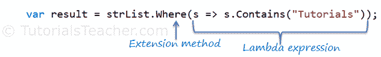

# LINQ 方法语法

> 原文：<https://www.tutorialsteacher.com/linq/linq-method-syntax>

在前一节中，您已经了解了 LINQ 查询语法。在这里，您将学习方法语法。

方法语法(也称为流畅语法)使用包含在[可枚举](https://msdn.microsoft.com/en-us/library/system.linq.enumerable(v=vs.110).aspx))或[可查询](https://msdn.microsoft.com/en-us/library/system.linq.queryable(v=vs.110).aspx)静态类中的扩展方法，类似于调用任何类的扩展方法。

编译器在编译时将查询语法转换为方法语法。

下面是一个示例 LINQ 方法语法查询，它返回包含单词“教程”的字符串集合。

Example: LINQ Method Syntax in C#

```
// string collection
IList<string> stringList = new List<string>() { 
    "C# Tutorials",
    "VB.NET Tutorials",
    "Learn C++",
    "MVC Tutorials" ,
    "Java" 
};

// LINQ Method Syntax
var result = stringList.Where(s => s.Contains("Tutorials"));
```

下图说明了 LINQ 方法语法的结构。

[](../../Content/images/linq/linq-method-syntax.png)

LINQ Method Syntax Structure


如上图所示，方法语法由扩展方法和 Lambda 表达式组成。扩展方法**其中()**在可枚举类中定义。

如果您检查 Where 扩展方法的签名，您会发现 Where 方法接受一个[谓词](/csharp/csharp-predicate "predicate in C#")委托作为 Func < Student，bool >。这意味着您可以传递任何接受 Student 对象作为输入参数并返回布尔值的委托函数，如下图所示。lambda 表达式充当 Where 子句中传递的委托。在下一节学习 lambda 表达式。

[](../../Content/images/linq/linq-where-extension-method.png)

Func delegate in Where


以下示例显示了如何使用 IEnumerable <t>集合进行 LINQ 方法语法查询。</t>

Example: Method Syntax in C#

```
// Student collection
IList<Student> studentList = new List<Student>() { 
        new Student() { StudentID = 1, StudentName = "John", Age = 13} ,
        new Student() { StudentID = 2, StudentName = "Moin",  Age = 21 } ,
        new Student() { StudentID = 3, StudentName = "Bill",  Age = 18 } ,
        new Student() { StudentID = 4, StudentName = "Ram" , Age = 20} ,
        new Student() { StudentID = 5, StudentName = "Ron" , Age = 15 } 
    };

// LINQ Method Syntax to find out teenager students
var teenAgerStudents = studentList.Where(s => s.Age > 12 && s.Age < 20)
                                  .ToList<Student>();
```

Example: Method Syntax in VB.Net

```
// Student collection
Dim studentList = New List(Of Student) From {
        New Student() With {.StudentID = 1, .StudentName = "John", .Age = 13},
        New Student() With {.StudentID = 2, .StudentName = "Moin", .Age = 21},
        New Student() With {.StudentID = 3, .StudentName = "Bill", .Age = 18},
        New Student() With {.StudentID = 4, .StudentName = "Ram", .Age = 20},
        New Student() With {.StudentID = 5, .StudentName = "Ron", .Age = 15}
    }

// LINQ Method Syntax to find out teenager students
Dim teenAgerStudents As IList(Of Student) = studentList.Where(Function(s) s.Age > 12 And s.Age < 20)
                                                       .ToList()
```

  Points to Remember :

1.  顾名思义，**方法语法**就像调用扩展方法。
2.  LINQ **方法语法**又名流畅语法，因为它允许一系列扩展方法调用。
3.  隐式类型变量- `var`可用于保存 LINQ 查询的结果。