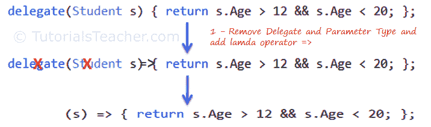
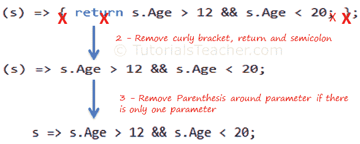
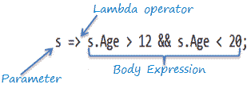
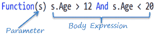
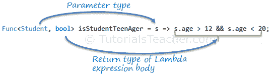
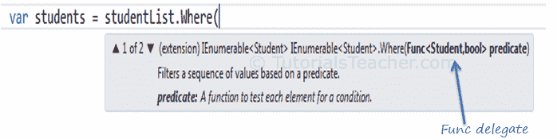

# LINQ Lambda 表达式的剖析

> 原文：<https://www.tutorialsteacher.com/linq/linq-lambda-expression>

C# 3.0( .NET 3.5)和 LINQ 一起引入了 lambda 表达式。lambda 表达式是使用一些特殊的语法来表示[匿名方法](/csharp/csharp-anonymous-method)的一种更短的方式。

例如，以下匿名方法检查学生是否是青少年:

Example: Anonymous Method in C#

```cs
delegate(Student s) { return s.Age > 12 && s.Age < 20; };
```

Example: Anonymous method in VB.Net

```cs
Dim isStudentTeenAger = Function(s As Student) As Boolean
                                    Return s.Age > 12 And s.Age < 20
                        End Function
```

上面的匿名方法可以用 C# 和 VB.Net 中的 Lambda 表达式表示，如下所示:

Example: Lambda Expression in C#

```cs
s => s.Age > 12 && s.Age < 20
```

Example: Lambda Expression in VB.Net

```cs
Function(s) s.Age  > 12 And s.Age < 20
```

让我们看看 lambda 表达式是如何从下面的匿名方法演变而来的。

Example: Anonymous method in C#

```cs
delegate(Student s) { return s.Age > 12 && s.Age < 20; };
```

lambda 表达式从匿名方法发展而来，首先移除委托关键字和参数类型，然后添加 Lambda 运算符= >。

[](../../Content/images/linq/lambda-expression-1.png)

Lambda Expression from Anonymous Method


上面的 lambda 表达式绝对有效，但是如果我们只有一个返回值的语句，就不需要大括号、return 和分号。所以我们可以消除它。

此外，如果只有一个参数，我们可以删除括号()。

[](../../Content/images/linq/lambda-expression-2.png)

Lambda Expression from Anonymous Method


因此，我们得到了 Lambda 表达式:`s => s.Age > 12 && s.Age < 20` ，其中`**s**`是参数，`**=>**`是λ运算符，`**s.Age > 12 && s.Age < 20**`是身体表达式:

[](../../Content/images/linq/lambda-expression-structure.png)

Lambda Expression Structure in C#


同样的方式，我们在 VB.Net 得到的 Lambda 表达式可以写成如下:

[](../../Content/images/linq/lambda-expression-vb.png)

Lambda Expression Structure in VB.Net


lambda 表达式可以像委托一样使用()调用。

*Note:**VB.Net doesn't support lambda operator `=>`* *## 多参数 Lambda 表达式

如果需要传递多个参数，可以将参数包装在括号中，如下所示:

Example: Specify Multiple Parameters in Lambda Expression C#

```cs
**(s, youngAge)** => s.Age >= youngage;
```

如果参数令人困惑，您也可以给出每种类型的参数:

Example: Specify Parameter Type

```cs
**(Student s,int youngAge)** => s.Age >= youngage;
```

Example: Specify Multiple Parameters in Lambda Expression VB.Net

```cs
Function(s, youngAge) s.Age >= youngAge
```

## 不带参数的 Lambda 表达式

lambda 表达式中不必至少有一个参数。lambda 表达式也可以在没有任何参数情况下指定。

Example: Lambda Expression without Parameter

```cs
**()** => Console.WriteLine("Parameter less lambda expression")
```

## Lambda 表达式体中的多个语句

如果要在正文中包含多个语句，可以用大括号将表达式换行:

Example: Multi Statements Lambda expression C#

```cs
(s, youngAge) =>
**{**
  Console.WriteLine("Lambda expression with multiple statements in the body");

  Return s.Age >= youngAge;
**}**
```

Example: Multi Statements Lambda Expression VB.Net

```cs
Function(s , youngAge)

    Console.WriteLine("Lambda expression with multiple statements in the body")

    Return s.Age >= youngAge

End Function
```

## 在 Lambda 表达式体中声明局部变量

您可以在表达式主体中声明一个变量，以便在表达式主体中的任何位置使用它，如下所示:

Example: Local Variable in Lambda expression C#

```cs
s =>
{
   **int youngAge = 18;**

    Console.WriteLine("Lambda expression with multiple statements in the body");

    return s.Age >= youngAge;
}
```

Example: Local Variable in Lambda Expression VB.Net

```cs
Function(s) 

        **Dim youngAge As Integer = 18**

        Console.WriteLine("Lambda expression with multiple statements in the body")

        Return s.Age >= youngAge

End Function
```

Lambda 表达式也可以分配给内置委托，如 [Func](/csharp/csharp-func-delegate) 、 [Action](/csharp/csharp-action-delegate) 和[谓词](/csharp/csharp-predicate)。

## 将 Lambda 表达式分配给委托

lambda 表达式可以分配给`Func<in T, out TResult>`类型的委托。 委托中的最后一个参数类型是返回类型，其余是输入参数。请访问 C# 教程的[功能委托](/csharp/csharp-func-delegate)部分了解更多信息。

考虑下面的 lambda 表达式，找出学生是否是青少年。

Example: Lambda Expression Assigned to Func Delegate C#

```cs
Func<Student, bool> isStudentTeenAger = s => s.age > 12 && s.age < 20;

Student std = new Student() { age = 21 };

bool isTeen = isStudentTeenAger(std);// returns false
```

Example: Lamda Expression Assigned to Func Delegate VB.Net

```cs
Dim isStudentTeenAger As Func(Of Student, Boolean) = Function(s) s.Age > 12 And s.Age < 20

Dim stud As New Student With {.Age = 21}

Dim isTeen As Boolean = isStudentTeenAger(stud) // returns false
```

在上面的例子中，Func 委托期望第一个输入参数是 Student 类型，返回类型是布尔值。Lambda 表达式 `s => s.age > 12 && s.age < 20`满足函数<学生、布尔>委托要求，如下所示:

[](../../Content/images/linq/func-with-lambda-expression.png)

Func delegate with Lambda Expression


上面显示的函数<>委托将变成如下所示的函数。

```cs
bool isStudentTeenAger(Student s)
{
    return s.Age > 12 && s.Age < 20;
}
```

## `Action`委托

与 Func 委托不同，Action 委托只能有输入参数。当不需要从 lambda 表达式返回任何值时，使用[动作委托](/csharp/csharp-action-delegate)类型。

Example: Lamda Expression Assigned to Action Delegate C#

```cs
Action<Student> PrintStudentDetail = s => Console.WriteLine("Name: {0}, Age: {1} ", s.StudentName, s.Age);

Student std = new Student(){ StudentName = "Bill", Age=21};

PrintStudentDetail(std);//output: Name: Bill, Age: 21
```

Example: Lamda Expression Assigned to Action Delegate VB.Net

```cs
Dim printStudentDetail As Action(Of Student) = Sub(s) Console.WriteLine("Name: {0}, Age: {1} ", s.StudentName, s.Age)

Dim stud As New Student With {.StudentName = "Bill", .Age = 21}

printStudentDetail(stud)//output: Name: Bill, Age: 21
```

## LINQ 查询中的 Lambda 表达式

通常 lambda 表达式与 LINQ 查询一起使用。可枚举静态类包括接受`Func<TSource,bool>`的`IEnumerable<T>`的 Where 扩展方法。所以`IEnumerable<Student>`集合的 Where()扩展方法需要通过`Func<Student,bool>`，如下图:

[](../../Content/images/linq/linq-where-extension-method.png)

Func delegate parameter in Where extension method


现在，您可以在方法语法中将分配给 Func 委托的 lambda 表达式传递给 Where()扩展方法，如下所示:

Example: Func Delegate in LINQ Method Syntax

```cs
IList<Student> studentList = new List<Student>(){...};

Func<Student, bool> isStudentTeenAger = s => s.age > 12 && s.age < 20;

var teenStudents = studentList.Where(isStudentTeenAger).ToList<Student>();
```

Example: Func Delegate in LINQ Query Syntax

```cs
IList<Student> studentList = new List<Student>(){...};

Func<Student, bool> isStudentTeenAger = s => s.age > 12 && s.age < 20;

var teenStudents = from s in studentList
                   where isStudentTeenAger(s)
                   select s;
```

您可以在 VB.Net 使用相同的方法传递 Func 委托。

  Points to Remember :

1.  Lambda 表达式是表示匿名方法的一种更短的方式。
2.  Lambda 表达式语法:`*parameters => body expression*`
3.  Lambda 表达式可以有零个参数。
4.  Lambda 表达式在括号()中可以有多个参数。
5.  Lambda Expression 在花括号{}中的正文表达式中可以有多个语句。
6.  Lambda 表达式可以分配给函数、动作或`Predicate`委托。
7.  Lambda 表达式可以以类似的方式调用来委托。*