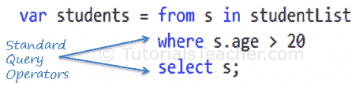

# 标准查询运算符

> 原文:[https://www . tutorial stearner . com/linq/linq-standard-query-operators](https://www.tutorialsteacher.com/linq/linq-standard-query-operators)

LINQ 的标准查询操作符实际上是`IEnumerable<T> and IQueryable<T>`类型的扩展方法。它们在`System.Linq.Enumerable`和`System.Linq.Queryable`类中定义。LINQ 有 50 多种标准查询操作符，提供不同的功能，如过滤、排序、分组、聚合、连接等。

## 查询语法中的标准查询运算符

<figure>

<figcaption>Standard Query Operators in Query Syntax</figcaption>

</figure>

## 方法语法中的标准查询运算符

<figure>

<figcaption>Standard Query Operators in Method Syntax</figcaption>

</figure>

查询语法中的标准查询运算符在编译时转换为扩展方法。所以两者都一样。

标准查询运算符可以根据它们提供的功能进行分类。下表列出了标准查询运算符的所有分类:

| 分类 | 标准查询运算符 |
| --- | --- |
| 过滤 | 其中，类型 |
| 整理 | 排序依据，排序依据降序，然后排序依据，然后降序，反向 |
| 分组 | groupby，托罗啦啦队 |
| 加入 | 群组加入，加入 |
| 规划 | 选择，选择许多 |
| 聚合 | 合计、平均、计数、长计数、最大值、最小值、总和 |
| 量词 | 所有、任何、包含 |
| 元素 | 元素默认，第一个，第一个或默认，最后一个，最后一个或默认，单一，单一或默认 |
| 一组 | 不同，除，相交，联合 |
| 分割 | 跳过，一边滑，一边拍，一边拍 |
| 串联 | 联结合并多个字符串 |
| 平等 | 相等操作符 |
| 产生 | 默认值空，空，范围，重复 |
| 转换 | 可计数、可查询、可转换、至数组、至列表、至列表 |

在接下来的部分中学习每个标准查询运算符。