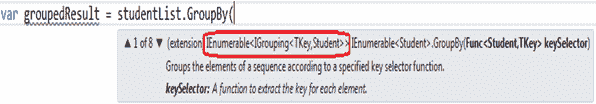

# 分组运算符:分组依据&查找

> 原文:[https://www . tutorial stearn . com/linq/linq-group-operator-group by-to lookup](https://www.tutorialsteacher.com/linq/linq-grouping-operator-groupby-tolookup)

分组运算符的作用与 SQL 查询的 GroupBy 子句相同。分组运算符基于给定的键创建一组元素。该组包含在一个特殊类型的集合中，该集合实现了一个 IGrouping <tkey>接口，其中 TKey 是一个键值，该组已经在该接口上形成，而 TSource 是与分组键值匹配的元素的集合。</tkey>

| 分组运算符 | 描述 |
| --- | --- |
| [基团](#groupby) | GroupBy 运算符基于某个键值返回元素组。每个组由 IGrouping <tkey telement="">对象表示。</tkey> |
| [托布鲁克](#tolookup) | ToLookup 与 GroupBy 相同；唯一的区别是 GroupBy 的执行是延迟的，而 ToLookup 的执行是立即的。 |

## 群组依据

GroupBy 运算符基于某个键值从给定集合中返回一组元素。每个组由 IGrouping <tkey telement="">对象表示。此外，GroupBy 方法有八个重载方法，因此您可以根据方法语法的要求使用适当的扩展方法。</tkey>

*Note:**A LINQ query can end with a GroupBy or Select clause.* *GroupBy 运算符的结果是组的集合。例如，GroupBy 从 Student 集合中返回 IEnumerable <igrouping>>:</igrouping>

[](../../Content/images/linq/linq-groupby.png)

Return type of GroupBy()


### 查询语法中的分组依据

以下示例创建一组年龄相同的学生。同龄学生将在同一个集合中，每个分组的集合将有一个密钥和内部集合，其中密钥将是年龄，内部集合将包括年龄与密钥匹配的学生。

Example: GroupBy in Query syntax C#

```
IList<Student> studentList = new List<Student>() { 
        new Student() { StudentID = 1, StudentName = "John", Age = 18 } ,
        new Student() { StudentID = 2, StudentName = "Steve",  Age = 21 } ,
        new Student() { StudentID = 3, StudentName = "Bill",  Age = 18 } ,
        new Student() { StudentID = 4, StudentName = "Ram" , Age = 20 } ,
        new Student() { StudentID = 5, StudentName = "Abram" , Age = 21 } 
    };

var groupedResult = from s in studentList
                    group s by s.Age;

//iterate each group 
foreach (var ageGroup in groupedResult)
{
    Console.WriteLine("Age Group: {0}", ageGroup .Key); //Each group has a key 

    foreach(Student s in ageGroup) // Each group has inner collection
        Console.WriteLine("Student Name: {0}", s.StudentName);
}
```

Output:<samp>AgeGroup: 18
StudentName: John
StudentName: Bill
AgeGroup: 21
StudentName: Steve
StudentName: Abram
AgeGroup: 20
StudentName: Ram</samp>

如您在上面的示例中所见，您可以使用“foreach”循环迭代该组，其中每个组都包含一个键和内部集合。下图显示了调试视图中的结果。

[](../../Content/images/linq/linq-groupby-2.png)

Grouped collection with key and inner collection


如下所示，在 VB.Net 使用“分组”和“分组依据”从句。

Example: GroupBy clause in VB.Net

```
Dim groupQuery = From s In studentList
                 Group By s.Age Into Group

For Each group In groupQuery
    Console.WriteLine("Age Group: {0}", group.Age) // Each group has key property name

    For Each student In group.Group // Each group has inner collection
        Console.WriteLine("Student Name: {0}", student.StudentName)
    Next
Next
```

请注意，每个组都有一个属性名，在该属性名上执行组操作。在上面的例子中，我们使用年龄来形成一个组，因此每个组都将有“年龄”属性名称，而不是“密钥”作为属性名称。

Output:<samp>AgeGroup: 18
StudentName: John
StudentName: Bill
AgeGroup: 21
StudentName: Steve
StudentName: Abram
AgeGroup: 20
StudentName: Ram</samp>

## 方法语法中的分组依据

GroupBy()扩展方法在方法语法中的工作方式相同。为 GroupBy 扩展方法中的键选择器字段名指定 lambda 表达式。

Example: GroupBy in method syntax C#

```
IList<Student> studentList = new List<Student>() { 
        new Student() { StudentID = 1, StudentName = "John", Age = 18 } ,
        new Student() { StudentID = 2, StudentName = "Steve",  Age = 21 } ,
        new Student() { StudentID = 3, StudentName = "Bill",  Age = 18 } ,
        new Student() { StudentID = 4, StudentName = "Ram" , Age = 20 } ,
        new Student() { StudentID = 5, StudentName = "Abram" , Age = 21 } 
    };

var groupedResult = studentList.GroupBy(s => s.Age);

foreach (var ageGroup in groupedResult)
{
    Console.WriteLine("Age Group: {0}", ageGroup.Key);  //Each group has a key 

    foreach(Student s in ageGroup)  //Each group has a inner collection  
        Console.WriteLine("Student Name: {0}", s.StudentName);
}
```

Example: GroupBy in method syntax VB.Net

```
Dim groupQuery = studentList.GroupBy(Function(s) s.Age)

For Each ageGroup In groupQuery

    Console.WriteLine("Age Group: {0}", ageGroup.Key)  //Each group has a key 

    For Each student In ageGroup.AsEnumerable()  //Each group has a inner collection
        Console.WriteLine("Student Name: {0}", student.StudentName)
    Next
Next
```

Output:<samp>AgeGroup: 18
StudentName: John
StudentName: Bill
AgeGroup: 21
StudentName: Steve
StudentName: Abram
AgeGroup: 20
StudentName: Ram</samp>

## ToLookup

ToLookup 与 GroupBy 相同；唯一的区别是 GroupBy 的执行是延迟的，而 ToLookup 的执行是立即的。此外，ToLookup 仅适用于方法语法。**查询语法不支持 ToLookup。**

Example: ToLookup in method syntax C#

```
IList<Student> studentList = new List<Student>() { 
        new Student() { StudentID = 1, StudentName = "John", Age = 18 } ,
        new Student() { StudentID = 2, StudentName = "Steve",  Age = 21 } ,
        new Student() { StudentID = 3, StudentName = "Bill",  Age = 18 } ,
        new Student() { StudentID = 4, StudentName = "Ram" , Age = 20 } ,
        new Student() { StudentID = 5, StudentName = "Abram" , Age = 21 } 
    };

var lookupResult = studentList.ToLookup(s => s.age);

foreach (var group in lookupResult)
{
    Console.WriteLine("Age Group: {0}", group.Key);  //Each group has a key 

    foreach(Student s in group)  //Each group has a inner collection  
        Console.WriteLine("Student Name: {0}", s.StudentName);
}

```

Example: ToLookup in method syntax VB.Net

```
Dim loopupResult = studentList.ToLookup(Function(s) s.Age)
```

  Points to Remember :

1.  GroupBy & ToLookup 返回一个集合，该集合有一个键和一个基于键字段值的内部集合。
2.  GroupBy 的执行是延迟的，而 ToLookup 的执行是立即的。
3.  LINQ 查询语法可以以 GroupBy 或 Select 子句结尾。*