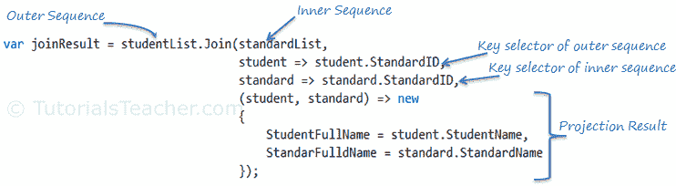

# 加入运算符:加入

> 原文:[https://www . tutorial stearner . com/linq/linq-joing-operator-join](https://www.tutorialsteacher.com/linq/linq-joining-operator-join)

连接运算符连接两个序列(集合)并产生一个结果。

| 加入运营商 | 使用 |
| --- | --- |
| [加入](#join) | Join 运算符基于一个键连接两个序列(集合)，并返回结果序列。 |
| [群组加入](/linq/linq-joining-operator-groupjoin) | GroupJoin 运算符基于键连接两个序列，并返回序列组。这就像是 SQL 的左外连接。 |

## 加入

Join 运算符操作两个集合，内部集合和外部集合。它返回一个新的集合，该集合包含两个集合中满足指定表达式的元素。与 SQL 的**内部连接**相同。

### 方法语法中的联接

连接扩展方法有两个重载，如下所示。

Join Overload Methods:

```
public static IEnumerable<TResult> Join<TOuter, TInner, TKey, TResult>(this IEnumerable<TOuter> outer, 
            IEnumerable<TInner> inner, Func<TOuter, TKey> outerKeySelector, 
            Func<TInner, TKey> innerKeySelector, 
            Func<TOuter, TInner, TResult> resultSelector);

public static IEnumerable<TResult> Join<TOuter, TInner, TKey, TResult>(this IEnumerable<TOuter> outer, 
            IEnumerable<TInner> inner, 
            Func<TOuter, TKey> outerKeySelector,
            Func<TInner, TKey> innerKeySelector, 
            Func<TOuter, TInner, TResult> resultSelector,
            IEqualityComparer<TKey> comparer);

```

如您所见，第一个重载方法接受五个输入参数(除了第一个“this”参数):1)外部 2)内部 3)外部关键字选择器 4)内部关键字选择器 5)结果选择器。

我们举一个简单的例子。下面的示例联接两个字符串集合，并返回一个新集合，该集合包括两个集合中的匹配字符串。

Example: Join operator C#

```
IList<string> strList1 = new List<string>() { 
    "One", 
    "Two", 
    "Three", 
    "Four"
};

IList<string> strList2 = new List<string>() { 
    "One", 
    "Two", 
    "Five", 
    "Six"
};

var innerJoin = strList1.Join(strList2,
                      str1 => str1, 
                      str2 => str2, 
                      (str1, str2) => str1);
```

<samp>One
Two</samp>

现在，让我们使用以下学生和标准类来理解联接方法，其中学生类包括与标准类的标准标识相匹配的标准标识。

Example Classes

```
public class Student{ 
    public int StudentID { get; set; }
    public string StudentName { get; set; }
    public int StandardID { get; set; }
}

public class Standard{ 
    public int StandardID { get; set; }
    public string StandardName { get; set; }
}
```

下面的示例演示了 LINQ 连接查询。

Example: Join Query C#

```
IList<Student> studentList = new List<Student>() { 
    new Student() { StudentID = 1, StudentName = "John", StandardID =1 },
    new Student() { StudentID = 2, StudentName = "Moin", StandardID =1 },
    new Student() { StudentID = 3, StudentName = "Bill", StandardID =2 },
    new Student() { StudentID = 4, StudentName = "Ram" , StandardID =2 },
    new Student() { StudentID = 5, StudentName = "Ron"  } 
};

IList<Standard> standardList = new List<Standard>() { 
    new Standard(){ StandardID = 1, StandardName="Standard 1"},
    new Standard(){ StandardID = 2, StandardName="Standard 2"},
    new Standard(){ StandardID = 3, StandardName="Standard 3"}
};

var innerJoin = studentList.Join(// outer sequence 
                      standardList,  // inner sequence 
                      student => student.StandardID,    // outerKeySelector
                      standard => standard.StandardID,  // innerKeySelector
                      (student, standard) => new  // result selector
                                    {
                                        StudentName = student.StudentName,
                                        StandardName = standard.StandardName
                                    });
```

下图说明了上述示例中连接运算符的各个部分。

<figure>[](../../Content/images/linq/linq-join-operator.png)

<figcaption>join operator</figcaption>

</figure>

在上面的连接查询示例中，studentList 是外部序列，因为查询从它开始。Join 方法中的第一个参数用于指定内部序列，在上面的示例中是 standardList。Join 方法的第二个和第三个参数用于指定一个字段，该字段的值应该使用 lambda 表达式进行匹配，以便在结果中包含元素。外部序列`student => student.StandardID`的键选择器指示 studentList 每个元素的 take StandardID 字段应该与内部序列`standard => standard.StandardID`的键匹配。如果两个关键字字段的值都匹配，则在结果中包含该元素。

Join 方法中的最后一个参数是一个表达式，用于表示结果。在上面的示例中，结果选择器包括序列的 StudentName 和 StandardName 属性。

两个序列(集合)的标准标识键必须匹配，否则该项目将不会包含在结果中。例如，Ron 与任何标准都没有关联，因此 Ron 不包括在结果集合中。上述示例中的 innerJoinResult 在执行后将包含以下元素:

<samp>John - Standard 1
Moin - Standard 1
Bill - Standard 2
Ram - Standard 2</samp> 

以下示例演示了 VB.Net 方法语法中的连接运算符。

Example: Join operator VB.Net

```
Dim innerJoin = studentList.Join(standardList, 
                                    Function(s) s.StandardID, 
                                    Function(std) std.StandardID, 
                                    Function(s, std) New With 
                                    {
                                        .StudentName = s.StudentName, 
                                        .StandardName = std.StandardName
                                    });
```

### 查询语法中的联接

查询语法中的 Join 运算符的工作原理与方法语法略有不同。它需要外部序列、内部序列、键选择器和结果选择器。“on”关键字用于键选择器，其中“equals”运算符的左侧是外部键选择符，“equals”的右侧是内部键选择符。

Syntax: Join in query syntax

```
from ... in outerSequence

        join ... in innerSequence  

        on outerKey equals innerKey

        select ...
```

如果 studentList 和 standardList 的`Student.StandardID`和`Standard.StandardID`匹配，查询语法中的 Join 运算符的以下示例将返回它们的元素集合。

Example: Join operator in query syntax C#

```
IList<Student> studentList = new List<Student>() { 
    new Student() { StudentID = 1, StudentName = "John", Age = 13, StandardID =1 },
    new Student() { StudentID = 2, StudentName = "Moin",  Age = 21, StandardID =1 },
    new Student() { StudentID = 3, StudentName = "Bill",  Age = 18, StandardID =2 },
    new Student() { StudentID = 4, StudentName = "Ram" , Age = 20, StandardID =2 },
    new Student() { StudentID = 5, StudentName = "Ron" , Age = 15 } 
};

IList<Standard> standardList = new List<Standard>() { 
    new Standard(){ StandardID = 1, StandardName="Standard 1"},
    new Standard(){ StandardID = 2, StandardName="Standard 2"},
    new Standard(){ StandardID = 3, StandardName="Standard 3"}
};

var innerJoin = from s in studentList // outer sequence
                      join st in standardList //inner sequence 
                      on s.StandardID equals st.StandardID // key selector 
                      select new { // result selector 
                                    StudentName = s.StudentName, 
                                    StandardName = st.StandardName 
                                };
```

Example: Join operator in query syntax VB.Net

```
Dim innerJoin = From s In studentList ' outer sequence
                      Join std In standardList  ' inner sequence 
                      On s.StandardID Equals std.StandardID ' key selector 
                      Select _  ' result selector
                            StudentName = s.StudentName,
                            StandardName = std.StandardName
```

Output:<samp>John - Standard 1
Moin - Standard 1
Bill - Standard 2
Ram - Standard 2</samp>*Note:**Use the **equals** operator to match key selector in query syntax. `==` is not valid.**  Points to Remember :

1.  **加入****群加入**正在加入运营商。
2.  **连接**就像 SQL 的内部连接。它返回一个新的集合，该集合包含两个关键字匹配的集合中的公共元素。
3.  **Join** 对两个序列内部序列和外部序列进行操作，产生一个结果序列。
4.  **加入**查询语法:

    ```
    from... in outerSequence
    join... in innerSequence 
    on  outerKey equals innerKey
    select ...

    ```