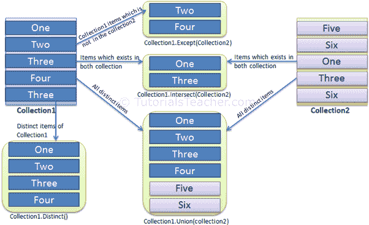

# LINQ 集合运算符`Distinct`

> 原文：<https://www.tutorialsteacher.com/linq/linq-set-operators-distinct>

下表列出了 LINQ 所有可用的 Set 运算符。

| 集合运算符 | 使用 |
| --- | --- |
| [截然不同](#distinct)T2】 | 从集合中返回不同的值。 |
| [除](/linq/linq-set-operators-except)外 | 返回两个序列之间的差异，这意味着一个集合中的元素不会出现在第二个集合中。 |
| [相交](/linq/linq-set-operators-intersect)T2】 | 返回两个序列的交集，这意味着元素出现在两个集合中。 |
| [联合](/linq/linq-set-operators-union)T2】 | 从两个序列中返回唯一元素，这意味着出现在两个序列中的任何一个中的唯一元素。 |

下图显示了每组运算符如何在集合上工作:

[](../../Content/images/linq/linq-set-operators.png)

LINQ Set operators


## 明显的

Distinct 扩展方法从给定集合中返回唯一元素的新集合。

Example: Distinct C#

```
IList<string> strList = new List<string>(){ "One", "Two", "Three", "Two", "Three" };

IList<int> intList = new List<int>(){ 1, 2, 3, 2, 4, 4, 3, 5 };

var distinctList1 = strList.Distinct();

foreach(var str in distinctList1)
    Console.WriteLine(str);

var distinctList2 = intList.Distinct();

foreach(var i in distinctList2)
    Console.WriteLine(i);
```

输出：

```
One
Two
Three
1
2
3
4
5
```

Distinct 扩展方法不比较复杂类型对象的值。为了比较复杂类型的值，需要实现`IEqualityComparer<T>`接口。 在下面的例子中，`StudentComparer`类实现了`IEqualityComparer<Student>`来比较`Student<`对象。

Example: Implement IEqualityComparer in C#

```
public class Student 
{
    public int StudentID { get; set; }
    public string StudentName { get; set; }
    public int Age { get; set; }
}

class StudentComparer : IEqualityComparer<Student>
{
    public bool Equals(Student x, Student y)
    {
        if (x.StudentID == y.StudentID 
                && x.StudentName.ToLower() == y.StudentName.ToLower())
            return true;

        return false;
    }

    public int GetHashCode(Student obj)
    {
        return obj.StudentID.GetHashCode();
    }
}
```

现在，您可以在 Distinct()方法中传递上述`StudentComparer`类的一个对象作为参数来比较如下所示的`Student`对象。

Example: Distinct in C#

```
IList<Student> studentList = new List<Student>() { 
        new Student() { StudentID = 1, StudentName = "John", Age = 18 } ,
        new Student() { StudentID = 2, StudentName = "Steve",  Age = 15 } ,
        new Student() { StudentID = 3, StudentName = "Bill",  Age = 25 } ,
        new Student() { StudentID = 3, StudentName = "Bill",  Age = 25 } ,
        new Student() { StudentID = 3, StudentName = "Bill",  Age = 25 } ,
        new Student() { StudentID = 3, StudentName = "Bill",  Age = 25 } ,
        new Student() { StudentID = 5, StudentName = "Ron" , Age = 19 } 
    };

var distinctStudents = studentList.Distinct(new StudentComparer()); 

foreach(Student std in distinctStudents)
    Console.WriteLine(std.StudentName);
```

输出：

```
John
Steve
Bill
Ron
``` 

## 查询语法中的独特运算符

在 C# 查询语法中，Distinct 运算符是不支持的**。但是，您可以使用查询变量的 Distinct 方法或将整个查询包装在括号中，然后调用 Distinct()。**

 **在 VB.Net 查询语法中使用 Distinct 关键字:

Example: Distinct in query syntax VB.Net

```
Dim strList = New List(Of string) From {"One", "Three", "Two", "Two", "One" }

Dim distinctStr = From s In strList _
                  Select s Distinct
```

