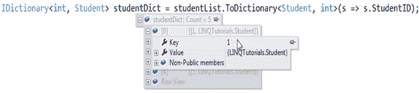

# LINQ 转换运算符

> 原文：<https://www.tutorialsteacher.com/linq/linq-conversion-operators>

LINQ 的转换运算符在转换序列(集合)中元素的类型时非常有用。有三种类型的转换运算符: **As** 运算符(AsEnumerable 和 AsQueryable)、 **To** 运算符(ToArray、ToDictionary、ToList 和 ToLookup)和 **Casting** 运算符(Cast 和 OfType)。

下表列出了所有转换运算符。

| 方法 | 描述 |
| --- | --- |
| 可数的 | 将输入序列返回为 IEnumerable |
| AsQueryable | 将 IEnumerable <t>转换为 IQueryable，以模拟远程查询提供程序</t> |
| 演员阵容 | 将非泛型集合转换为泛型集合(IEnumerable 到 IEnumerable <t>)</t> |
| [眼型](/linq/linq-filtering-operators-oftype) | 基于指定类型筛选集合 |
| toaarray(数组) | 将集合转换为数组 |
| 到过渡时期 | 基于键选择器功能将元素放入字典 |
| 托利斯 | 将收藏转换为列表 |
| [托布鲁克](/linq/linq-grouping-operator-groupby-tolookup) | 将元素分组到查找中 |

## 可计数和可查询

AsEnumerable 和 AsQueryable 方法分别将源对象强制转换或转换为 IEnumerable <t>或 IQueryable <t>。</t></t>

考虑以下例子:(礼貌用语:[乔恩·斯基特](https://stackoverflow.com/a/9063184/861716))

Example: AsEnumerable & AsQueryable operator in C#:

```
class Program
{

    static void ReportTypeProperties<T>(T obj)
    {
        Console.WriteLine("Compile-time type: {0}", typeof(T).Name);
        Console.WriteLine("Actual type: {0}", obj.GetType().Name);
    }

    static void Main(string[] args)
    {
        Student[] studentArray = { 
                new Student() { StudentID = 1, StudentName = "John", Age = 18 } ,
                new Student() { StudentID = 2, StudentName = "Steve",  Age = 21 } ,
                new Student() { StudentID = 3, StudentName = "Bill",  Age = 25 } ,
                new Student() { StudentID = 4, StudentName = "Ram" , Age = 20 } ,
                new Student() { StudentID = 5, StudentName = "Ron" , Age = 31 } ,
            };   

        ReportTypeProperties( studentArray);
        ReportTypeProperties(studentArray.AsEnumerable());
        ReportTypeProperties(studentArray.AsQueryable());   
    }
}
```

输出：

```
Compile-time type: Student[]
Actual type: Student[]
Compile-time type: IEnumerable`1
Actual type: Student[]
Compile-time type: IQueryable`1
Actual type: EnumerableQuery`1
```

从上面的例子中可以看出，AsEnumerable 和 AsQueryable 方法分别将编译时类型转换为 IEnumerable 和 IQueryable

访问 [stackoverflow](https://stackoverflow.com/questions/17968469/whats-the-differences-between-tolist-asenumerable-asqueryable) 了解关于 AsEnumerable 和 AsQueryable 方法的详细信息。

## 演员阵容

Cast 做的和 asennumerical<t>一样的事情。它将源对象转换成 IEnumerable <t>。</t></t>

Example: Cast operator in C#

```
class Program
{

    static void ReportTypeProperties<T>(T obj)
    {
        Console.WriteLine("Compile-time type: {0}", typeof(T).Name);
        Console.WriteLine("Actual type: {0}", obj.GetType().Name);
    }

    static void Main(string[] args)
    {
        Student[] studentArray = { 
                new Student() { StudentID = 1, StudentName = "John", Age = 18 } ,
                new Student() { StudentID = 2, StudentName = "Steve",  Age = 21 } ,
                new Student() { StudentID = 3, StudentName = "Bill",  Age = 25 } ,
                new Student() { StudentID = 4, StudentName = "Ram" , Age = 20 } ,
                new Student() { StudentID = 5, StudentName = "Ron" , Age = 31 } ,
            };   

        ReportTypeProperties( studentArray);
        ReportTypeProperties(studentArray.Cast<Student>());
    }
}
```

输出：

```
Compile-time type: Student[]
Actual type: Student[]
Compile-time type: IEnumerable`1
Actual type: Student[]
Compile-time type: IEnumerable`1
Actual type: Student[]
Compile-time type: IEnumerable`1
Actual type: Student[]
``` 

`studentArray.Cast<Student>()`与`(IEnumerable<Student>)studentArray`相同，但<演员表>()可读性更强。

## 至运算符:至数组()，至列表()，至列表()

顾名思义，ToArray()，ToList()，ToDictionary()方法分别将源对象转换为数组、列表或字典。

**至**运算符强制执行查询。它强制远程查询提供程序执行查询，并从底层数据源(如 SQL Server 数据库)获取结果。

Example: ToArray & ToList in C#

```
IList<string> strList = new List<string>() { 
                                            "One", 
                                            "Two", 
                                            "Three", 
                                            "Four", 
                                            "Three" 
                                            };

string[] strArray = strList.ToArray<string>();// converts List to Array

IList<string> list = strArray.ToList<string>(); // converts array into list
```

将通用列表转换为通用词典:

Example: ToDictionary in C#:

```
IList<Student> studentList = new List<Student>() { 
                    new Student() { StudentID = 1, StudentName = "John", age = 18 } ,
                    new Student() { StudentID = 2, StudentName = "Steve",  age = 21 } ,
                    new Student() { StudentID = 3, StudentName = "Bill",  age = 18 } ,
                    new Student() { StudentID = 4, StudentName = "Ram" , age = 20 } ,
                    new Student() { StudentID = 5, StudentName = "Ron" , age = 21 } 
                };

//following converts list into dictionary where StudentId is a key
IDictionary<int, Student> studentDict = 
                                studentList.ToDictionary<Student, int>(s => s.StudentID); 

foreach(var key in studentDict.Keys)
	Console.WriteLine("Key: {0}, Value: {1}", 
                                key, (studentDict[key] as Student).StudentName);
```

输出：

```
Key: 1, Value: John
Key: 2, Value: Steve
Key: 3, Value: Bill
Key: 4, Value: Ram
Key: 5, Value: Ron
```

下图显示了上面示例中的 studentDict 如何包含键-值对，其中键是 StudentID，值是 Student 对象。

[](../../Content/images/linq/linq-todictionary.png)

LINQ-ToDictionary Operator

