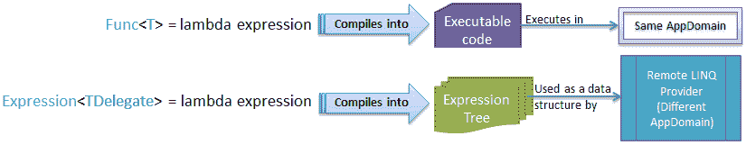

# LINQ 表达式

> 原文：<https://www.tutorialsteacher.com/linq/linq-expression>

可以将[Lambda 表达式](/linq/linq-lambda-expression)分配给[函数](/csharp/csharp-func-delegate)或[动作](/csharp/csharp-action-delegate)类型的委托来处理内存中的集合。那个 .NET 编译器在编译时将分配给 [Func](/csharp/csharp-func-delegate) 或 [Action](http://localhost:56670/csharp/csharp-action-delegate) 类型委托的 lambda 表达式转换为可执行代码。

LINQ 引入了一种新的类型叫做[表达式](https://msdn.microsoft.com/en-us/library/bb335710(v=vs.110).aspx)，它代表强类型的 lambda 表达式。意思是Lambda 表达式也可以赋给表达式< TDelegate >类型。 该 .NET 编译器将分配给表达式<的 lambda 表达式转换为表达式树[而不是可执行代码。远程 LINQ 查询提供程序将此表达式树用作数据结构，以构建运行时查询(如 LINQ-到-SQL、EntityFramework 或任何其他实现 IQueryable < T >接口的 LINQ 查询提供程序)。](/linq/expression-tree)

下图说明了将 lambda 表达式分配给 Func 或 Action 委托和 LINQ 表达式时的区别。

[](../../Content/images/linq/expression.png)

Expression and Func


我们将在下一节学习表达式树，但是首先，让我们看看如何定义和调用表达式。

## 定义表达式

以*系统为参考。Linq.Expressions* 命名空间，并使用 Expression < TDelegate >类来定义表达式。表达式<需要委托类型功能或动作。

例如，您可以将 lambda 表达式分配给 Func 类型委托的 isTeenAger 变量，如下所示:

Example: Define Func delegate for an expression in C#

```
public class Student 
{
    public int StudentID { get; set; }
    public string StudentName { get; set; }
    public int Age { get; set; }
}

Func<Student, bool> isTeenAger = s => s.Age > 12 && s.Age < 20;
```

Example: Define Func delegate for an expression in VB.Net

```
Dim isTeenAger As Func(Of Student, Boolean) = Function(s) s.Age > 12 And s.Age < 20
```

现在，您可以通过用 Expression 包装 Func 委托，将上面的 Func 类型委托转换为表达式，如下所示:

Example: Define Expression in C#

```
Expression<Func<Student, bool>> isTeenAgerExpr = s => s.Age > 12 && s.Age < 20;
```

Example: Define Expression in VB.Net

```
Dim isTeenAgerExpr As Expression(Func(Of Student, Boolean)) = 
                                        Function(s) s.Age > 12 And s.Age < 20
```

同样，如果没有从委托中返回值，也可以用表达式包装 Action <t>类型的委托。</t>

Example: Define Expression in C#

```
Expression<Action<Student>> printStudentName = s => Console.WriteLine(s.StudentName);
```

Example: Define Expression in VB.Net

```
Dim printStudentName As Expression(Action(Of Student) = 
                                        Function(s) Console.WriteLine(s.StudentName);
```

因此，您可以定义表达式<tdelegate>类型。现在，让我们看看如何调用由表达式<tdelegate>包装的委托。</tdelegate></tdelegate>

## 调用表达式

您可以像调用委托一样调用由表达式包装的委托，但是首先需要使用 compile()方法编译它。Compile()返回**函数**或**动作**类型的委托，这样您就可以像委托一样调用它。

Example: Invoke Expression in C#

```
Expression<Func<Student, bool>> isTeenAgerExpr = s => s.Age > 12 && s.Age < 20;

//compile Expression using Compile method to invoke it as Delegate
Func<Student, bool>  isTeenAger = isTeenAgerExpr.Compile();

//Invoke
bool result = isTeenAger(new Student(){ StudentID = 1, StudentName = "Steve", Age = 20});
```

Example: Invoke Expression in VB.Net

```
Dim isTeenAgerExpr As Expression(Of Func(Of Student, Boolean)) = 
                                                    Function(s) s.Age > 12 And s.Age < 20

'compile Expression using Compile method to invoke it as Delegate
Dim isTeenAger As Func(Of Student, Boolean) = isTeenAgerExpr.Compile()

Dim result = isTeenAger(New Student() With { .StudentID = 1, .StudentName = "Steve", .Age = 20})
```

在下一节中详细了解表达式树。