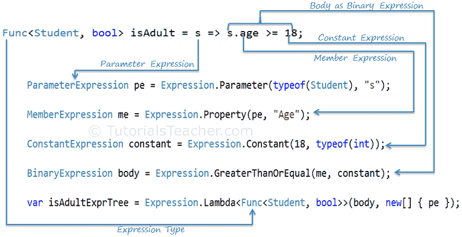
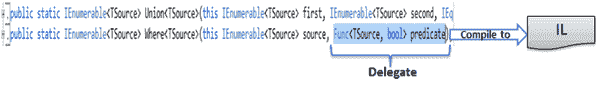
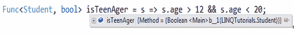
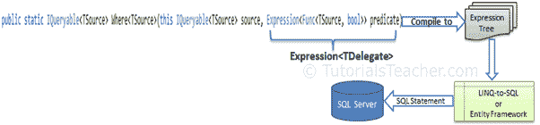

# 表达式树

> 原文：<https://www.tutorialsteacher.com/linq/expression-tree>

您已经在上一节中学习了[表达式](/linq/linq-expression)。现在，让我们在这里了解一下表达式树。

表达式树顾名思义就是以树状数据结构排列的表达式。表达式树中的每个节点都是一个表达式。例如，表达式树可用于表示数学公式 x < y，其中 x，

表达式树是 lambda 表达式的内存表示。它保存查询的实际元素，而不是查询的结果。

表达式树使 lambda 表达式的结构透明且显式。您可以像处理任何其他数据结构一样，与表达式树中的数据进行交互。

例如，考虑下面的 isTeenAgerExpr 表达式:

Example: Expression in C#

```
Expression<Func<Student, bool>> isTeenAgerExpr = s => s.age > 12 && s.age < 20;
```

编译器会将上面的表达式翻译成下面的表达式树:

Example: Expression Tree in C#

```
Expression.Lambda<Func<Student, bool>>(
                Expression.AndAlso(
                    Expression.GreaterThan(Expression.Property(pe, "Age"), Expression.Constant(12, typeof(int))),
                    Expression.LessThan(Expression.Property(pe, "Age"), Expression.Constant(20, typeof(int)))),
                        new[] { pe });
```

您也可以手动构建表达式树。让我们看看如何为以下简单的 lambda 表达式构建表达式树:

Example: Func delegate in C#:

```
Func<Student, bool> isAdult = s => s.age >= 18;
```

此 Func 类型委托将被视为以下方法:

C#:

```
public bool function(Student s)
{
  return s.Age > 18;
}
```

要创建表达式树，首先创建一个参数表达式，其中 Student 是参数的类型，s 是参数的名称，如下所示:

Step 1: Create Parameter Expression in C#

```
ParameterExpression pe = Expression.Parameter(typeof(Student), "s");
```

现在，使用表达式。属性()来创建年龄表达式，其中 s 是参数，年龄是学生的属性名。(**表达式**是一个抽象类，包含手动创建表达式树的静态助手方法。)

Step 2: Create Property Expression in C#

```
MemberExpression me = Expression.Property(pe, "Age");
```

现在，为 18 创建一个常量表达式:

Step 3: Create Constant Expression in C#

```
ConstantExpression constant = Expression.Constant(18, typeof(int));
```

到目前为止，我们已经为 s.Age(成员表达式)和 18(常量表达式)构建了表达式树。我们现在需要检查成员表达式是否大于常量表达式。为此，请使用表达式。方法，并将成员表达式和常量表达式作为参数传递:

Step 4: Create Binary Expression in C#

```
BinaryExpression body = Expression.GreaterThanOrEqual(me, constant);
```

因此，我们已经为 lambda 表达式主体建立了一个表达式树。我们现在需要连接参数和主体表达式。使用表达式。Lambda <tdelegate>(body，parameters array)加入 body 和 parameter 部分的 Lambda 表达式 s = > s.age > = 18:</tdelegate>

Step 5: Create Lambda Expression in C#

```
var isAdultExprTree = Expression.Lambda<Func<Student, bool>>(body, new[] { pe });
```

这样，您可以用 lambda 表达式为简单 Func 委托构建表达式树。

Example: Expression Tree in C#

```
ParameterExpression pe = Expression.Parameter(typeof(Student), "s");

MemberExpression me = Expression.Property(pe, "Age");

ConstantExpression constant = Expression.Constant(18, typeof(int));

BinaryExpression body = Expression.GreaterThanOrEqual(me, constant);

var ExpressionTree = Expression.Lambda<Func<Student, bool>>(body, new[] { pe });

Console.WriteLine("Expression Tree: {0}", ExpressionTree);

Console.WriteLine("Expression Tree Body: {0}", ExpressionTree.Body);

Console.WriteLine("Number of Parameters in Expression Tree: {0}", 
                                ExpressionTree.Parameters.Count);

Console.WriteLine("Parameters in Expression Tree: {0}", ExpressionTree.Parameters[0]);
```

Example: Expression Tree in VB.Net

```
Dim pe As ParameterExpression = Expression.Parameter(GetType(Student), "s")

Dim mexp As MemberExpression = Expression.Property(pe, "Age")

Dim constant As ConstantExpression = Expression.Constant(18, GetType(Integer))

Dim body As BinaryExpression = Expression.GreaterThanOrEqual(mexp, constant)

Dim ExpressionTree As Expression(Of Func(Of Student, Boolean)) = 
    Expression.Lambda(Of Func(Of Student, Boolean))(body, New ParameterExpression() {pe})

Console.WriteLine("Expression Tree: {0}", ExpressionTree)

Console.WriteLine("Expression Tree Body: {0}", ExpressionTree.Body)

Console.WriteLine("Number of Parameters in Expression Tree: {0}", 
                                ExpressionTree.Parameters.Count)

Console.WriteLine("Parameters in Expression Tree: {0}", ExpressionTree.Parameters(0))
```

输出：

```
Expression Tree: s => (s.Age >= 18)
Expression Tree Body: (s.Age >= 18)
Number of Parameters in Expression Tree: 1
Parameters in Expression Tree: s
```

下图说明了创建表达式树的整个过程:

[](../../Content/images/linq/linq-construct-expression-tree.png "Construct Expression Tree Manually")

Construct Expression Tree


## 为什么是表情树？

上一节我们已经看到，分配给 ***Func < T >*** 的 lambda 表达式编译成可执行代码，分配给 ***表达式< TDelegate >*** 类型的 lambda 表达式编译成表达式树。

可执行代码在同一个应用域中执行，以处理内存中的集合。可枚举静态类包含实现 **IEnumerable < T >** 接口的内存中集合的扩展方法，如 List < T >、Dictionary < T >等。可枚举类中的扩展方法接受**函数**类型委托的谓词参数。例如**其中**扩展方法接受**函数<源，布尔>谓词**。然后，它将其编译成中间语言，以处理同一应用域中的内存集合。

下图显示了可枚举类中的 Where 扩展方法包含 Func 委托作为参数:

[](../../Content/images/linq/linq-func-delegate-IEnumerable.png)

Func delegate in Where


**Func** 委托是一个原始的可执行代码，所以如果你调试代码，你会发现 **Func** 委托会表现为不透明代码。您看不到其参数、返回类型和正文:

[](../../Content/images/linq/func-delegate-debug.png)

Func delegate in debug mode


**Func** delegate 用于内存中的集合，因为它将在同一个 AppDomain 中处理，但是像 LINQ 到 SQL、EntityFramework 或其他提供 LINQ 功能的第三方产品这样的远程 LINQ 查询提供程序呢？他们将如何解析已编译成原始可执行代码的 lambda 表达式以了解参数、返回 lambda 表达式的类型并构建运行时查询以进一步处理？答案是**表情树**。

表达式<tdelegate>被编译成一个叫做表达式树的数据结构。</tdelegate>

如果调试代码，表达式委托将表示如下:

[](../../Content/images/linq/linq-expressiontree-debug.png)

Expression Tree in debug mode


现在，您可以看到普通委托和表达式之间的区别。表达式树是透明的。您可以从表达式中检索参数、返回类型和正文表达式信息，如下所示:

Example: Expression Tree in C#

```
Expression<Func<Student, bool>> isTeenAgerExpr = s => s.Age > 12 && s.Age < 20;

Console.WriteLine("Expression: {0}", isTeenAgerExpr );

Console.WriteLine("Expression Type: {0}", isTeenAgerExpr.NodeType);

var parameters = isTeenAgerExpr.Parameters;

foreach (var param in parameters)
{
    Console.WriteLine("Parameter Name: {0}", param.Name);
    Console.WriteLine("Parameter Type: {0}", param.Type.Name );
}
var bodyExpr = isTeenAgerExpr.Body as BinaryExpression;

Console.WriteLine("Left side of body expression: {0}", bodyExpr.Left);
Console.WriteLine("Binary Expression Type: {0}", bodyExpr.NodeType);
Console.WriteLine("Right side of body expression: {0}", bodyExpr.Right);
Console.WriteLine("Return Type: {0}", isTeenAgerExpr.ReturnType);
```

输出：

```
Expression: s => ((s.Age > 12) AndAlso (s.Age < 20))
Expression Type: Lambda
Parameter Name: s
Parameter Type: Student
Left side of body expression: (s.Age > 12)
Binary Expression Type: AndAlso
Right side of body expression: (s.Age < 20)
Return Type: System.Boolean
```

LINQ 到 SQL 或实体框架的 LINQ 查询不在同一应用域中执行。例如，以下针对实体框架的 LINQ 查询从未在您的程序中实际执行过:

Example: LINQ Query in C#

```
var query = from s in dbContext.Students
            where s.Age >= 18
            select s;
```

它首先被翻译成一条 SQL 语句，然后在数据库服务器上执行。

在查询表达式中找到的代码必须被翻译成一个可以作为字符串发送给另一个进程的 SQL 查询。对于 LINQ-到-SQL 或实体框架，这个过程恰好是一个 SQL 服务器数据库。显然，将表达式树等数据结构翻译成 SQL 要比将原始的 IL 或可执行代码翻译成 SQL 容易得多，因为正如您所看到的，从表达式中检索信息很容易。

表达式树是为将诸如查询表达式之类的代码转换成可以传递给其他进程并在那里执行的字符串的任务而创建的。

可查询的静态类包括接受表达式类型的谓词参数的扩展方法。该谓词表达式将被转换为表达式树，然后作为数据结构传递给远程 LINQ 提供程序，以便提供程序可以从表达式树构建适当的查询并执行该查询。

[](../../Content/images/linq/linq-expressiontree-process.png)

Expression Tree Process

