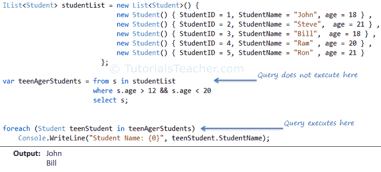
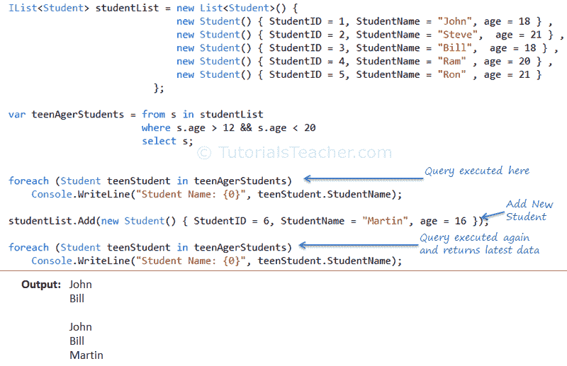
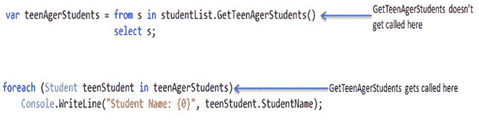

# LINQ 查询的延迟执行

> 原文：<https://www.tutorialsteacher.com/linq/linq-deferred-execution>

延迟执行意味着表达式的求值被延迟，直到实际需要它的实现值。它通过避免不必要的执行大大提高了性能。

延迟执行适用于任何内存集合以及远程 LINQ 提供程序，如 LINQ 到 SQL、LINQ 到实体、LINQ 到 XML 等。

让我们用下面的例子来理解延迟执行:

[](../../Content/images/linq/linq-deferred-execution-1.png)

Deferred Execution


在上面的示例中，您可以看到当您使用 foreach 循环进行迭代时，查询被具体化并执行。这被称为延迟执行。当您实际访问集合中的每个对象并对其进行操作时，LINQ 会处理 studentList 集合。

### 延迟执行返回最新数据

要检查延迟执行是否每次都返回最新数据，请在 foreach 循环后再添加一名青少年学生，并检查青少年学生列表:

[](../../Content/images/linq/linq-deferred-execution-2.png)

Deferred Execution


如您所见，第二个 foreach 循环再次执行查询并返回最新数据。延迟执行会在每次执行时重新评估；这叫**懒评**。这是延迟执行的主要优势之一:它总是能给你最新的数据。

## 实现延迟执行

您可以使用 C# 的 ***yield*** 关键字为 *IEnumerable* 实现自定义扩展方法的延迟执行。

例如，您可以为 IEnumerable 实现自定义扩展方法 GetTeenAgerStudents，该方法返回所有青少年学生的列表。

Example: Implimenting Deferred Execution in C#

```cs
public static class EnumerableExtensionMethods
{
    public static IEnumerable<Student> GetTeenAgerStudents(this IEnumerable<Student> source)
    {

        foreach (Student std in source)
        {
            Console.WriteLine("Accessing student {0}", std.StudentName);

            if (std.age > 12 && std.age < 20)
                yield return std;
        }
    }
}
```

请注意，每当调用 GetTeenAgerStudents()时，我们都会在控制台上打印学生姓名。

您现在可以使用如下扩展方法:

C#:

```cs
IList<Student> studentList = new List<Student>() { 
            new Student() { StudentID = 1, StudentName = "John", age = 13 } ,
            new Student() { StudentID = 2, StudentName = "Steve",  age = 15 } ,
            new Student() { StudentID = 3, StudentName = "Bill",  age = 18 } ,
            new Student() { StudentID = 4, StudentName = "Ram" , age = 12 } ,
            new Student() { StudentID = 5, StudentName = "Ron" , age = 21 } 
        };

var teenAgerStudents = from s in studentList.GetTeenAgerStudents() 
                        select s;

foreach (Student teenStudent in teenAgerStudents)
    Console.WriteLine("Student Name: {0}", teenStudent.StudentName);
```

输出：

```cs
Accessing student John
Student Name: John
Accessing student Steve
Student Name: Steve
Accessing student Bill
Student Name: Bill
Accessing student Ram
Accessing student Ron
```

从输出中可以看到，当您使用 foreach 循环迭代 studentList 时，GetTeenAgerStudents()会被调用。

[](../../Content/images/linq/linq-deferred-execution-3.png)

Deferred Execution


因此，通过这种方式，您可以使用 ***yield*** 关键字创建自定义方法，以获得延迟执行的优势。