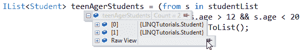

# LINQ 查询的立即执行

> 原文：<https://www.tutorialsteacher.com/linq/linq-immediate-execution>

立即执行与延迟执行相反。它强制执行 LINQ 查询，并立即获得结果。“到”[转换运算符](/linq/linq-conversion-operators)执行给定的查询并立即给出结果。

### 方法语法

在下面的示例中，ToList()扩展方法立即执行查询并返回结果。

C#: Immediate Execution

```cs
IList<Student> teenAgerStudents = 
                studentList.Where(s => s.age > 12 && s.age < 20).ToList();
```

VB.Net:Immediate Execution

```cs
Dim teenAgerStudents As IList(Of Student) = 
                    studentList.Where(Function(s) s.Age > 12 And s.Age < 20).ToList()
```

### 查询语法

C#:

```cs
var teenAgerStudents = from s in studentList
                where s.age > 12 && s.age < 20
                select s;
```

上述查询不会立即执行。您不会发现如下所示的任何结果:

 

Immediate Execution


查询语法不支持“到”运算符，但可以使用 ToList()、ToArray()或 ToDictionary()立即执行，如下所示:

C#:

```cs
IList<Student> teenAgerStudents = (from s in studentList
                where s.age > 12 && s.age < 20
                select s).ToList();
```

VB.Net:

```cs
Dim teenAgerStudents As IList(Of Student) = (From s In studentList _
                Where s.Age > 12 And s.Age < 20 _
                Select s).ToList()
```

您可以在青少年学生集合中看到结果，如下所示:

 

Immediate Execution

