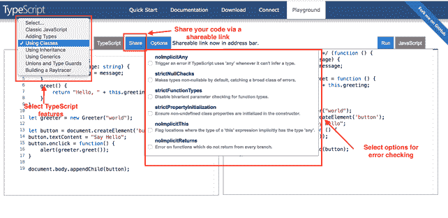

# 安装 TypeScript

> 原文：<https://www.tutorialsteacher.com/typescript/typescript-environment-setup>

安装 TypeScript 有三种方法:

1.  将 TypeScript 作为 NPM 包安装在本地计算机或项目中。
2.  在您的中安装 TypeScript/获取包 .NET 或 .NET Core 项目。
3.  将 TypeScript 作为插件安装在集成开发环境中。

## 使用 NPM 安装 TypeScript

NPM ( [Node.js 包管理器](/nodejs/what-is-node-package-manager))用于在本地机器或项目上安装 [TypeScript 包](https://www.npmjs.com/package/typescript)。 确保在本地机器上安装了 [Node.js](/nodejs/what-is-nodejs) 。 如果你的应用使用的是 JavaScript 框架，那么强烈建议[安装 Node.js](/nodejs/setup-nodejs-development-environment ) 。

要安装或更新最新版本的 TypeScript，请打开命令提示符/终端并键入以下命令:

```ts
npm install -g typescript
```

上面的命令将全局安装 TypeScript，以便您可以在任何项目中使用它。使用以下命令检查已安装的 TypeScript 版本:

```ts
tsc -v
```

执行以下命令，将 TypeScript 作为开发依赖项安装到本地项目中。

```ts
npm install typescript --save-dev
```

## 将 TypeScript 安装为数字获取包

为了 .NET 或 .NET Core 项目，TypeScript 可以作为一个 NuGet 包安装在您的项目中。[微软的 NuGet 包。TypeScript.MSBuild](https://www.nuget.org/packages/Microsoft.TypeScript.MSBuild/) 是 TypeScript 的一个 MSBuild 任务，当你构建你的项目时，它会根据`tsconfig.json`的配置自动将所有`.ts`文件编译成`.js`文件。

要安装 TypeScript NuGet 包，右键单击项目节点打开 NuGet 包管理器，单击`Manage NuGet Packages..`，在`Browse`选项卡中搜索 TypeScript。它将列出所有与 TypeScript 相关的包。 选择**微软。键入脚本. MSBuild** 并点击安装按钮。 这将在您当地的 ASP.NET 项目中安装 TypeScript。

### Visual Studio 扩展的 TypeScript

如果您的项目类型不支持 NuGet 包，那么您可以使用[TypeScript Visual Studio 扩展](https://marketplace.visualstudio.com/items?itemName=TypeScriptTeam.typescript-40)。 您可以从工具>扩展和更新菜单[在 Visual Studio](https://docs.microsoft.com/en-us/visualstudio/ide/finding-and-using-visual-studio-extensions) 中找到并安装扩展。

[Visual Studio 代码](https://code.visualstudio.com/)自带对 TypeScript 的内置支持。

## 在集成开发环境中安装 TypeScript 插件

您可以为您的集成开发环境安装一个特定于集成开发环境的 TypeScript 包或插件。

流行代码编辑器插件的几个例子如下:

1.  [Atom-TypeScript](https://atom.io/packages/atom-typescript):TypeStrong 为 Atom 开发的一个 TypeScript 语言服务。
2.  [Eclipse 的 TypeScript IDE](https://github.com/angelozerr/typescript.java/wiki/Getting-Started):一个由 Angelo Zerr 开发的 Eclipse 插件。
3.  [Eclipse 的 TypeScript 插件](https://github.com/palantir/eclipse-typescript):Palantir 开发的 Eclipse 插件。
4.  WebStorm 包括开箱即用的 TypeScript 支持。

访问 [TypeScript Github 资源库](https://github.com/Microsoft/TypeScript/wiki/TypeScript-Editor-Support )获取支持 TypeScript 开发的 ide 的完整列表。

## TypeScript 操场

TypeScript 提供了一个在线游乐场[https://www.typescriptlang.org/play](https://www.typescriptlang.org/play)来动态编写和测试您的代码，而不需要下载或安装任何东西。

这是初学者学习 TypeScript 和尝试不同 TypeScript 功能的好地方。您还可以选择通过游乐场提供的可共享链接来共享您的代码。

[](../../Content/images/typescript/ts-playground.png) 