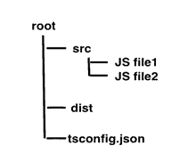

# 将现有的 JavaScript 转换为类型脚本

> 原文：<https://www.tutorialsteacher.com/typescript/converting-javascript-to-typescript>

在本节中，我们将学习如何将现有的 JavaScript 项目转换为 TypeScript。

让我们假设您有一些需要转换为 TypeScript 的 JavaScript 文件。由于编译时的 TypeScript 文件会生成同名的 JavaScript 文件，因此我们需要确保作为输入的原始 JavaScript 文件驻留在一个目录中，这样 TypeScript 就不会覆盖它们。此外，让我们将所有输出文件保存在一个名为 dist 的输出目录中。

对于本教程，我们将有以下目录结构:

[](../../Content/images/typescript/proj-structure.png) 

为了从 JS 迁移到 TS，我们将遵循以下步骤:

1.  将 tsconfig.json 文件添加到项目中
2.  与构建工具集成
3.  全部改变。js 文件到。ts 文件
4.  检查是否有任何错误

## 将 tsconfig.json 文件添加到项目

首先，我们将向项目中添加一个 tsconfig.json 文件。该文件管理项目的编译选项以及要包括和排除的文件。

Example: tsconfig.json 

```
{
    "compilerOptions": {
        "outDir": "./dist",
        "allowJs": true,
        "target": "es5"
    },
        "include": [
        "./src/**/*"
    ]
} 
```

在上面的配置文件中，我们指定包含 src 文件夹中的所有文件。这是使用“包含”选项完成的。compilerOptions，outDir 指定输出文件应该重定向到一个名为“dist”的文件夹。allowJs 选项指定应该允许所有的 Js 文件。目标选项指定所有 JavaScript 构造都应该被翻译成 ECMAScript 5。

## 与构建工具集成

大多数 JavaScript 项目都有一个集成的构建工具，比如 webpack 或 have。

为了与 webpack 集成，

a)在您的终端上运行以下命令:

<samp>npm install awesome-typescript-loader source-map-loader</samp>

awesome-typescript-loader 是一个 typescript 加载程序，而 source-map-loader 用于调试您的源代码。

b)在您的 webpack.config.js 文件中添加/编辑模块配置属性，以包括这两个加载器:

Example: webpack.config.js 

```
module: {
    loaders: [
        // All files with a '.ts' or '.tsx' extension will be handled by 'awesome-typescript-loader'.
        { test: /\.tsx?$/, loader: "awesome-typescript-loader" }
    ],

    preLoaders: [
        // All output '.js' files will have any sourcemaps re-processed by 'source-map-loader'.
        { test: /\.js$/, loader: "source-map-loader" }
    ]
} 
```

对于其他构建工具，如大口、咕噜和浏览，请参考我们前面关于构建工具的部分。

## 正在转换。js 文件到。ts 文件

首先重命名您的。同样，将。jsx 文件转换为. tsx。

一旦这样做了，您的一些代码可能会开始出现编译错误。

## 检查错误

由于 TypeScript 具有严格的类型检查，您可能会注意到 JavaScript 代码中的错误。

几个例子:

a)参数过多或过少的函数

```
function displayPerson(name, age, height) {
    let str1 = "Person named " + name + ",  " + age + " years old";
    let str2 = (height !== undefined) ? (" and " + height +  " feet tall") : '';
    console.log(str1 + str2);
}

displayPerson( "John", 32); 
```

在上面的代码中，我们有一个名为`displayPerson()`的函数，它接受三个参数:姓名、年龄和身高。 我们用两个值调用上面的函数:“John”，和 23。上述函数在 JavaScript 中完全有效。 这是因为如果 JavaScript 中缺少函数的预期参数，它会将未定义的值赋给该参数。

但是，TypeScript 中的相同代码将给出编译错误:错误 TS2554:应为 3 个参数，但得到了 2 个。

为了纠正这一点，您可以在参数`height`中添加一个可选的参数符号。此外，在删除错误时，您还可以如下所示注释代码:

```
function displayPerson( name: string, age: number, height?: number) {
    let str1: string = "Person named " + name + ",  " + age + " years old";
    let str2: string = (height !== undefined) ? (" and " + height +  " feet tall") : '';

    console.log(str1 + str2);
} 
```

b)考虑 JavaScript 中的以下对象:

```
let employee = {};
employee.code = 10;
employee.name = "John";

console.log(employee); 
```

在 TypeScrip 中，这会产生编译错误:

错误 TS2339:类型“{ 0 }”上不存在属性“代码”。

错误 TS2339:类型“{ 0 }”上不存在属性“name”。

要纠正这种情况，您可以移动对象内部的属性:

```
let employee = {
    code: 10,
    name: "John"
}; 
```

或者，创建一个接口:

```
interface Employee {
    code: number,
    name: string
}

let empObj = {} as Employee;
empObj.code = 10;
empObj.name = "John"; 
```

## 使用第三方 JavaScript 库

大多数 JavaScript 项目使用第三方库，如 jQuery 或 Lodash。TypeScript 需要知道这些库中所有对象的类型，以便编译文件。幸运的是，大多数 JavaScript 库的 TypeScript 类型定义文件已经在 [DefinitelyTyped](https://github.com/DefinitelyTyped/DefinitelyTyped) 处可用。 所以，我们不需要自己给它们添加类型。您所需要做的就是为项目中使用的每个库安装类型。

例如，对于 Jquery，安装定义:

<samp>npm install @types/jquery</samp>

所有可用类型脚本类型定义的列表可以在这里看到。

一旦您对您的 JavaScript 项目进行了上述所有更改，运行您的构建工具，您应该将您的 TypeScript 项目编译成可以在浏览器中运行的普通 JavaScript。

这样，您就可以使用 TypeScript 来转换现有的 JavaScript 项目。**