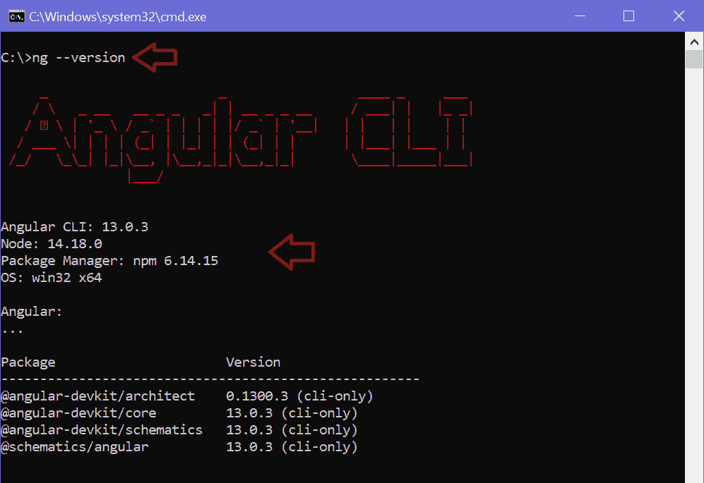
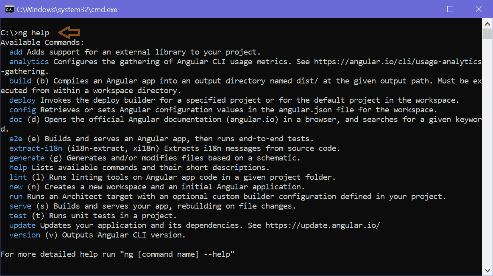

# 安装 Angular2 (v11)

> 原文：<https://www.tutorialsteacher.com/angular/install-angular>

在这里，您将了解如何安装最新版本的 Angular 2。

在安装 Angular 之前，您需要安装一些先决条件。Angular 使用 NPM ( [节点包管理器](/nodejs/what-is-node-package-manager))来安装库、包以及执行脚本。所以，你需要在安装 Angular 之前先安装 NPM。

Angular 需要节点. js 和 NPM 的当前、活动的 LTS 或维护 LTS 版本。

打开终端/命令窗口，输入`node -v`命令，检查本地机器上是否安装了 Node.js。 如果已经安装，则显示版本号，如下图。

<samp>C:\Users\xyz> node -v
v14.18.0</samp>

如果上面的命令没有显示版本号，那么这意味着没有安装 Node.js。要安装最新版本的 Node.js，去[https://nodejs.org](https://nodejs.org/)下载适合你平台的安装程序并安装。这将在您的本地机器上安装 Node.js 和 NPM ( [节点包管理器](/nodejs/what-is-node-package-manager))。

## 更新 NPM

Angular 需要 NPM v6.11 或更高版本。打开终端/命令窗口，键入以下命令，检查本地计算机上的 NPM 版本:

<samp>>npm -v
6.14.4</samp>

这将显示本地计算机上安装的 NPM 版本号。如果您没有最新版本的 NPM，请在 Windows 上使用以下命令进行更新。

<samp>npm install -g npm</samp>

如果你在 MAC 上，使用`sudo npm install -g npm`命令。

安装 Node.js 和 NPM 之后，安装 Angular CLI。

## 安装 Angular 命令行界面

Angular 为应用开发提供了许多库和包。您可以使用 Angular CLI(命令行界面)安装应用所需的库。Angular CLI 还用于生成、构建、运行和部署 Angular 应用。

要使用 NPM 全局安装 Angular CLI，请打开终端/命令窗口，并输入以下命令:

<samp>npm install -g @angular/[[email protected]](/cdn-cgi/l/email-protection)</samp>

在上面的命令中`-g`表示全局，这样就可以在本地机器的任何地方使用 angular CLI。 `@latest`是指定安装最新版本的 angular CLI。

安装后，使用终端/命令窗口中的`ng --version`命令检查 Angular 版本，如下图所示。

使用`ng help`命令查看所有 CLI 命令，如下图所示。

*Note:**Angular CLI use Package.json in your application to install all the necessary libraries and packages for your application, including the required Angular framework libraries.* *## Visual Studio 代码

大多数 Angular 开发人员更喜欢使用 Visual Studio 代码进行 Angular 应用开发。它是免费和开源的。

安装 VS 代码，去[https://code.visualstudio.com](https://code.visualstudio.com/)下载安装。

现在，您已经准备好开发 Angular 应用了。接下来学习如何使用 Angular CLI 生成初始 Angular 应用。*