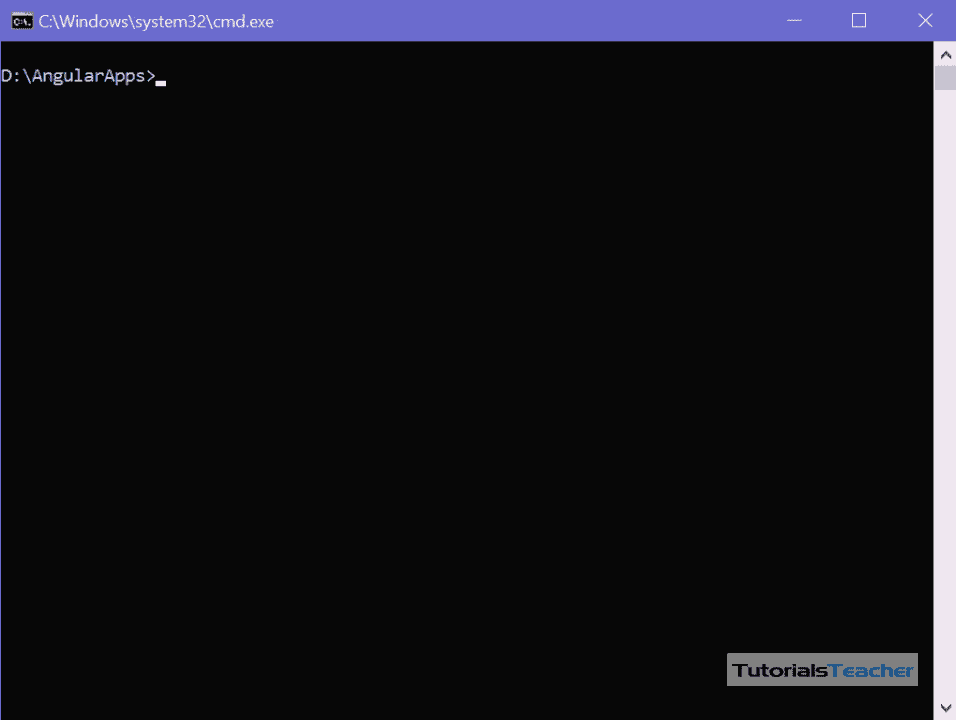
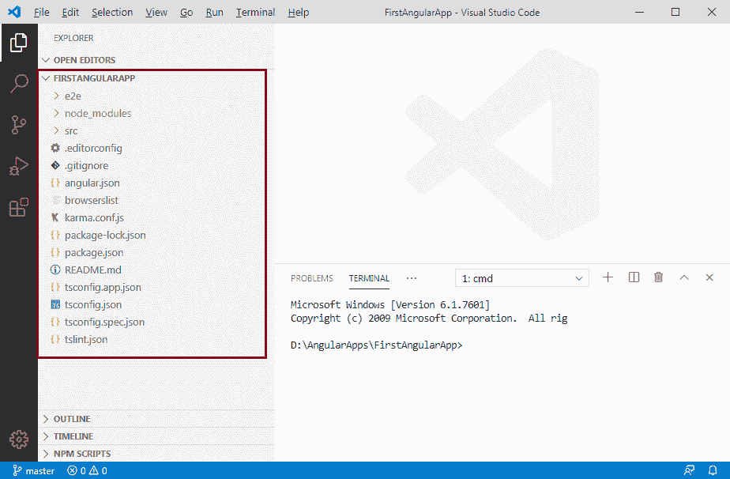
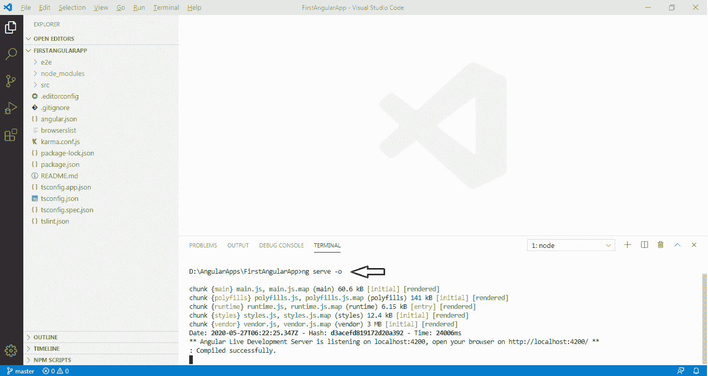
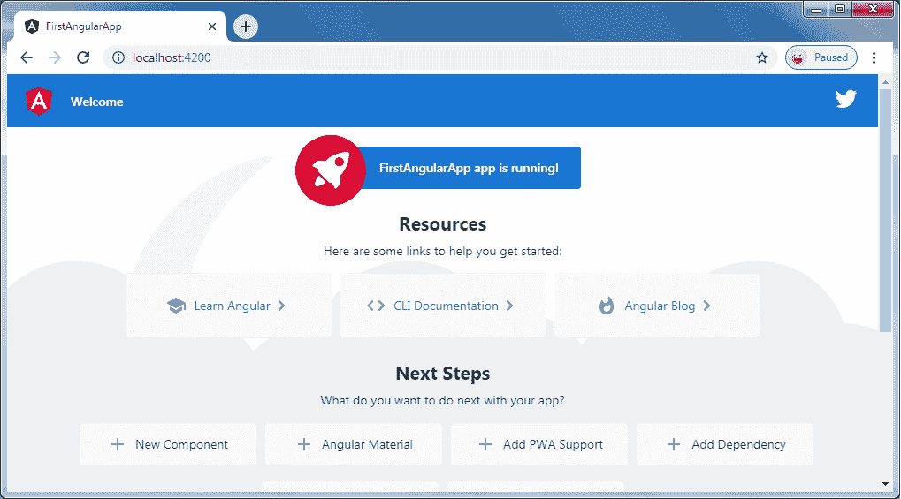

# 创建 Angular2 应用

> 原文：<https://www.tutorialsteacher.com/angular/create-angular-application>

在这里，您将学习使用 Angular CLI 创建 Angular 2(在 Angular2 中也有效)应用。

Angular CLI 帮助我们快速设置工作空间和初始应用，其中包括必要的 NPM 库和应用的其他依赖项。

要创建一个初始应用，导航到要创建应用的文件夹，并在终端/命令窗口中执行`ng new <project name>`命令。

下面在“Angular”文件夹中创建了一个名为“第一 Angular”的新 Angular 应用。

```
D:\AngularApps> ng new FirstAngularApp
```

`ng new`命令提示您输入要包含在初始应用项目中的功能信息。您可以通过按回车键接受默认值，如下所示。

[](../../Content/images/angular/create-angular-app.gif)

Generate Angular App using Angular CLI


上述命令可能需要 2-3 分钟来创建项目和安装必要的库。要在 VS Code 中打开该项目，请导航到终端/命令窗口中的项目文件夹，并键入`code .`。

```
D:\AngularApps\FirstAngularApp\>code .
```

您在 VS 代码中的新项目如下所示。

[](../../Content/images/angular/angular-project.png)

Angular Project in VS Code


VS Code 中的左窗格显示了由 Angular CLI 创建的文件和文件夹。在这里了解 Angular 项目文件夹结构[。](https://angular.io/guide/file-structure)

## 运行 Angular 应用

要在浏览器中运行 Angular 应用，首先需要构建它。

您可以使用 Angular CLI 命令或 NPM 命令构建和运行应用。您可以使用终端/命令窗口来执行这些命令。但是，如果您使用的是 VS 代码，那么您可以从它的终端执行命令。

使用 Angular CLI 命令`ng serve -o`构建应用。-o 表示在默认浏览器中自动打开。

使用 NPM 命令`npm start`构建应用。在内部，它只使用 ng serve 命令。打开浏览器，导航到 http://localhost:4200 查看应用主页。http://localhost:4200 是使用 Angular CLI 创建的 Angular 应用的默认 URL。

从菜单终端->新建终端打开 VS 码中的终端，输入`ng serve -o`命令，回车，如下图。

[](../../Content/images/angular/run-angular-app.png)


`ng serve`命令构建应用，启动开发服务器，观察源文件，并在您对这些文件进行更改时重建应用。它将在默认浏览器中打开您的 Angular 应用，如下所示。

[](../../Content/images/angular/angular-app.png)


`ng serve`命令保持关注源文件，所以如果你在项目的任何文件中做了任何更改，它会重新构建并自动刷新浏览器以反映更改。

要停止自动构建过程，请在 VS Code 终端按`Ctrl + c`。

因此，您可以创建一个工作空间和一个初始的 Angular 项目，并使用 VS 代码运行它。