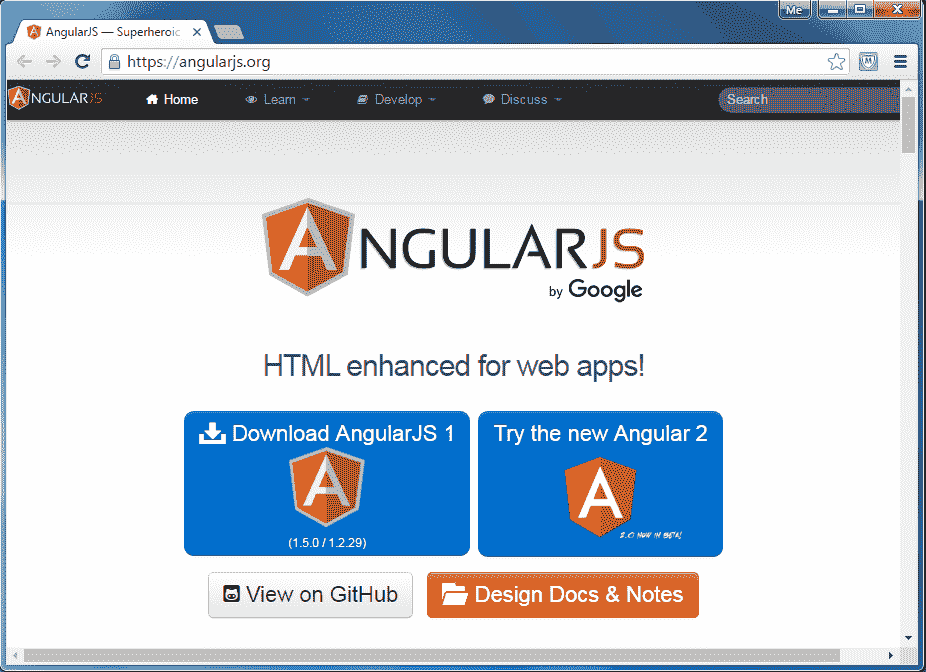

# 什么是 AngularJS？

> 原文:[https://www . tutorial stearn . com/angular js/what-is-angular js](https://www.tutorialsteacher.com/angularjs/what-is-angularjs)

AngularJS 是一个客户端 JavaScript MVC 框架，用来开发动态 web 应用程序。AngularJS 最初是作为一个项目在谷歌开始的，但现在，它是开源框架。

AngularJS 完全基于 HTML 和 JavaScript，所以不需要学习另一种语法或语言。

  AngularJS is also called just "Angular".

AngularJS 将静态 HTML 更改为动态 HTML。它通过添加内置属性和组件来扩展 HTML 的能力，还提供了使用简单的 JavaScript 创建自定义属性的能力。

angolajs 网站-[https://angolajs . org](https://angularjs.org)

[](../../Content/images/ng/angular-website.png)

AngularJS Official Website


正如你在上面的 angularjs.org 网站上看到的，你可以通过点击**下载 AngularJS 1** 链接来下载 AngularJS 1 库。截至本文撰写之时，AngularJS 2 处于测试版。本教程使用 AngularJS 1。

Angular 是一个开源框架。点击 GitHub 链接上的**查看源代码。**

## 角度示例

下面是一个简单的 AngularJS 示例，它将标签更改为您在文本框中键入的任何内容。

AngularJS Example:

```
<!DOCTYPE html>

<html>
<head>
    <script src="~/Scripts/angular.js"></script>
</head>
<body **ng-app**>
    Enter Your Name: <input type="text" **ng-model="name"** /> <br />
    Hello <label **ng-bind="name"**></label>
</body>
</html> 
```

上面的例子是带有一些 AngularJS 指令(属性)的普通 HTML 代码，比如 ng-app、ng-model 和 ng-bind。

使用 jQuery 可以用更多行代码完成同样的任务，如下所示。

jQuery Example:

```
<!DOCTYPE html>

<html>
<head>
    <script src="~/Scripts/jquery-1.10.2.min.js"></script>
</head>
<body>
    Enter Your Name: <input type="text" id="txtName" /> <br />
    Hello <label id="lblName"></label>

    <script>
        $(document).ready( function () {
            $('#txtName').keyup(function () {
                $('#lblName').text($('#txtName').val());
            });
        });
    </script>
</body>
</html> 
```

因此，AngularJS 包含内置属性，使用这些属性我们可以提高生产率。

## AngularJS 的优势

1.  开源 JavaScript MVC 框架。
2.  由谷歌支持
3.  不需要学习另一种脚本语言。只是纯粹的 JavaScript 和 HTML。
4.  通过使用 MVC 设计模式支持关注点分离。
5.  内置属性(指令)使 HTML 成为动态的。
6.  易于扩展和定制。
7.  支持单页应用程序。
8.  使用依赖注入。
9.  易于单元测试。
10.  REST 友好。

让我们在下一节中设置 AngularJS 开发环境。