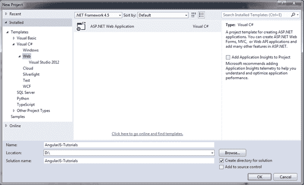
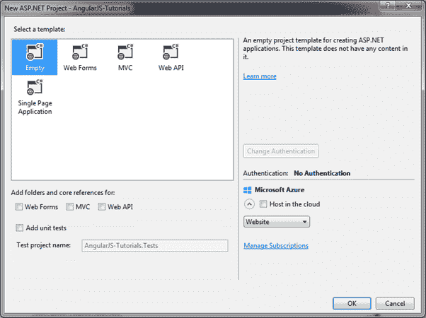
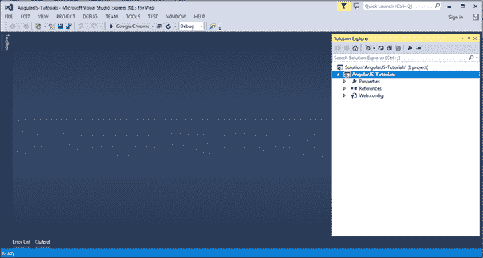
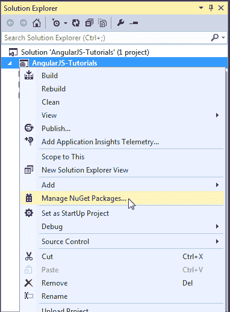
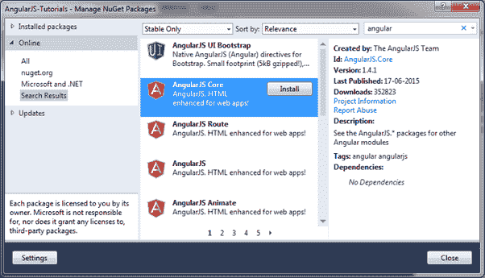
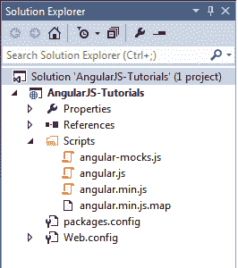

# 安装 AngularJS 开发环境

> 原文：<https://www.tutorialsteacher.com/angularjs/angularjs-development-environment>

我们需要以下工具来为 AngularJS 设置开发环境:

1.  安圭拉图书馆
2.  编辑器/集成开发环境
3.  浏览器
4.  网络服务器

## 安圭拉图书馆

要下载 AngularJS 库，进入[angularjs.org](https://angularjs.org)->点击下载按钮，弹出如下窗口。

Download AngularJS Library

从弹出窗口中选择所需的版本，然后单击弹出窗口中的下载按钮。

CDN:可以从 CDN URL-[https://Ajax . googleapis . com/Ajax/libs/AngularJS/1 . 3 . 16/angular . min . js](https://ajax.googleapis.com/ajax/libs/angularjs/1.3.16/angular.min.js) 收录 AngularJS 库

## 编者ˌ编辑

AngularJS 最终是 HTML 和 JavaScript 代码。所以你可以根据自己的选择安装任何好的编辑器/IDE。

建议使用以下编辑器:

*   [崇高的文字](https://www.sublimetext.com/)
*   [【aptana studio 3】](http://www.aptana.com)
*   [超编辑](http://www.ultraedit.com)
*   [日食](https://eclipse.org)T2】
*   [Visual Studio](https://www.visualstudio.com)

## 在线编辑

您也可以使用以下在线编辑器进行学习。

*   [plnkr.co](http://plnkr.co)
*   [jsbin.com](http://jsbin.com)

对于这些教程中的所有 AngularJS 示例，我们使用自己的在线代码编辑器。

## 网络服务器

使用任何网络服务器，如 IIS、apache 等。，在当地用于发展目的。

## 浏览器

您可以安装任何您选择的浏览器，因为 AngularJS 支持跨浏览器兼容性。不过建议在开发应用的时候使用[谷歌 Chrome](https://www.google.com/chrome/) 。

## 有角种子

使用 Angular 种子项目快速启动 AngularJS 应用。Angular-seed 是典型 AngularJS web 应用的应用框架。您可以使用它来快速引导您的 angular webapp 项目和项目的开发环境。

从[GitHub](https://github.com/angular/angular-seed)T2 下载 angular-seed

让我们在 Visual Studio 2013 中为 web 设置 Angular 项目。

## 在 Visual Studio 中设置 AngularJS 项目

您可以在任何版本的 Visual Studio 中创建 AngularJS 应用。在这里，我们将使用 Visual Studio 2013 进行网页。

首先，通过单击起始页上的新建项目链接来创建新项目。这将打开“新建项目”对话框，如下所示。

AngularJS in Visual Studio

在左窗格中选择网络，在中间窗格中选择 ASP.NET 网络应用，然后单击确定。

在“新 ASP.NET 项目”对话框中，选择“空模板”，然后单击“确定”。

AngularJS in Visual Studio

这将在 Visual Studio 中创建一个空的网站项目。

AngularJS in Visual Studio

现在，从 NuGet 包管理器安装 AngularJS 库。在解决方案资源管理器中右键单击项目，然后选择管理/获取包..

AngularJS in Visual Studio

在“管理 NuGet 包”对话框中搜索“angular”，然后安装 AngularJS Core。

AngularJS in Visual Studio

这将把 AngularJS 文件添加到 Scripts 文件夹中，例如 angular.js、angular.min.js 和 angular-mocks.js，如下所示。

AngularJS in Visual Studio

现在，您可以开始编写 AngularJS web 应用了。

在下一节中，创建一个简单的 AngularJS 应用，并理解 AngularJS 的基本构造块。