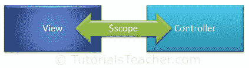

# AngularJS 中的范围

> 原文：<https://www.tutorialsteacher.com/angularjs/angularjs-scope>

AngularJS 中的$scope 是一个内置对象，它包含应用数据和方法。您可以在控制器函数内为$scope 对象创建属性，并为其分配值或函数。

$scope 是控制器和视图(HTML)之间的粘合剂。它将数据从控制器传输到视图，反之亦然。

[](../../Content/images/ng/ng-scope.png)

Scope


正如我们在控制器部分看到的，我们可以将属性和方法附加到控制器函数内部的$scope 对象。该视图可以使用表达式、ng-model 或 ng-bind 指令显示$scope 数据，如下所示。

Example: $scope

```
<!DOCTYPE html>
<html >
<head>
    <title>AngualrJS $scope object</title>
    <script src="~/Scripts/angular.js"></script>
</head>
<body ng-app="myNgApp">
    <div ng-controller="myController">
        Message: <br />
        {{message}}<br />
        <span ng-bind="message"></span> <br />
        <input type="text" ng-model="message" /> 
    </div>
    <script>
        var ngApp = angular.module('myNgApp', []);

        ngApp.controller('myController', function ($scope) {
            $scope.message = "Hello World!";        
        });
    </script>
</body>
</html> 
```

AngularJS 为应用中的每个控制器创建并注入不同的$scope 对象。因此，一个控制器内附加到$scope 的数据和方法不能在另一个控制器中访问。使用嵌套控制器，子控制器将继承父控制器的作用域对象。因此，子控制器可以访问在父控制器中添加的属性，但是父控制器不能访问在子控制器中添加的属性。

Note: The ng-model directive is used for two-way data binding. It transfers the data from controller to view and vice-versa. An expression and ng-bind directive transfers data from controller to view but not vice-versa.

## $rootScope

一个 AngularJS 应用只有一个$rootScope。所有其他$scope 对象都是子对象。

附加到$rootScope 的属性和方法将对所有控制器可用。

下面的示例演示了$rootScope 和$scope 对象。

Example: $rootScope & $scope

```
<!DOCTYPE html>
<html>
<head>
    <title>AngualrJS Controller</title>
    <script src="~/Scripts/angular.js"></script>
</head>
<body ng-app="myNgApp">
    <div ng-controller="parentController">
        Controller Name: {{controllerName}} <br />
        Message: {{message}} <br />
        <div style="margin:10px 0 10px 20px;" ng-controller="childController">
            Controller Name: {{controllerName}} <br />
            Message: {{message}} <br />
        </div>
    </div>
    <div  ng-controller="siblingController">
        Controller Name: {{controllerName}} <br />
        Message: {{message}} <br />
    </div>
    <script>
        var ngApp = angular.module('myNgApp', []);

        ngApp.controller('parentController', function ($scope, $rootScope) {
            $scope.controllerName = "parentController";
            $rootScope.message = "Hello World!";
        });

        ngApp.controller('childController', function ($scope) {
            $scope.controllerName = "childController";
        });

        ngApp.controller('siblingController', function ($scope) {

        });
    </script>
</body>
</html>
```

Result:

```
 Controller Name: parentController
Message: Hello World!
    Controller Name: childController
    Message: Hello World!
Controller Name:
Message: Hello World!
```

根据上面的例子，在$rootScope 中添加的属性在所有控制器中都是可用的。

$scope 对象包含各种方法。下表列出了$scope 对象的重要方法。

| 方法 | 描述 |
| --- | --- |
| $new() | 创建新的子范围。 |
| $watch() | 注册一个回调，在模型属性改变时执行。 |
| $watchGroup() | 注册一个回调，在模型属性改变时执行。在这里，指定要跟踪的属性数组。 |
| $watchCollection() | 注册一个回调函数，每当模型对象或数组属性改变时执行。 |
| $digest() | 处理当前范围及其子范围的所有观察者。 |
| $destroy() | 从父范围中移除当前范围(及其所有子范围)。 |
| $eval() | 在当前范围内执行表达式并返回结果。 |
| $apply() | 在角度框架之外执行角度表达式。 |
| $on() | 注册事件的回调。 |
| $emit() | 向上调度指定的事件，直到$rootScope。 |
| $broadcast() | 将指定的事件向下调度到所有子范围。 |

## $手表

Angular scope 对象包含$watch 事件，每当模型属性更改时都会引发该事件。

Example:$watch()

```
<!DOCTYPE html>
<html>
<head>
    <script src="~/Scripts/angular.js"></script>
</head>
<body ng-app="myNgApp">
    <div ng-controller="myController">
        Enter Message: <input type="text" ng-model="message" /> <br />
        New Message: {{newMessage}} <br />
        Old Message: {{oldMessage}} 
    </div>
    <script>
        var ngApp = angular.module('myNgApp', []);

        ngApp.controller('myController', function ($scope) {
            $scope.message = "Hello World!";

            $scope.$watch('message', function (newValue, oldValue) {
                $scope.newMessage = newValue;
                $scope.oldMessage = oldValue;
            });
        });
    </script>
</body>
</html> 
```

正如您在上面的例子中看到的，$watch 注册了一个回调，每当指定的模型属性“message”改变时，就会调用这个回调。