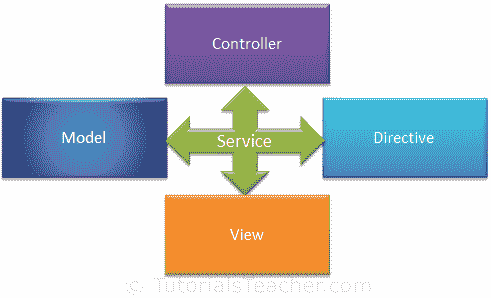

# AngularJS 服务

> 原文：<https://www.tutorialsteacher.com/angularjs/angularjs-service>

AngularJS 服务是用于特定任务的 JavaScript 函数，可以在整个应用中重用。

  AngularJS built-in services starts with $, same as other built-in objects.

AngularJS 包含不同用途的服务。例如，`$http`服务可用于向远程服务器发送 AJAX 请求。AngularJS 还允许您为应用创建定制服务。

大多数 AngularJS 服务与控制器、模型或定制指令交互。然而，一些服务与视图(用户界面)交互，也用于用户界面特定的任务。

Services

下表列出了所有内置的 AngularJS 服务。

| $锚定滚动 | $ exception handler-例外处理程式 | $间隔 | $rootScope |
| $动画 | $筛选器 | $区域设置 | $ sceDelegate |
| $cacheFactory | $httpParamSerializer | $位置 | $sce |
| $templateCache | $httpParamSerializerJQLike | $log | $templateRequest |
| $编译 | $http | $parse | $超时 |
| $控制器 | $httpBackend | $q | $窗口 |
| $文档 | $插值 | $rootElement |  |

所有的 Angular 服务都是**延迟实例化**和**单例**。这意味着当应用组件依赖于一个服务时，AngularJS 框架会实例化该服务。此外，所有组件共享同一个服务实例。

在下一节中学习一些重要的内置服务。