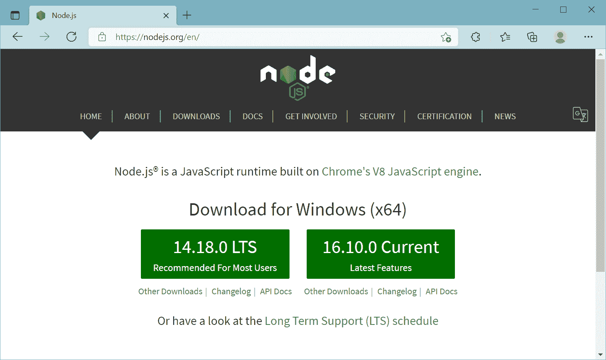
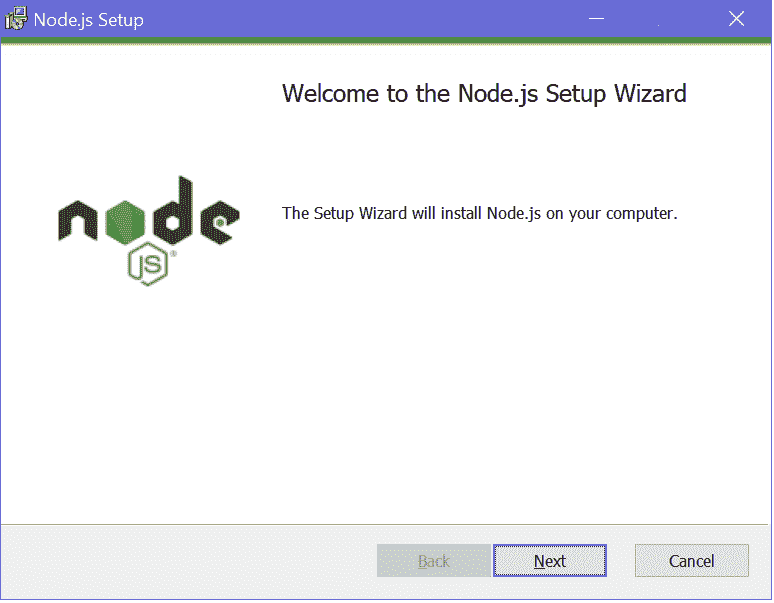
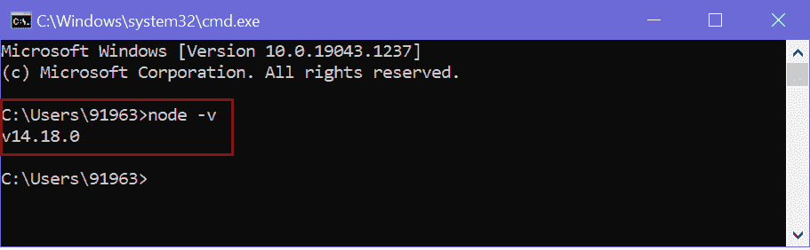
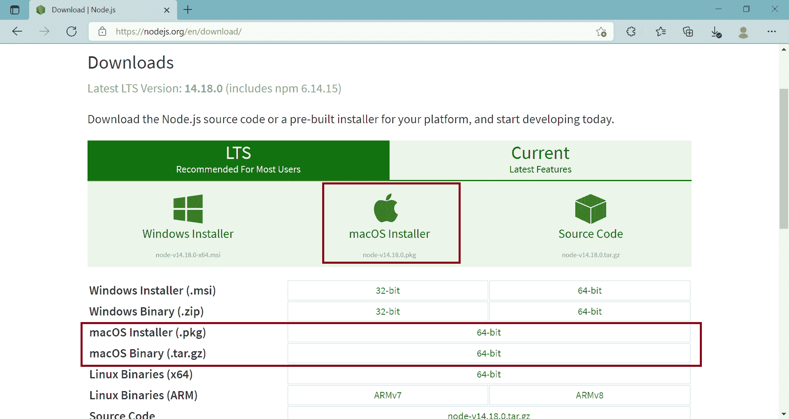
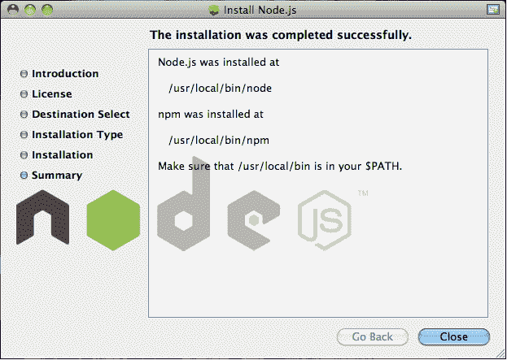

# 安装 Node.js

> 原文：<https://www.tutorialsteacher.com/nodejs/setup-nodejs-development-environment>

在本节中，您将了解到开发 Node.js 应用所需的工具以及设置开发环境的步骤。

Node.js 开发环境可以在 Windows、Mac、Linux 和 Solaris 中设置。在任何平台上开发 Node.js 应用都需要以下工具/SDK。

1.  Node.js
2.  节点包管理器(NPM)
3.  集成开发环境或文本编辑器

自节点版本 0.6.0 以来，节点包管理器(Node Package Manager)已包含在 Node.js 安装中。，所以没有必要单独安装。

## 在 Windows 上安装 Node.js

访问 Node.js 官方网站[https://nodejs.org](https://nodejs.org)。它会根据您的操作系统自动检测操作系统并显示下载链接。例如，它将显示以下 64 位操作系统的 下载链接。

 

Download Node.JS Installer for Windows

点击 LTS 或当前版本按钮下载 windows 安装程序。在这里，我们将为 windows 安装具有长期支持的最新版本 LTS。但是，您也可以安装具有最新功能的当前版本。

下载 MSI 后，双击它开始安装，如下所示。

 

Node.js Installation

单击“下一步”阅读并接受许可协议，然后单击“安装”。它将在您的计算机上快速安装 Node.js。最后，单击“完成”完成安装。

## 验证安装

一旦在计算机上安装了 Node.js，就可以通过打开命令提示符并键入`node -v`来进行验证。如果 Node.js 安装成功，那么它将显示安装在您机器上的 Node.js 版本，如下所示。

 

Verify Node.js Installation

## 在 Mac/Linux 上安装 Node.js

访问 Node.js 官方网站[https://nodejs.org/en/download](https://nodejs.org/en/download/)页面。单击适用于 Mac 的安装程序()。pkg 或. tar.gz)或 Linux 来下载 Node.js 安装程序。

 

Node Environment Setup

下载后，单击安装程序启动 Node.js 安装向导。点击**继续**并按照步骤进行。成功安装后，它将显示关于安装 Node.js 和 NPM 的位置的安装摘要。

 

Node.js Installation on OS X

安装后，使用终端窗口验证 Node.js 安装，并输入以下命令。它将显示安装在您的 Mac 上的 Node.js 的版本号。

<samp>$ node -v</samp>

或者，对于 Mac 或 Linux 用户，您可以使用 Mac OS 的自制软件包管理器或 Linux 操作系统的 Linuxbrew 软件包管理器从命令行直接安装 Node.js。对于 Linux，您需要安装额外的依赖项，即。安装节点前，先安装 ruby 1 . 8 . 6 或更高版本和 GCC 4.2 或更高版本。

<samp>$ brew install node</samp>