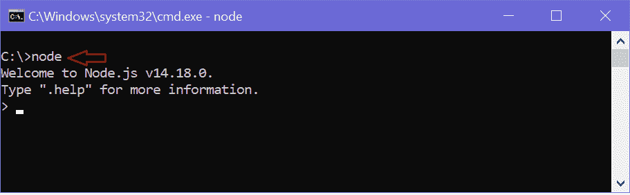
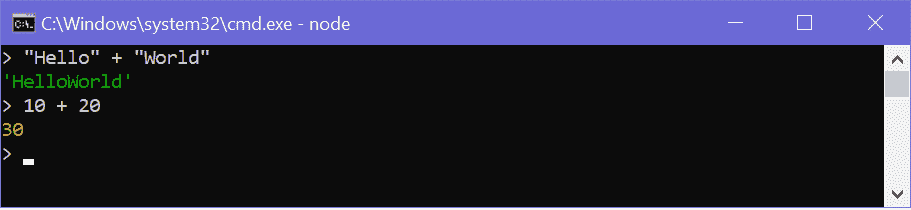
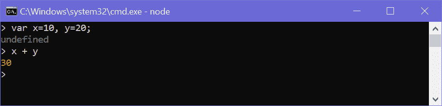
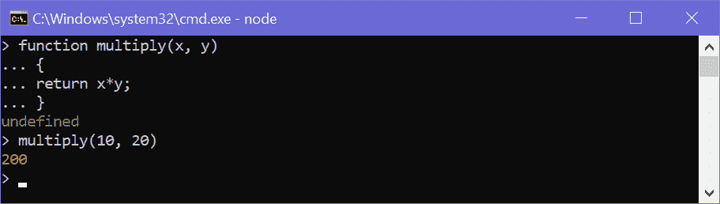
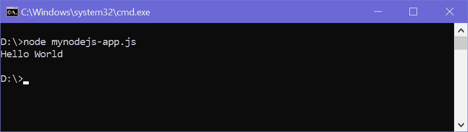
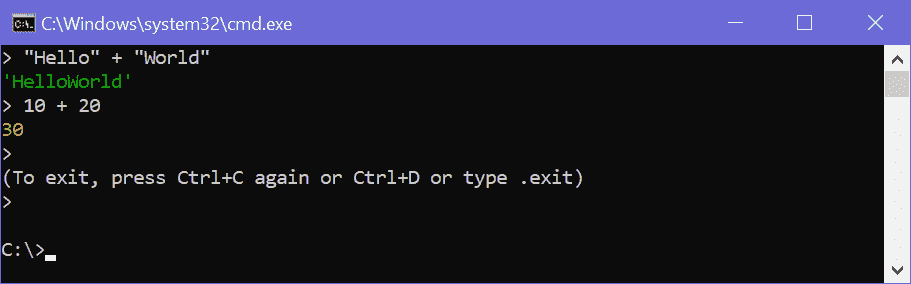

# 节点. js 控制台/REPL

> 哎哎哎:# t0]https://www . tutorial connector . com/nodejs/nodejs-console-repl

Node.js 附带了一个名为 REPL 的虚拟环境(又名 Node shell)。REPL 代表读-评估-打印-循环。这是测试简单 Node.js/JavaScript 代码的一种快速简单的方法。

要启动 REPL (Node shell)，请打开命令提示符(在 Windows 中)或终端(在 Mac 或 UNIX/Linux 中)并键入*节点*，如下所示。在 Windows 和 MAC 中会将提示改为>。

<figure>[](../../Content/images/nodejs/node-repl.png)

<figcaption>Launch Node.js REPL</figcaption>

</figure>

你现在可以在 REPL 测试几乎所有的 Node.js/JavaScript 表情。10 + 20 将在新行中立即显示 30。

+运算符还像浏览器的 JavaScript 一样连接字符串。

<figure>[](../../Content/images/nodejs/node-repl-examples.png)

<figcaption>Node.js Examples</figcaption>

</figure>

您还可以定义变量并对其执行一些操作。

<figure>[](../../Content/images/nodejs/node-variables.png)

<figcaption>Define Variables on REPL</figcaption>

</figure>

如果你需要写多行 JavaScript 表达式或函数，那么只要你想在下一行写一些东西作为代码的延续，就按下**进入**。REPL 终端将显示三个点(...)，表示可以继续下一行。写。中断以脱离连续模式。

例如，您可以定义一个函数并执行它，如下所示。

<figure>[](../../Content/images/nodejs/nodejs-example2.png)

<figcaption>Node.js Example in REPL</figcaption>

</figure>

您可以通过执行`node fileName`命令来执行外部 JavaScript 文件。 例如，下面在命令提示符/终端上运行`mynodejs-app.js`并显示结果。

mynodejs-app.js<button class="copy-btn pull-right" title="Copy example code">*Copy*</button> 

```
console.log("Hello World"); 
```

现在，可以从如下所示的命令提示符执行`mynodejs-app`。

<figure>[](../../Content/images/nodejs/run-nodejs-external-file.png)

<figcaption>Run External JavaScript file</figcaption>

</figure>

要退出 REPL 终端，请按两次 Ctrl + C 或书写。退出并按回车键。

<figure>[](../../Content/images/nodejs/quit-repl.png)

<figcaption>Quit from REPL</figcaption>

</figure>

因此，您可以在节点外壳(REPL)中执行任何 Node.js/JavaScript 代码。这将会给你一个类似于你在谷歌浏览器控制台中得到的结果。

*Note:**ECMAScript implementation in Node.js and browsers is slightly different. For example, {}+{} is '[object Object][object Object]' in Node.js REPL, whereas the same code is NaN in the Chrome console because of the automatic semicolon insertion feature. However, mostly Node.js REPL and the Chrome/Firefox consoles are similar.* *下表列出了重要的 REPL 命令。

| REPL 司令部 | 描述 |
| --- | --- |
| 。帮助 | 显示所有命令的帮助 |
| 选项卡键 | 显示所有命令的列表。 |
| 向上/向下键 | 请参阅以前在 REPL 应用的命令。 |
| 。保存文件名 | 将当前节点 REPL 会话保存到文件中。 |
| 。加载文件名 | 在当前节点 REPL 会话中加载指定的文件。 |
| Ctrl + c | 终止当前命令。 |
| ctrl + c(两次) | REPL 出口。 |
| Ctrl + d | REPL 出口。 |
| 。破裂 | 退出多行表达式。 |
| 。清楚的 | 退出多行表达式。 |**