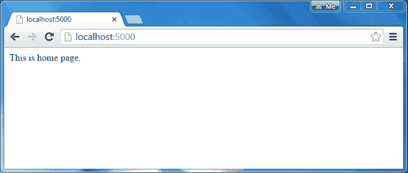
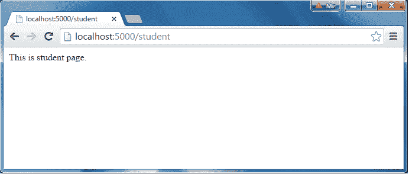

# NodeJS Web 服务器


在本节中，我们将学习如何创建一个简单的 Node.js web 服务器并处理 HTTP 请求。

要访问任何 Web 应用的网页，你需要一个[Web 服务器](https://en.wikipedia.org/wiki/Web_server)。Web 服务器将处理 Web 应用的所有 http 请求，例如，IIS 是 ASP.NET Web 应用的 Web 服务器，而 Apache 是 PHP 或 Java Web 应用的 Web 服务器。

Node.js 提供了创建自己的 web 服务器的功能，该服务器将异步处理 HTTP 请求。您可以使用 IIS 或 Apache 运行 Node.js web 应用，但建议使用 Node.js web 服务器。

## 创建 Web 服务器

Node.js 使得创建一个异步处理传入请求的简单 web 服务器变得很容易。

下面的例子是一个简单的 Node.js web 服务器，包含在 server.js 文件中。

server.js 

```
var http = require('http'); // 1 - Import Node.js core module

var server = http.createServer(function (req, res) {   // 2 - creating server

    //handle incomming requests here..

});

server.listen(5000); //3 - listen for any incoming requests

console.log('Node.js web server at port 5000 is running..') 
```

在上面的例子中，我们使用 require()函数导入 http 模块。http 模块是 Node.js 的核心模块，所以不需要用 NPM 安装。下一步是调用 http 的 createServer()方法，用请求和响应参数指定回调函数。最后，调用从带有端口号的 createServer()方法返回的服务器对象的 listen()方法，开始侦听端口 5000 上的传入请求。您可以在此指定任何未使用的端口。

通过在命令提示符或终端窗口中写入`node server.js`命令运行上述 Web 服务器，它将显示如下所示的消息。

```
C:\> node server.js
Node.js web server at port 5000 is running..
```

这就是如何使用简单的步骤创建一个 Node.js Web 服务器。现在，让我们看看如何在 Node.js web 服务器中处理 HTTP 请求和发送响应。

## 处理 HTTP 请求

http.createServer()方法包括由 Node.js 提供的[请求](https://nodejs.org/api/http.html#http_http_incomingmessage)和[响应](https://nodejs.org/api/http.html#http_class_http_serverresponse)参数。请求对象可用于获取关于当前 http 请求的信息，例如 url、请求头和数据。响应对象可用于发送当前 HTTP 请求的响应。

下面的例子演示了如何在 Node.js 中处理 HTTP 请求和响应

server.js 

```
var http = require('http'); // Import Node.js core module

var server = http.createServer(function (req, res) {   //create web server
    if (req.url == '/') { //check the URL of the current request

        // set response header
        res.writeHead(200, { 'Content-Type': 'text/html' }); 

        // set response content    
        res.write('<html><body><p>This is home Page.</p></body></html>');
        res.end();

    }
    else if (req.url == "/student") {

        res.writeHead(200, { 'Content-Type': 'text/html' });
        res.write('<html><body><p>This is student Page.</p></body></html>');
        res.end();

    }
    else if (req.url == "/admin") {

        res.writeHead(200, { 'Content-Type': 'text/html' });
        res.write('<html><body><p>This is admin Page.</p></body></html>');
        res.end();

    }
    else
        res.end('Invalid Request!');

});

server.listen(5000); //6 - listen for any incoming requests

console.log('Node.js web server at port 5000 is running..') 
```

在上面的示例中，req.url 用于检查当前请求的 url，并基于此发送响应。要发送响应，它首先使用 writeHead()方法设置响应头，然后使用 write()方法写入字符串作为响应体。最后，Node.js web 服务器使用 end()方法发送响应。

现在，运行上面的 web 服务器，如下所示。

```
C:\> node server.js
Node.js web server at port 5000 is running..
```

要测试它，您可以使用命令行程序 curl，大多数 Mac 和 Linux 机器都预装了该程序。

```
curl -i http://localhost:5000
```

您应该会看到以下响应。

```
HTTP/1.1 200 OK
Content-Type: text/plain
Date: Tue, 8 Sep 2015 03:05:08 GMT
Connection: keep-alive
This is home page.
``` 

对于 Windows 用户，将浏览器指向 *http://localhost:5000* ，会看到如下结果。

[](../../Content/images/nodejs/webserver-response.png)

Node.js Web Server Response


同理，将浏览器指向*http://localhost:5000/student*，看到如下结果。

[](../../Content/images/nodejs/webserver-response2.png)

Node.js Web Server Response


除上述网址外，它将显示所有请求的“无效请求”。

## 发送 JSON 响应

下面的示例演示了如何从 Node.js web 服务器提供 JSON 响应。

server.js 

```
var http = require('http'); 

var server = http.createServer(function (req, res) {   

    if (req.url == '/data') { //check the URL of the current request
            res.writeHead(200, { 'Content-Type': 'application/json' });
            res.write(JSON.stringify({ message: "Hello World"}));  
            res.end();  
    }
});

server.listen(5000);

console.log('Node.js web server at port 5000 is running..') 
```

这样，您就可以创建一个简单的 web 服务器来提供不同的响应。

了解如何在 Visual Studio 中[创建 Node.js Web 应用。](/articles/create-nodejs-web-application-in-visual-studio)***