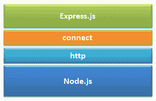
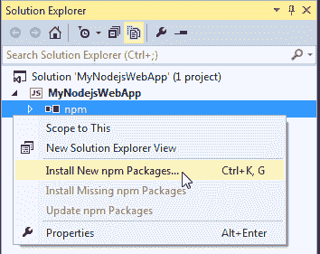
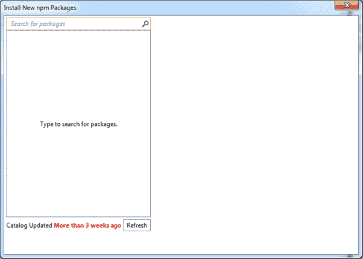
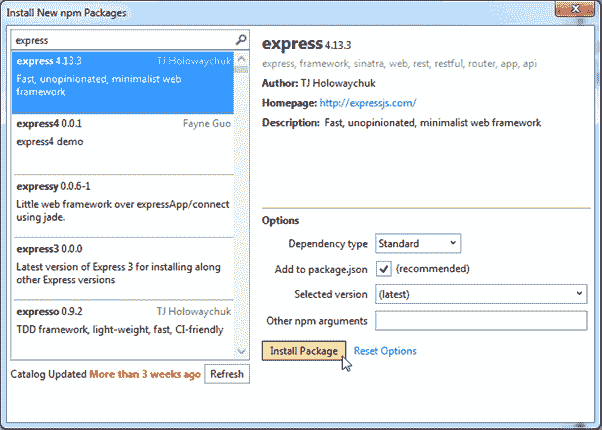
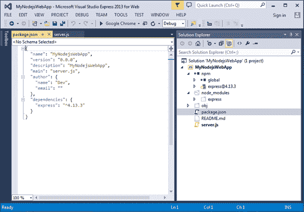

# Express.js


“Express 是 Node.js 的一个快速的、未绑定的极简网络框架”——官方网站:[Expressjs.com](https://expressjs.com/)T2】

Express.js 是一个用于 Node.js 的 web 应用框架。它提供了各种功能，使得 web 应用的开发变得又快又容易，否则只使用 Node.js 会花费更多的时间

Express.js 基于名为 ***的 Node.js 中间件模块连接*** ，后者又使用 **http** 模块。因此，任何基于 connect 的中间件也将与 Express.js 一起工作

[](../../Content/images/nodejs/expressjs.png)

Express.js


## 快递的优势

1.  使 Node.js web 应用开发变得快速而简单。
2.  易于配置和定制。
3.  允许您基于 HTTP 方法和 URL 定义应用的路由。
4.  包括各种中间件模块，您可以使用这些模块根据请求和响应执行额外的任务。
5.  易于集成不同的模板引擎，如杰德，瓦什，EJS 等。
6.  允许您定义错误处理中间件。
7.  易于为应用的静态文件和资源提供服务。
8.  允许您创建 REST API 服务器。
9.  易于与 MongoDB、Redis、MySQL 等数据库连接

## 安装 Express.js

您可以使用 npm 安装 express.js。以下命令将在您的机器上全局安装最新版本的 express.js，以便您机器上的每个 Node.js 应用都可以使用它。

```js
npm install -g express
```

以下命令将在项目文件夹本地安装最新版本的 express.js。

```js
C:\MyNodeJSApp> npm install express --save
```

如您所知，- save 将通过指定 express.js 依赖项来更新 package.json 文件。

## 在 Visual Studio 中安装 Express.js

在 node.js web app 中，我们在 Visual Studio 中创建了一个简单的 node.js web 应用。现在，要安装 Express.js，右键单击项目 MyNodejsWebApp ->选择安装新的 npm 包。

[](../../Content/images/nodejs/expressjs-in-visualstudio.png)

Install Express.js in Visual Studio


它将打开以下对话框。

[](../../Content/images/nodejs/expressjs-in-visualstudio2.png)

Install Express.js in Visual Studio


现在，在搜索框中键入“express”。它将显示从快递开始的所有包裹。选择最新版本的 express.js，选择**添加到 package.json** 复选框，然后点击**安装 Package** 按钮，如下图所示。

[](../../Content/images/nodejs/expressjs-in-visualstudio3.png)

Install Express.js in Visual Studio


因此，这将把 express.js 包安装到 node_modules 文件夹下的项目中。它还为 express.js 添加了一个依赖项，如下所示。

[](../../Content/images/nodejs/expressjs-in-visualstudio4.png)

Express.js in Visual Studio


现在，您已经准备好在应用中使用 Express.js 了。

在下一节中学习如何使用 Express.js 创建 web 应用。